# Regresión logística {#logistica}


## El problema de clasificación

Una variabla $G$ **categórica** o **cualitativa** toma valores que no
son numéricos. Por ejemplo, si $G$ denota el estado del contrato de celular
de un cliente dentro de un año, podríamos tener $G\in \{ activo, cancelado\}$.

En un **problema de clasificación** buscamos predecir una variable respuesta
categórica $G$ en función de otras variables de entrada
$X=(X_1,X_2,\ldots, X_p)$.

#### Ejemplos {-}
- Predecir si un cliente cae en impago de una tarjeta de crédito, de forma
que podemos tener $G=corriente$ o $G=impago$. Variables de entrada podrían
ser $X_1=$ porcentaje de saldo usado, $X_2=$ atrasos en los úlltimos 3 meses,
$X_3=$ edad, etc

- En nuestro ejemplo de 
reconocimiento de dígitos tenemos $G\in\{ 0,1,\ldots, 9\}$. Nótese
que los` dígitos no se pueden considerar como valores numéricos (son etiquetas).
Tenemos que las entradas $X_j$ para $j=1,2,\ldots, 256$ son valores de cada pixel
(imágenes blanco y negro).

- En reconocimiento de imágenes quiza tenemos que $G$ pertenece a un conjunto
que típicamente contiene miles de valores (manzana, árbol, pluma, perro, coche, persona,
cara, etc.). Las $X_j$ son valores de pixeles de la imagen para tres canales
(rojo, verde y azul). Si las imágenes son de 100x100, tendríamos 30,000 variables
de entrada.


### ¿Qué estimar en problemas de clasificación? {-}


En problemas de regresión, consideramos modelos de la forma $Y= f(X) + \epsilon$,
y vimos que podíamos plantear el problema de aprendizaje supervisado como uno 
donde el objetivo
es estimar lo mejor que podamos la función $f$ mediante un estimador
$\hat{f}$. Usamos entonces $\hat{f}$ para hacer predicciónes. En el caso de regresión:
  
  - $f(X)$ es la relación sistemática de $Y$ en función de $X$
  - Dada $X$, la variable observada $Y$ es una variable aleatoria
  ($\epsilon$ depende de otras variables que no conocemos)

No podemos usar un modelo así
en clasificación pues $G$ no es numérica. Sin embargo, podemos pensar que $X$
  nos da cierta información probabilística acerca de las clases que pueden ocurrir:
  
  - $P(G|X)$ es la probabilidad condicional de observar $G$ si tenemos $X$. Esto es la información sistemática de $G$ en función de $X$
  - Dada $X$, la clase observada $G$ es una variable aleatoria 
(depende de otras variables que no conocemos).

En analogía con el problema de regresión, quisiéramos estimar las probabilidades condicionales $P(G|X)$, que es la parte sistemática de la relación de $G$ en función de $X$.

Normalmente codificamos las clases $g$ con una etiqueta numérica, de modo
que $G\in\{1,2,\ldots, K\}$:


#### Ejemplo {-}
(Impago de tarjetas de crédito) 
Supongamos que $X=$ porcentaje del crédito máximo usado, y $G\in\{1, 2\}$, donde
$1$ corresponde al corriente y $2$ representa impago. Podríamos tener, por ejemplo:

\begin{align*} 
p_1(10\%) &= P(G=1|X=10\%) = 0.95 \\
p_2(10\%) &= P(G=2|X=10\%) =  0.05
\end{align*}

y 

\begin{align*} 
p_1(95\%) &= P(G=1|X=95\%) = 0.70 \\
p_2(95\%) &= P(G=2|X=95\%) =  0.30
\end{align*}


En resumen:

\BeginKnitrBlock{comentario}<div class="comentario">En problemas de clasificación queremos estimar la parte
sistemática de la relación de $G$ en función $X$, que en este caso quiere
decir que buscamos estimar las probabilidades condicionales:
\begin{align*}
p_1(x) &= P(G=1|X=x), \\
p_2(x) &= P(G=2|X=x), \\
\vdots &  \\
p_K(x) &= P(G=K|X=x)
\end{align*}
 para cada valor $x$ de las entradas.</div>\EndKnitrBlock{comentario}

A partir de estas probabilidades de clase podemos producir un clasificador de 
varias maneras (las discutiremos más adelante). La
forma más simple es usando el clasificador de Bayes:


\BeginKnitrBlock{comentario}<div class="comentario">Dadas las probabilidades condicionales $p_1(x),p_2(x),\ldots, p_K(x)$, el 
**clasificador de Bayes** asociado está dado por
$$G (x) = \arg\max_{g} p_g(x)$$

Es decir, clasificamos en la clase que tiene máxima probabilidad de ocurrir.</div>\EndKnitrBlock{comentario}


#### Ejemplo {-}
(Impago de tarjetas de crédito) 
Supongamos que $X=$ porcentaje del crédito máximo usado, y $G\in\{1, 2\}$, donde
$1$ corresponde al corriente y $2$ representa impago.
 Las probabilidades condicionales de clase para la clase *al corriente* podrían
 ser, por ejemplo:

- $p_1(x) = P(G=1|X = x) =0.95$  si $x < 15\%$
- $p_1(x) = P(G=1|X = x) = 0.95 - 0.007(x-15)$ si $x>=15\%$
  
Estas son probabilidades, pues hay otras variables que influyen en que un cliente
permanezca al corriente o no en sus pagos más allá de información contenida en el
porcentaje de crédito usado. Nótese que estas probabilidades son diferentes
a las no condicionadas, por ejempo, podríamos tener que a total $P(G=1)=0.83$.


```r
p_1 <- function(x){
  ifelse(x < 15, 0.95, 0.95 - 0.007 * (x - 15))
}
curve(p_1, 0,100, xlab = 'Porcentaje de crédito máximo', ylab = 'p_1(x)',
  ylim = c(0,1))
```

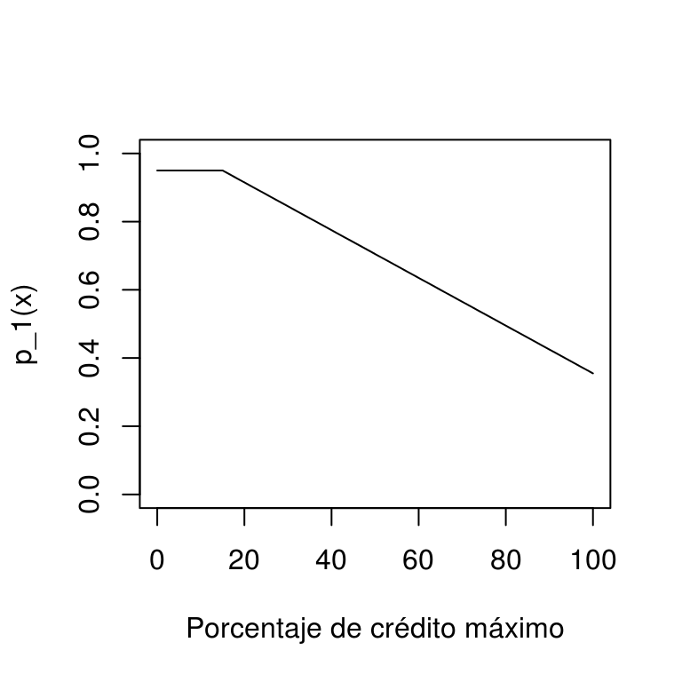

¿Por qué en este ejemplo ya no mostramos la función $p_2(x)$? 

Si usamos el clasificador de Bayes, tendríamos por ejemplo que
si $X=10\%$, como $p_1(10\%) = 0.95$ y $p_2(10\%)=0.05$, nuestra predicción
de clase sería $G(10\%) = 1$ (al corriente), pero si $X=70\%$,
$G(70\%) = 1$ (impago), pues $p_1(70\%) = 0.57$ y $p_2(70\%) = 0.43$.


## Estimación de probabilidades de clase

¿Cómo estimamos ahora las probabilidades de clase a partir de una
muestra de entrenamiento? Veremos por ahora
dos métodos: k-vecinos más cercanos y regresión logística. 

### Ejemplo {-}


Vamos a generar unos datos con el modelo simple del ejemplo anterior:


```r
library(dplyr)
library(tidyr)
library(kknn)
set.seed(1933)
x <- pmin(rexp(500,1/30),100)
probs <- p_1(x)
g <- ifelse(rbinom(length(x), 1, probs)==1 ,1, 2)
dat_ent <- data_frame(x = x, p_1 = probs, g = factor(g))
dat_ent %>% select(x, g) 
```

```
## # A tibble: 500 x 2
##             x      g
##         <dbl> <fctr>
##  1  0.5320942      1
##  2 25.3910853      1
##  3 37.4805755      1
##  4 20.8732917      1
##  5 70.8899113      2
##  6 14.8300636      1
##  7 49.4363507      1
##  8 20.9386771      1
##  9 35.4585176      1
## 10  9.8302441      1
## # ... with 490 more rows
```

Como este problema es de dos clases, podemos graficar como sigue:


```r
graf_1 <- ggplot(dat_ent, aes(x = x)) +
  geom_jitter(aes(colour = g, y = as.numeric(g=='1')), width=0, height=0.1)
graf_1
```

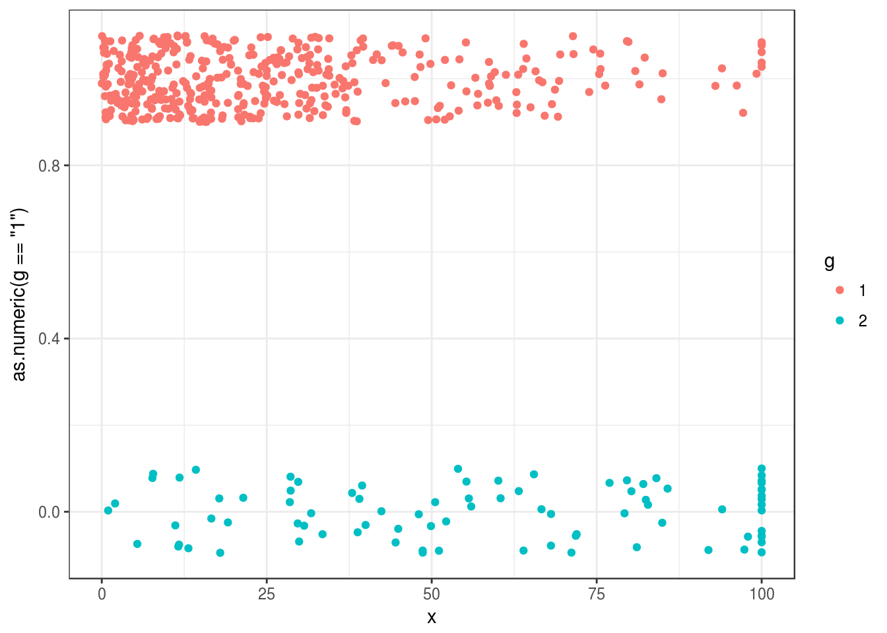


### k-vecinos más cercanos 

Podemos extender fácilmente k vecinos más cercanos para ver un ejemplo de cómo
estimar
las probabilidades de clase $p_g(x)$. La idea general es igual que en regresión:

Supongamos que tenemos un conjunto de entrenamiento
$${\mathcal L}=\{ (x^{(1)},g^{(1)}),(x^{(2)},g^{(2)}), \ldots, (x^{(N)}, g^{(N)}) \}$$

La idea es que si queremos predecir en $x_0$, busquemos varios $k$ vecinos más cercanos
a $x_0$, y estimamos entonces $p_g(x)$ como la **proporción** de casos tipo $g$ que
hay entre los $k$ vecinos de $x_0$. 

Vemos entonces que este método es un intento de hacer una aproximación directa
de las probabilidades condicionales de clase.

Podemos escribir esto como:


\BeginKnitrBlock{comentario}<div class="comentario">**k vecinos más cercanos para clasificación**

Estimamos contando los elementos de cada clase entre los $k$ vecinos más cercanos:

$$\hat{p}_g (x_0) = \frac{1}{k}\sum_{x^{(i)} \in N_k(x_0)} I( g^{(i)} = g),$$

para $g=1,2,\ldots, K$, 
donde $N_k(x_0)$ es el conjunto de $k$ vecinos más cercanos en ${\mathcal L}$
de $x_0$, y $I(g^{(i)}=g)=1$ cuando $g^{(i)}=g$, y cero en otro caso (indicadora).</div>\EndKnitrBlock{comentario}

#### Ejemplo {-}

Regresamos a nuestro problema de impago. Vamos a intentar estimar la
probabilidad condicional de estar al corriente usando k vecinos 
más cercanos (curva roja):


```r
graf_data <- data_frame(x = seq(0,100, 1))
vmc <- kknn(g ~ x, train = dat_ent,  k = 60,
              test = graf_data, kernel = 'rectangular')
graf_data$p_1 <- vmc$prob[ ,1]
graf_verdadero <- data_frame(x = 0:100, p_1 = p_1(x))
graf_1 + 
  geom_line(data = graf_data, aes(y = p_1), colour = 'red', size=1.2) +
  geom_line(data = graf_verdadero, aes(y = p_1)) +
  ylab('Probabilidad al corriente') + xlab('% crédito usado')
```

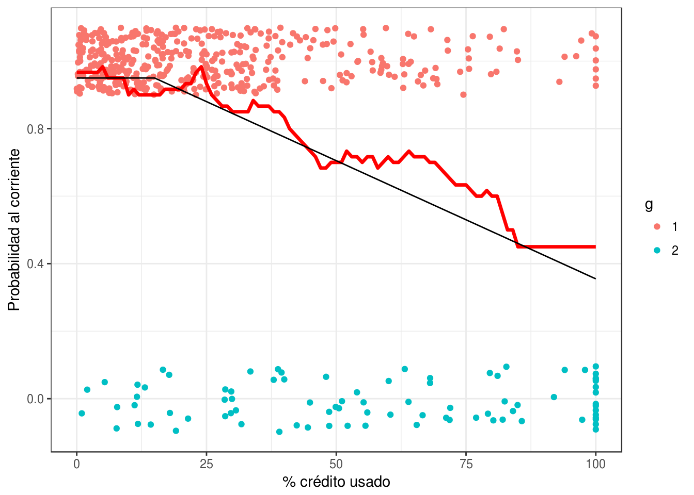

Igual que en el caso de regresión, ahora tenemos qué pensar cómo validar nuestra
estimación, pues no vamos a tener la curva negra real para comparar.

### Ejemplo {-}
Consideremos datos de diabetes en mujeres Pima:

A population of women who were at least 21 years old, of Pima Indian heritage and living near Phoenix, Arizona, was tested for diabetes according to World Health Organization criteria. The data were collected by the US National Institute of Diabetes and Digestive and Kidney Diseases. We used the 532 complete records after dropping the (mainly missing) data on serum insulin.

- npreg number of pregnancies.
- glu plasma glucose concentration in an oral glucose tolerance test.
- bp diastolic blood pressure (mm Hg).
- skin triceps skin fold thickness (mm).
- bmi body mass index (weight in kg/(height in m)\^2).
- ped diabetes pedigree function.
- age age in years.
- type Yes or No, for diabetic according to WHO criteria.


```r
diabetes_ent <- as_data_frame(MASS::Pima.tr)
diabetes_pr <- as_data_frame(MASS::Pima.te)
diabetes_ent
```

```
## # A tibble: 200 x 8
##    npreg   glu    bp  skin   bmi   ped   age   type
##  * <int> <int> <int> <int> <dbl> <dbl> <int> <fctr>
##  1     5    86    68    28  30.2 0.364    24     No
##  2     7   195    70    33  25.1 0.163    55    Yes
##  3     5    77    82    41  35.8 0.156    35     No
##  4     0   165    76    43  47.9 0.259    26     No
##  5     0   107    60    25  26.4 0.133    23     No
##  6     5    97    76    27  35.6 0.378    52    Yes
##  7     3    83    58    31  34.3 0.336    25     No
##  8     1   193    50    16  25.9 0.655    24     No
##  9     3   142    80    15  32.4 0.200    63     No
## 10     2   128    78    37  43.3 1.224    31    Yes
## # ... with 190 more rows
```

Intentaremos predecir diabetes dependiendo del BMI:


```r
library(ggplot2)
ggplot(diabetes_ent, aes(x = bmi, y= as.numeric(type=='Yes'), colour = type)) +
  geom_point()
```

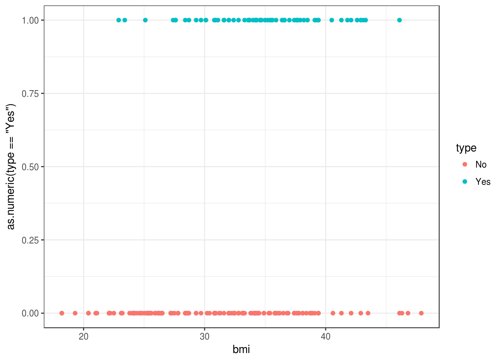

Usamos $20$ vecinos más cercanos para estimar $p_g(x)$:


```r
graf_data <- data_frame(bmi = seq(20,45, 1))
vmc_5 <- kknn(type ~ bmi, train = diabetes_ent,  k = 20,
              test = graf_data, kernel = 'rectangular')
graf_data$Yes <- vmc_5$prob[ ,"Yes"]
graf_data$No <- vmc_5$prob[ ,"No"]
graf_data <- graf_data %>% gather(type, prob, Yes:No)
ggplot(diabetes_ent, aes(x = bmi, y= as.numeric(type=='Yes'), colour = type)) +
  geom_point() + 
  geom_line(data = filter(graf_data, type =='Yes') , 
            aes(x=bmi, y = prob, colour=type, group = type)) +
  ylab('Probabilidad diabetes')
```

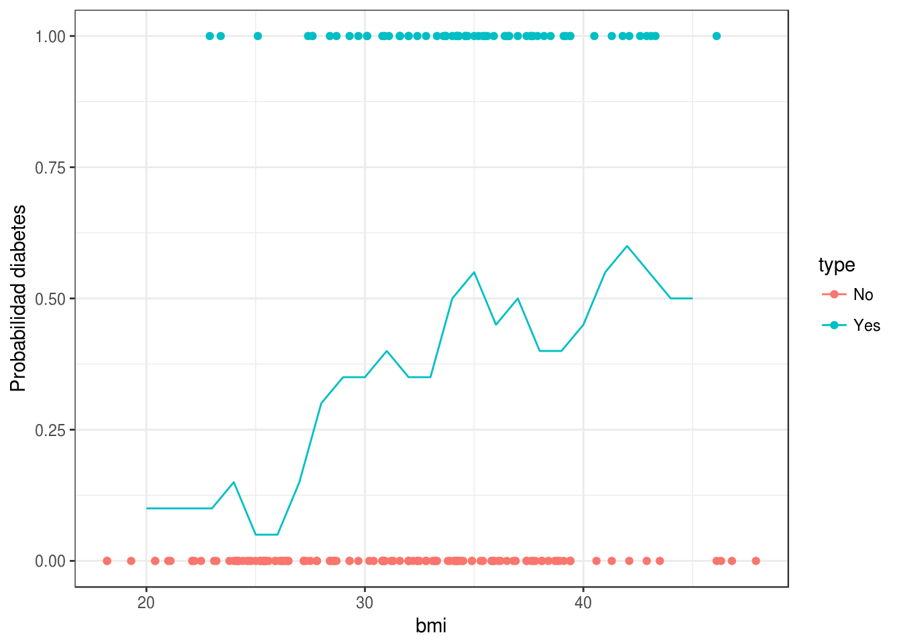


## Error para modelos de clasificación

En regresión, vimos que la pérdida cuadrática era una buena opción para ajustar
modelos (descenso en gradiente, por ejemplo), y también para evaluar su desempeño.
Ahora necesitamos una pérdida apropiada para trabajar con modelos de clasificación.

Consideremos entonces que tenemos una estimación $\hat{p}_g(x)$ de las probabilidad
de clase $P(G=g|X=x)$. Supongamos que observamos ahora $(x, g)$. 

- Si 
$\hat{p}_{g}(x)$ es muy cercana a uno, deberíamos penalizar poco, pues dimos
probabilidad alta a $G=g$.
- Si $\hat{p}_{g}(x)$ es chica, deberíamos penalizar más, pues dimos probabilidad baja
a $G=g$.
- Si $\hat{p}_{g}(x)$ es muy cercana a cero, y observamos $G=g$, deberíamos hacer
una penalización muy alta (convergiendo a $\infty$, pues no es aceptable que sucedan
eventos con probabilidad estimada extremadamente baja).


Quisiéramos encontrar una función $h$ apropiada, de forma que la pérdida
al observar $(x, g)$ sea 
$$s(\hat{p}_{g}(x)),$$
y que cumpla con los puntos arriba señalados. Entonces tenemos que

- $s$ debe ser una función continua y decreciente en $[0,1]$
- Podemos poner $s(1)=0$ (no hay pérdida si ocurre algo con probabilidad 1)
- $s(p)$ debe ser muy grande is $p$ es muy chica.

Una opción analíticamente conveniente es
$$s(z) = - 2log(z)$$


```r
s <- function(z){ -2*log(z)}
curve(s, 0, 1)
```

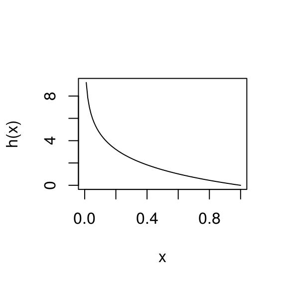


Y entonces la pérdida (que llamamos **devianza**) que construimos está dada, para
$(x,g)$ observado y probabilidades estimadas $\hat{p}_g(x)$ por

$$
- 2\log(\hat{p}_g(x))
$$

Su valor esperado (según el proceso que genera los datos) es nuestra medición
del desempeño del modelo $\hat{p}_g (x)$:

$$-2E\left [ \log(\hat{p}_G(X)) \right ]$$


**Observaciones**:

- Ojo: el nombre de devianza se utiliza
de manera diferente en distintos lugares (pero para cosas similares). 

- Usamos el factor 2 por razones históricas (la medida de devianza
definida en estadística tiene un 2, para usar más fácilmente en 
pruebas de hipótesis relacionadas con comparaciones de modelos). Para nuestros
propósitos, podemos usar o no el 2.

- No es fácil interpretar la devianza, pero es útil para comparar modelos. Veremos
otras medidas más fáciles de intrepretar más adelante.


Compara la siguiente definición con la que vimos para modelos de regresión:

\BeginKnitrBlock{comentario}<div class="comentario">Sea $${\mathcal L}=\{ (x^{(1)},g^{(1)}),(x^{(2)},g^{(2)}), \ldots, (x^{(N)}, g^{(N)}) \}$$
una muestra de entrenamiento, a partir de las cuales construimos mediante
un algoritmo  funciones estimadas
$\hat{p}_{g} (x)$ para $g=1,2,\ldots, K$. La **devianza promedio de entrenamiento** 
está dada por
\begin{equation}
\overline{err} = - \frac{2}{N}\sum_{i=1}^N log(\hat{p}_{g^{(i)}} (x^{(i)}))
  (\#eq:devianza)
\end {equation}

Sea $${\mathcal T}=\{ (x_0^{(1)},g_0^{(1)}),(x_0^{(2)},g_0^{(2)}), \ldots, (x_0^{(m)}, g_0^{(m)}) \}$$ una muestra de prueba. La **devianza promedio de prueba** es
\begin{equation}
\hat{Err} = - \frac{2}{m}\sum_{i=1}^m log(\hat{p}_{g_0^{(i)}} (x_0^{(i)}))
\end {equation}
que es una estimación de la devianza de predicción
$$-2E\left [ \log(\hat{p}_G(X)) \right ]$$</div>\EndKnitrBlock{comentario}


#### Ejemplo {-}

Regresamos a nuestros ejemplo de impago de tarjetas de crédito. Primero
calculamos la devianza de entrenamiento


```r
s <- function(x) -2*log(x)

vmc <- kknn(g ~ x, train = dat_ent,  k = 60,
              test = dat_ent, kernel = 'rectangular')
dat_dev <- dat_ent %>% select(x,g)
dat_dev$hat_p_1 <- predict(vmc, type ='prob')[,1]
dat_dev$hat_p_2 <- predict(vmc, type ='prob')[,2]
dat_dev <- dat_dev %>% mutate(hat_p_g = ifelse(g==1, hat_p_1, hat_p_2))
```

Nótese que dependiendo de qué clase observamos (columna $g$), extraemos la
probabilidad correspondiente a la columna hat_p_g:


```r
head(dat_dev, 50)
```

```
## # A tibble: 50 x 5
##             x      g   hat_p_1    hat_p_2   hat_p_g
##         <dbl> <fctr>     <dbl>      <dbl>     <dbl>
##  1  0.5320942      1 0.9666667 0.03333333 0.9666667
##  2 25.3910853      1 0.8833333 0.11666667 0.8833333
##  3 37.4805755      1 0.8500000 0.15000000 0.8500000
##  4 20.8732917      1 0.9000000 0.10000000 0.9000000
##  5 70.8899113      2 0.6000000 0.40000000 0.4000000
##  6 14.8300636      1 0.9333333 0.06666667 0.9333333
##  7 49.4363507      1 0.8000000 0.20000000 0.8000000
##  8 20.9386771      1 0.9000000 0.10000000 0.9000000
##  9 35.4585176      1 0.7500000 0.25000000 0.7500000
## 10  9.8302441      1 0.9333333 0.06666667 0.9333333
## # ... with 40 more rows
```

Ahora aplicamos la función $s$ que describimos arriba, y promediamos sobre
el conjunto de entrenamiento:


```r
dat_dev <- dat_dev %>% mutate(dev = s(hat_p_g))
dat_dev %>% ungroup %>% summarise(dev_entrena = mean(dev))
```

```
## # A tibble: 1 x 1
##   dev_entrena
##         <dbl>
## 1   0.6997961
```

Recordemos que la devianza de entrenamiento no es la cantidad que evalúa el
desempeño del modelo. Hagamos el cálculo entonces para una muestra de prueba:


```r
set.seed(1213)
x <- pmin(rexp(1000,1/30),100)
probs <- p_1(x)
g <- ifelse(rbinom(length(x), 1, probs)==1 ,1, 2)
dat_prueba <- data_frame(x = x, g = factor(g))

vmc <- kknn(g ~ x, train = dat_ent,  k = 60,
              test = dat_prueba, kernel = 'rectangular')
dat_dev <- dat_prueba %>% select(x,g)
dat_dev$hat_p_1 <- predict(vmc, type ='prob')[,1]
dat_dev$hat_p_2 <- predict(vmc, type ='prob')[,2]
dat_dev <- dat_dev %>% mutate(hat_p_g = ifelse(g==1, hat_p_1, hat_p_2))
dat_dev <- dat_dev %>% mutate(dev = s(hat_p_g))
dat_dev %>% ungroup %>% summarise(dev_prueba = mean(dev))
```

```
## # A tibble: 1 x 1
##   dev_prueba
##        <dbl>
## 1  0.7113815
```


### Ejercicio
Utiliza 5, 20, 60, 200 y 400 vecinos más cercanos para nuestro ejemplo de tarjetas
de crédito. ¿Cuál tiene menor devianza de prueba? ¿Cuál tiene menor devianza
de entrenamiento? Grafica el mejor que obtengas y otros dos modelos malos. ¿Por qué
crees que la devianza es muy grande para los modelos malos? 

Nota: ten cuidado con probabilidades iguales a 0 o 1, pues en en estos casos
la devianza puede dar $\infty$. Puedes por ejemplo hacer que las probabilidades
siempre estén en $[\epsilon, 1-\epsilon]$ para $\epsilon>0$ chica.

Empieza con el código en *clase_3_ejercicio.R*.


### Error de clasificación y función de pérdida 0-1

Otra  medida común para medir el error de un clasificador es
el *error de clasificación*, que también llamamos *probabilidad de clasificación
incorrecta*, o error bajo pérdida 0-1. 

\BeginKnitrBlock{comentario}<div class="comentario">Si $\hat{G}$ es un clasificador (que puede
ser construido a partir de probabilidades de clase),
decimos que su **error de clasificación** es

$$P(\hat{G}\neq G)$$

</div>\EndKnitrBlock{comentario}

Aunque esta definición aplica para cualquier clasificador, podemos usarlo
para clasificadores construidos con probabilidades de clase de la siguiente
forma:

\BeginKnitrBlock{comentario}<div class="comentario">Sean $\hat{p}_g(x)$ probabilidades de clase estimadas. El clasificador asociado
está dado por
$$\hat{G} (x) = \arg\max_g \hat{p}_g(x)$$
Podemos estimar su  error de clasificación $P(\hat{G} \neq G)$ con una muestra
de prueba
$${\mathcal T}=\{ (x_0^{(1)},g_0^{(1)}),(x_0^{(2)},g_0^{(2)}), \ldots, (x_0^{(m)}, g_0^{(m)})$$
mediante
$$\hat{Err} = \frac{1}{m} \sum_{j=i}^m I(\hat{G}(x_0^{(i)}) \neq g_0^{(i)}),$$
es decir, la proporción de casos de prueba que son clasificados incorrectamente.</div>\EndKnitrBlock{comentario}

#### Ejemplo {-}
Veamos cómo se comporta en términos de error de clasificación nuestro último modelo:


```r
dat_dev$hat_G <- predict(vmc)
dat_dev %>% mutate(correcto = hat_G == g) %>% 
  ungroup %>% summarise(p_correctos = mean(correcto)) %>%
  mutate(error_clasif = 1 - p_correctos)
```

```
## # A tibble: 1 x 2
##   p_correctos error_clasif
##         <dbl>        <dbl>
## 1       0.851        0.149
```


```r
vmc_2 <- kknn(g ~ x, train = dat_ent,  k = 3,
              test = dat_prueba, kernel = 'rectangular')
dat_dev$hat_G <- predict(vmc_2)
dat_dev %>% mutate(correcto = hat_G == g) %>% 
  ungroup %>% summarise(p_correctos = mean(correcto)) %>%
  mutate(error_clasif = 1 - p_correctos)
```

```
## # A tibble: 1 x 2
##   p_correctos error_clasif
##         <dbl>        <dbl>
## 1        0.82         0.18
```

### Discusión: relación entre devianza y error de clasificación

Cuando utilizamos devianza,
el mejor desempeño se alcanza cuando las probabilidades $\hat{p}_g (x)$
están bien calibradas, es decir, están cercanas a las probabilidades 
verdaderas $p_g (x)$. Esto se puede ver demostrando que las probabilidades
$\hat{p}_g (x)$ que minimizan la devianza 
$$-2E(\log (\hat{p}_G (X))) = -2E_X \left[  \sum_{k=1}^K p_g(X)\log\hat{p}_g(X)    \right]$$

son precisamente $\hat{p}_g (x)=p_g (x)$. 

Por otro lado, si consideramos el error de clasificación $P(\hat{G}\neq G)$,
es posible demostrar que se minimiza cuando
$\hat{G} = G_{bayes}$, donde

$${G}_{bayes} (x) = \arg\max_g {p}_g(x).$$

En consecuencia, cuando las $\hat{p}_g(x)$ estimadas están cercanas 
a las verdaderas $p_g (x)$ (que es lo que intentamos hacer cuando usamos devianza),
el clasificador $\hat{G}(x)$ producido a partir de las $\hat{p}_g(x)$ deberá
estar cercano a $G_{bayes}(x)$, que es el clasificador que minimiza el error
de clasificación.

Este argumento explica que buscar modelos con devianza baja no está alineado
con buscar modelos con error de clasificación bajo.

Cuando sea posible, es mejor trabajar con probabilidades de clase y devianza que solamente
con clasificadores y error de clasificación. Hay varias razones para esto:

- Tenemos una medida de qué tan seguros estamos en la clasificación (por ejemplo,
$p_1 = 0.55$ en vez de $p_1 = 0.995$). 
- La salida de probabilides es un insumo más útil para tareas posteriores (por ejemplo,
si quisiéramos ofrecer las 3 clases más probables en clasificación de imágenes).
- Permite hacer selección de modelos de manera más atinada: por ejemplo, dada una
misma tasa de correctos, preferimos aquellos modelos que lo hacen con probabilidades
que discriminan más (más altas cuando está en lo correcto y más bajas cuando 
se equivoca).


## Regresión logística

En $k$ vecinos más cercanos, intentamos estimar directamente con promedios
las probabilidades de clase. Regresión logística (y otros métodos, como redes neuronales),
son ajustados intentando minimizar la devianza de entrenamiento. Esto es necesario
si queremos aprovechar la estructura adicional que estos modelos aportan (recordemos
el caso de regresión lineal: intentamos minimizar el error de entrenamiento para
estimar nuestro predictor, y así podíamos explotar apropiadamente
la estructura lineal del problema).


Regresión logística es un método lineal de clasificación, en el sentido de
que produce fronteras lineales de decisión para el clasificador asociado.

#### Ejemplo {-}
Mostramos aquí una frontera de decisión de regresión logística y una de
k vecinos más cercanos:

```r
knitr::include_graphics(path = c("imagenes/clas_lineal.png", "imagenes/clas_nolineal.png"))
```


### Regresión logística simple

Vamos a construir el modelo de regresión logística (binaria) 
para una sola entrada.
Suponemos que
tenemos una sola entrada $X_1$, y  
que $G\in\{1,2\}$. Nos convendrá crear una nueva variable $Y$ dada por
$Y=1$ si $G=2$, $Y=0$ si $G=1$. 

Nótese que intentar estimar las probabilidades de clase $p_1(x)$ de forma lineal con

$$p_1(x)=\beta_0+\beta_1 x_1$$
tiene el defecto de que el lado derecho puede producir valores fuera
de $[0,1]$. La idea es entonces aplicar una función $h$ simple
que transforme la recta real al intervalo $[0,1]:$
$$p_1(x) = h(\beta_0+\beta_1 x_1),$$
donde $h$ es una función que toma valores en $[0,1]$. ¿Cúal es la función
más simple que hace esto?

### Función logística
 Comenzamos con el caso más simple, poniendo
$\beta_0=0$ y $\beta_1=1$, de modo que
$$p_1(x)=h(x).$$
¿Cómo debe ser $h$ para garantizar que $h(x)$ está entre 0 y 1 para toda $x$?
No van a funcionar polinomios, por ejemplo, porque para un polinomio cuando
$x$ tiende a infinito, el polinomio tiende a $\infty$ o a $-\infty$.
Hay varias posibilidades, pero una de las más simples es tomar (ver gráfica
al margen):

\BeginKnitrBlock{comentario}<div class="comentario">La función logística está dada por
$$h(x)=\frac{e^x}{1+e^x}$$</div>\EndKnitrBlock{comentario}

```r
h <- function(x){exp(x)/(1+exp(x)) }
curve(h, from=-6, to =6)
```

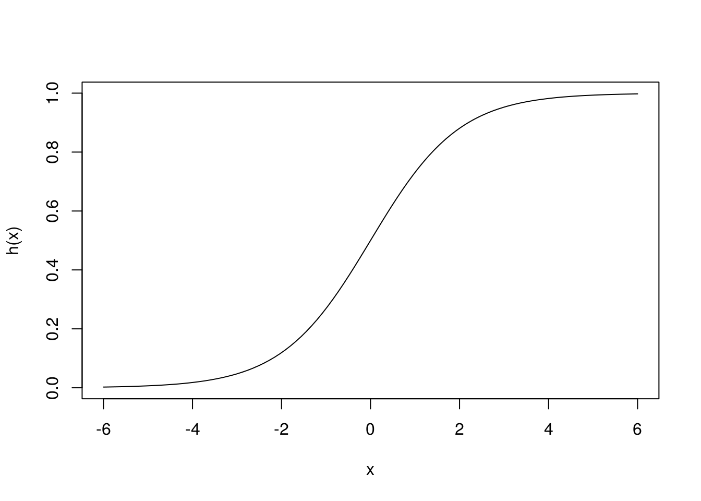
```

Esta función comprime adecuadamente (para nuestros propósitos) 
el rango de todos los reales dentro del intervalo $[0,1]$.


\BeginKnitrBlock{comentario}<div class="comentario">El modelo de regresión logística simple está dado por
$$p_1(x)=p_1(x;\beta)= h(\beta_0+\beta_1x_1)= \frac{e^{\beta_0+\beta_1x_1}}{1+ e^{\beta_0+\beta_1x_1}},$$
y $$p_0(x)=p_0(x;\beta)=1-p_1(x;\beta),$$
donde $\beta=(\beta_0,\beta_1)$.</div>\EndKnitrBlock{comentario}

Este es un modelo paramétrico con 2 parámetros.

#### Ejercicio {-}

- Demostrar que, si $p_1(x)$ está dado como en la ecuación anterior, entonces
también podemos escribir:
$$p_o(x)=\frac{1}{1+e^{\beta_0+\beta_1x_1}}.$$

- Graficar las funciones $p_1(x;\beta)$ para distintos
valores de $\beta_0$ y $\beta_1$.

#### Ejemplo
En nuestro ejemplo:


```r
graf_data <- data_frame(x = seq(0,100, 1))
vmc_graf <- kknn(g ~ x, train = dat_ent,  k = 60,
              test = graf_data, kernel = 'rectangular')
graf_data$p_1 <- vmc_graf$prob[ ,1]
graf_verdadero <- data_frame(x = 0:100, p_1 = p_1(x))
graf_1 + 
  geom_line(data = graf_data, aes(y = p_1), colour = 'red', size=1.2) +
  geom_line(data = graf_verdadero, aes(y = p_1)) +
  ylab('Probabilidad al corriente') + xlab('% crédito usado')
```

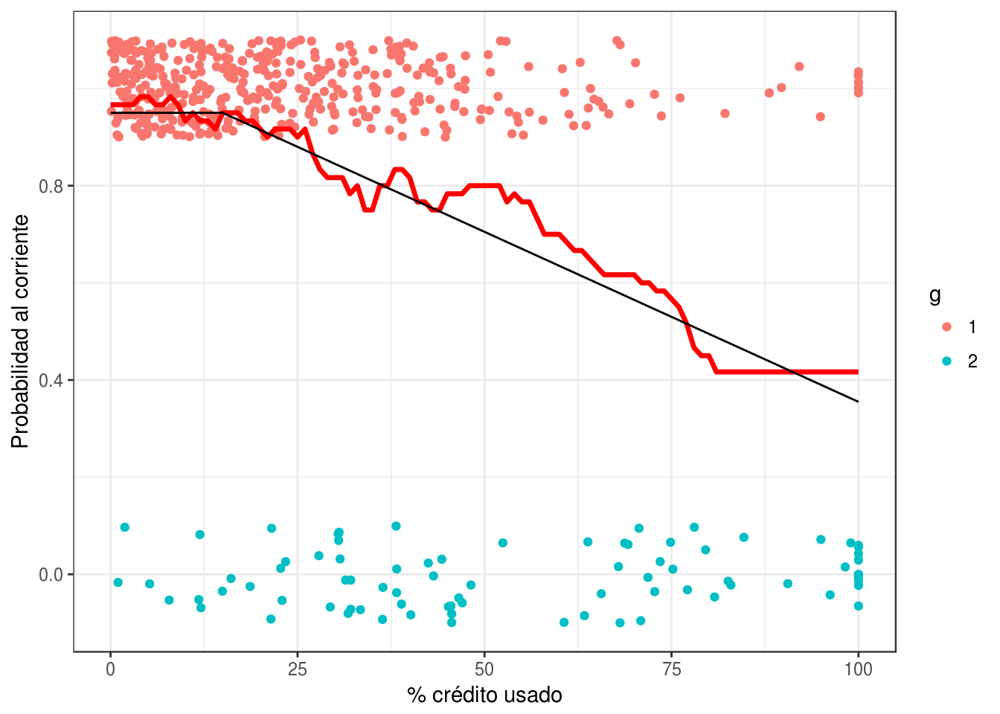

Ahora intentaremos ajustar a mano (intenta cambiar
las betas para p_mod_1 y p_mod_2 en el ejemplo de abajo) 
algunos modelos logísticos para las probabilidades
de clase:


```r
h <- function(z) exp(z)/(1+exp(z))
p_logistico <- function(beta_0, beta_1){
  p <- function(x){
    z <- beta_0 + beta_1*x
    h(z)
  }
}
p_mod_1 <- p_logistico(-20, 1)
p_mod_2 <- p_logistico(3, -0.04)
graf_data <- graf_data %>% 
  mutate(p_mod_1 = p_mod_1(x), p_mod_2 = p_mod_2(x))
graf_1 + 
  geom_line(data = graf_data, aes(y = p_mod_2), colour = 'red', size=1.2) +
    geom_line(data = graf_data, aes(y = p_mod_1), colour = 'orange', size=1.2) +
  geom_line(data = graf_verdadero, aes(y = p_1)) +
  ylab('Probabilidad al corriente') + xlab('% crédito usado')
```

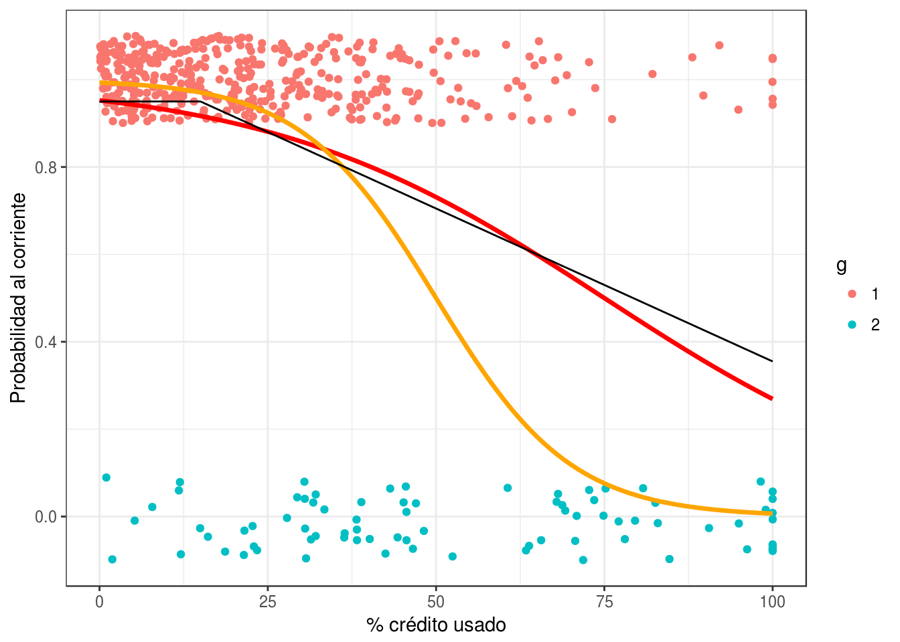

Podemos usar también la función glm de R para ajustar los coeficientes:


```r
mod_1 <- glm(g==1 ~ x, data = dat_ent, family = 'binomial')
coef(mod_1)
```

```
## (Intercept)           x 
##  3.24467326 -0.04353428
```

```r
p_mod_final <- p_logistico(coef(mod_1)[1], coef(mod_1)[2])
graf_data <- graf_data %>% 
  mutate(p_mod_f = p_mod_final(x))

graf_1 + 
  geom_line(data = graf_data, aes(y = p_mod_f), colour = 'red', size=1.2) +
    geom_line(data = graf_data, aes(y = p_mod_1), colour = 'orange', size=1.2) +
  geom_line(data = graf_verdadero, aes(y = p_1)) +
  ylab('Probabilidad al corriente') + xlab('% crédito usado')
```

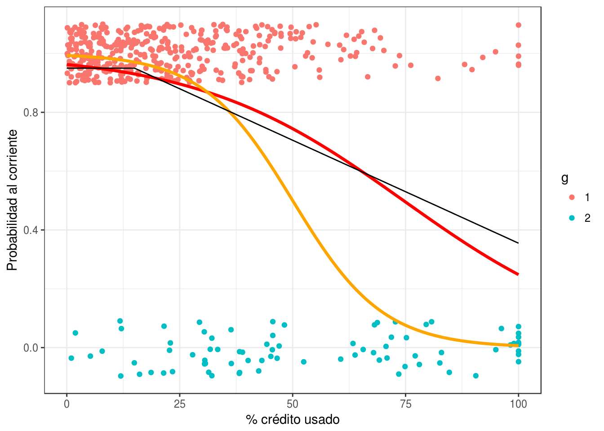


### Regresión logística

Ahora escribimos el modelo cuando tenemos más de una entrada. La idea es la misma:
primero combinamos las variables linealmente usando pesos $\beta$, y despúes
comprimimos a $[0,1]$ usando la función logística:

\BeginKnitrBlock{comentario}<div class="comentario">El modelo de regresión logística está dado por
$$p_1(x)=p_1(x;\beta)= h(\beta_0+\beta_1x_1 + \beta_2x_2 +\cdots + \beta_p x_p),$$
y $$p_0(x)=p_0(x;\beta)=1-p_1(x;\beta),$$
donde $\beta=(\beta_0,\beta_1, \ldots, \beta_p)$.</div>\EndKnitrBlock{comentario}

## Aprendizaje de coeficientes para regresión logística (binomial).


Ahora veremos cómo aprender los coeficientes con una muestra de entrenamiento. La idea
general es :

- Usamos la devianza de entrenamiento como medida de ajuste
- Usamos descenso en gradiente para minimizar esta devianza y aprender los coeficientes.


Sea entonces ${\mathcal L}$ una muestra de entrenamiento:

$${\mathcal L}=\{ (x^{(1)},y^{(1)}),(x^{(2)},y^{(2)}), \ldots, (x^{(N)}, y^{(N)}) \}$$

Donde $y=1$ o $y=0$ son las dos clases. Escribimos también


$$p_1(x)=p_1(x;\beta)= h(\beta_0+\beta_1x_1 + \beta_2x_2 +\cdots + \beta_p x_p),$$

y definimos la devianza sobre el conjunto de entrenamiento

$$D(\beta) = -2\sum_{i=1}^N \log(p_{y^{(i)}} (x^{(i)})).$$ 

Los **coeficientes estimados por regresión logística** están dados por
$$\hat{\beta} = \arg\min_\beta D(\beta)$$

Para minimizar utilizaremos descenso en gradiente (aunque hay más opciones).

La última expresión para $D(\beta)$ puede ser difícil de operar, pero podemos reescribir como:
$$D(\beta) = -2\sum_{i=1}^N y^{(i)} \log(p_{1} (x^{(i)})) + (1-y^{(i)}) \log(p_{0} (x^{(i)})).$$ 


Para hacer descenso en gradiente, necesitamos encontrar $\frac{\partial D}{\beta_j}$
para $j=1,2,\ldots,p$.

Igual que en regresión lineal, comenzamos por calcular la derivada de un término:

$$D^{(i)} (\beta) = y^{(i)} \log(p_{1} (x^{(i)})) + (1-y^{(i)}) \log(1-p_{1} (x^{(i)}))$$


Calculamos primero las derivadas de $p_1 (x^{(i)};\beta)$ (demostrar la siguiente ecuación):
$$\frac{\partial  p_1}{\partial \beta_0} = {p_1(x^{(i)})(1-p_1(x^{(i)}))},$$
y 
$$\frac{\partial  p_1}{\partial \beta_j} = p_1(x^{(i)})(1-p_1(x^{(i)}))x_j^{(i)},$$

Así que
\begin{align*}
\frac{\partial D^{(i)}}{\partial \beta_j} &= \frac{y^{(i)}}{(p_1(x^{(i)}))}\frac{\partial  p_1}{\partial \beta_j} -
\frac{1- y^{(i)}}{(1-p_1(x^{(i)}))}\frac{\partial  p_1}{\partial \beta_j} \\
 &= \left( \frac{y^{(i)} - p_1(x^{(i)})}{(p_1(x^{(i)}))(1-p_1(x^{(i)}))}  \right )\frac{\partial  p_1}{\partial \beta_j} \\
 & = \left ( y^{(i)} - p_1(x^{(i)}) \right ) x_j^{(i)} \\ 
\end{align*}

para $j=0,1,\ldots,p$, usando la convención de $x_0^{(i)}=1$. Podemos sumar
ahora sobre la muestra de entrenamiento para obtener


$$ \frac{\partial D}{\partial\beta_j} = - 2\sum_{i=1}^N  (y^{(i)}-p(x^{(i)}))x_j^{(i)}$$

De modo que, 

\BeginKnitrBlock{comentario}<div class="comentario">Para un paso $\eta>0$ fijo, la iteración de descenso para regresión logística para
el coeficiente $\beta_j$ es:
$$\beta_{j}^{(k+1)} = \beta_j^{(k)} + {2\eta} \sum_{i=1}^N (y^{(i)}-p(x^{(i)}))x_j^{(i)}$$
para 
$j=0,1,\ldots, p$, donde fijamos $x_0^{(i)}=1$.</div>\EndKnitrBlock{comentario}


Podríamos usar las siguientes implementaciones, que representan cambios
menores de lo que hicimos en regresión lineal:


```r
devianza_calc <- function(x, y){
  dev_fun <- function(beta){
    p_beta <- h(as.matrix(cbind(1, x)) %*% beta) 
   -2*sum(y*log(p_beta) + (1-y)*log(1-p_beta))
  }
  dev_fun
}

grad_calc <- function(x_ent, y_ent){
  salida_grad <- function(beta){
    p_beta <- h(as.matrix(cbind(1, x_ent)) %*% beta) 
    e <- y_ent - p_beta
    grad_out <- -2*as.numeric(t(cbind(1,x_ent)) %*% e)
    names(grad_out) <- c('Intercept', colnames(x_ent))
    grad_out
  }
  salida_grad
}
descenso <- function(n, z_0, eta, h_deriv){
  z <- matrix(0,n, length(z_0))
  z[1, ] <- z_0
  for(i in 1:(n-1)){
    z[i+1, ] <- z[i, ] - eta * h_deriv(z[i, ])
  }
  z
}
```

#### Ejemplo {-}
Probemos nuestros cálculos con el ejemplo de 1 entrada de tarjetas de crédito.


```r
dat_ent$y <- as.numeric(dat_ent$g==1)
dat_ent <- dat_ent %>% ungroup %>% mutate(x_s = (x - mean(x))/sd(x))
devianza <- devianza_calc(dat_ent[, 'x_s', drop = FALSE], dat_ent$y)
grad <- grad_calc(dat_ent[, 'x_s', drop = FALSE], dat_ent$y)
grad(c(0,1))
```

```
## Intercept       x_s 
## -354.2728  363.2408
```

```r
grad(c(0.5,-0.1))
```

```
## Intercept       x_s 
## -217.8069  140.9315
```
Verificamos cálculo de gradiente:

```r
(devianza(c(0.5+0.0001,-0.1)) - devianza(c(0.5,-0.1)))/0.0001
```

```
## [1] -217.7951
```

```r
(devianza(c(0.5,-0.1+0.0001)) - devianza(c(0.5,-0.1)))/0.0001
```

```
## [1] 140.9435
```
Y hacemos descenso:

```r
iteraciones <- descenso(200, z_0=c(0,0), eta = 0.001, h_deriv = grad)
tail(iteraciones, 20)
```

```
##            [,1]      [,2]
## [181,] 2.017177 -1.085143
## [182,] 2.017177 -1.085143
## [183,] 2.017178 -1.085144
## [184,] 2.017178 -1.085144
## [185,] 2.017178 -1.085144
## [186,] 2.017178 -1.085144
## [187,] 2.017178 -1.085144
## [188,] 2.017179 -1.085144
## [189,] 2.017179 -1.085144
## [190,] 2.017179 -1.085144
## [191,] 2.017179 -1.085144
## [192,] 2.017179 -1.085144
## [193,] 2.017179 -1.085145
## [194,] 2.017179 -1.085145
## [195,] 2.017179 -1.085145
## [196,] 2.017180 -1.085145
## [197,] 2.017180 -1.085145
## [198,] 2.017180 -1.085145
## [199,] 2.017180 -1.085145
## [200,] 2.017180 -1.085145
```

```r
plot(apply(iteraciones, 1, devianza))
```

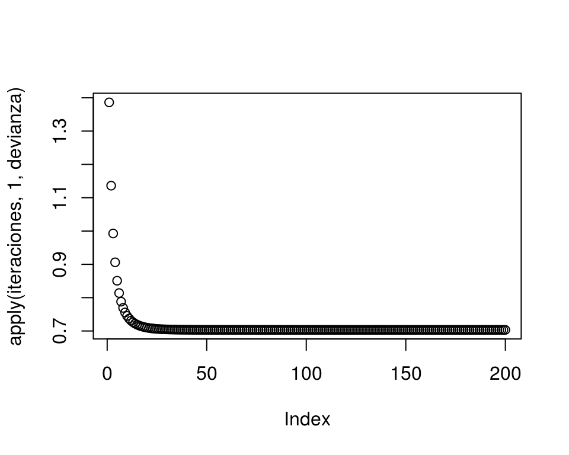

```r
matplot(iteraciones)
```

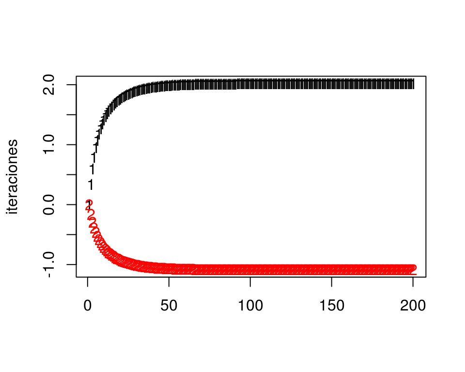

Comparamos con glm:

```r
mod_1 <- glm(y~x_s, data=dat_ent, family = 'binomial') 
coef(mod_1)
```

```
## (Intercept)         x_s 
##    2.017181   -1.085146
```

```r
mod_1$deviance
```

```
## [1] 351.676
```

```r
devianza(iteraciones[200,])
```

```
## [1] 351.676
```

Nótese que esta devianza está calculada sin dividir intre entre el número de casos. Podemos calcular la devianza promedio de entrenamiento haciendo:


```r
devianza(iteraciones[200,])/nrow(dat_ent)
```

```
## [1] 0.703352
```

## Observaciones adicionales


#### Máxima verosimilitud {-}

Es fácil ver que este método de estimación de los coeficientes (minimizando la
devianza de entrenamiento) es el método de máxima verosimilitud.  La verosimilitud
de la muestra de entrenamiento está dada por:

 $$L(\beta) =\prod_{i=1}^N p_{y^{(i)}} (x^{(i)})$$
Y la log verosimilitud es

 $$l(\beta) =\sum_{i=1}^N \log(p_{y^{(i)}} (x^{(i)})).$$

Así que ajustar el modelo minimizando la expresión
\@ref(eq:devianza)
es los mismo que hacer máxima verosimilitud (condicional a los valores de $x$).


#### Normalización {-}
Igual que en regresión lineal, en regresión logística conviene normalizar
las entradas antes de ajustar el modelo

#### Desempeño de regresión logística como método de aprendizaje {-}
Igual que en regresión lineal, regresión logística supera a métodos
más sofisticados o nuevos en numerosos ejemplos. Las razones son similares:
la rigidez de regresión logística es una fortaleza cuando la estructura
lineal es una buena aproximación.

#### Solución analítica
El problema de regresión logística no tiene solución analítica. Paquetes
como *glm* utilizan métodos numéricos (Newton-Raphson para regresión logística,
por ejemplo).

#### Interpretación de modelos logísticos
**Todas** las precauciones que mencionamos en modelos lineales aplican
para los modelos logísticos (aspectos estadísticos del ajuste, 
relación con fenómeno de interés, argumentos
de causalidad). 

Igual que en regresión lineal, podemos explicar el comportamiento de las
probabilidades de clase ajustadas, pero es un poco más difícil por la 
no linealidad introducida por la función logística.


#### Ejemplo {-}

Consideremos el modelo ajustado:


```r
head(dat_ent)
```

```
## # A tibble: 6 x 5
##            x       p_1      g     y        x_s
##        <dbl>     <dbl> <fctr> <dbl>      <dbl>
## 1  0.5320942 0.9500000      1     1 -1.1098309
## 2 25.3910853 0.8772624      1     1 -0.1125285
## 3 37.4805755 0.7926360      1     1  0.3724823
## 4 20.8732917 0.9088870      1     1 -0.2937750
## 5 70.8899113 0.5587706      2     0  1.7128107
## 6 14.8300636 0.9500000      1     1 -0.5362196
```

```r
coeficientes <- iteraciones[200,]
coeficientes
```

```
## [1]  2.017180 -1.085145
```
Como centramos todas las entradas, la ordenada al origen se interpreta
como la probabilidad de clase cuando todas las variables están en su media:

```r
h(coeficientes[1])
```

```
## [1] 0.8825891
```


Esto quiere decir que la probabilidad de estar al corriente ds de 87\% cuando
la variable $x$ está en su media.

Si $x$ se incrementa en una desviación estándar, la cantidad
$$z = \beta_0 + \beta_1x$$
baja por la cantidad

```r
coeficientes[2]
```

```
## [1] -1.085145
```

Y la probabilidad de estar al corriente cambia a 70\%:

```r
h(coeficientes[1]+ coeficientes[2])
```

```
## [1] 0.7174879
```

Nótese que una desviación estándar de $x$ equivale a


```r
sd(dat_ent$x)
```

```
## [1] 24.92623
```

**Ojo**: En regresión lineal, las variables contribuyen independientemente
de otras al predictor. Eso no pasa en regresión logística debido a la no linealidad
introducida por la función logística $h$. Por ejemplo, imaginemos el modelo:

$$p(z) = h(0.5 + 0.2 x_1 -0.5 x_2),$$
y suponemos las entradas normalizadas.
Si todas las variables están en su media, la probabilidad de clase 1 es

```r
h(0.5)
```

```
## [1] 0.6224593
```

Si todas las variables están en su media, y cambiamos en 1 desviación estándar la
variable $x_1$, la probabilidad de clase 1 es:

```r
h(0.5+0.2)
```

```
## [1] 0.6681878
```

Y el cambio en puntos de probabilidad es:

```r
h(0.5+0.2) - h(0.5)
```

```
## [1] 0.04572844
```

Pero si la variable $x_2 = -1$, por ejemplo, el cambio en probabilidad es de

```r
h(0.5+ 0.2 + 0.5*1) - h(0.5 + 0.5*1)
```

```
## [1] 0.0374662
```

## Ejercicio: datos de diabetes

Ya están divididos los datos en entrenamiento y prueba


```r
diabetes_ent <- as_data_frame(MASS::Pima.tr)
diabetes_pr <- as_data_frame(MASS::Pima.te)
diabetes_ent
```

```
## # A tibble: 200 x 8
##    npreg   glu    bp  skin   bmi   ped   age   type
##  * <int> <int> <int> <int> <dbl> <dbl> <int> <fctr>
##  1     5    86    68    28  30.2 0.364    24     No
##  2     7   195    70    33  25.1 0.163    55    Yes
##  3     5    77    82    41  35.8 0.156    35     No
##  4     0   165    76    43  47.9 0.259    26     No
##  5     0   107    60    25  26.4 0.133    23     No
##  6     5    97    76    27  35.6 0.378    52    Yes
##  7     3    83    58    31  34.3 0.336    25     No
##  8     1   193    50    16  25.9 0.655    24     No
##  9     3   142    80    15  32.4 0.200    63     No
## 10     2   128    78    37  43.3 1.224    31    Yes
## # ... with 190 more rows
```

```r
diabetes_ent$id <- 1:nrow(diabetes_ent)
diabetes_pr$id <- 1:nrow(diabetes_pr)
```

Normalizamos


```r
library(dplyr)
library(tidyr)
datos_norm <- diabetes_ent %>% 
  gather(variable, valor, npreg:age) %>%
  group_by(variable) %>%
  summarise(media = mean(valor), de = sd(valor))

normalizar <- function(datos, datos_norm){
  datos %>% 
    gather(variable, valor, npreg:age) %>%
    left_join(datos_norm) %>%
    mutate(valor_s = (valor  - media)/de) %>%
    select(id, type, variable, valor_s) %>%
    spread(variable, valor_s)
}

diabetes_ent_s <- normalizar(diabetes_ent, datos_norm)
diabetes_pr_s <- normalizar(diabetes_pr, datos_norm)
```


```r
x_ent <- diabetes_ent_s %>% select(age:skin) %>% as.matrix
p <- ncol(x_ent)
y_ent <- diabetes_ent_s$type == 'Yes'
grad <- grad_calc(x_ent, y_ent)
iteraciones <- descenso(1000, rep(0,p+1), 0.001, h_deriv = grad)
matplot(iteraciones)
```


```r
diabetes_coef <- data_frame(variable = c('Intercept',colnames(x_ent)), coef = iteraciones[1000,])
diabetes_coef
```

```
## # A tibble: 8 x 2
##    variable        coef
##       <chr>       <dbl>
## 1 Intercept -0.95583051
## 2       age  0.45200719
## 3       bmi  0.51263229
## 4        bp -0.05472949
## 5       glu  1.01705067
## 6     npreg  0.34734305
## 7       ped  0.55927529
## 8      skin -0.02247172
```

Ahora calculamos devianza de prueba y error de clasificación:


```r
x_prueba <- diabetes_pr_s %>% select(age:skin) %>% as.matrix
y_prueba <- diabetes_pr_s$type == 'Yes'
dev_prueba <- devianza_calc(x_prueba, y_prueba)
dev_prueba(iteraciones[1000,])/nrow(x_prueba)
```

```
## [1] 0.8813972
```

Y para el error clasificación de prueba, necesitamos las probabilidades de clase ajustadas:

```r
beta <- iteraciones[1000, ]
p_beta <- h(as.matrix(cbind(1, x_prueba)) %*% beta) 
y_pred <- as.numeric(p_beta > 0.5)
mean(y_prueba != y_pred)
```

```
## [1] 0.1987952
```

### Tarea {-}

La tarea está en el documento *scripts/tarea_3.Rmd* del repositorio.
