# Métodos basados en árboles: boosting


Boosting también utiliza la idea de un "ensamble" de árboles. La diferencia
grande con
 bagging y bosques aleatorios es que la sucesión de árboles de boosting se 
'adapta' al comportamiento del predictor a lo largo de las iteraciones, 
haciendo reponderaciones de los datos de entrenamiento para que el algoritmo
se concentre en las predicciones más pobres. Boosting generalmente funciona
bien con árboles chicos (cada uno con sesgo alto), mientras que bosques
aleatorios funciona con árboles grandes (sesgo bajo). 

- En boosting usamos muchos árboles chicos adaptados secuencialmente. La disminución
del sesgo proviene de usar distintos árboles que se encargan de adaptar el predictor
a distintas partes del conjunto de entrenamiento. El control de varianza se
logra con tasas de aprendizaje y tamaño de árboles, como veremos más adelante.

- En bosques aleatorios usamos muchos árboles grandes, cada uno con una muestra
de entrenamiento perturbada (bootstrap). El control de varianza se logra promediando sobre esas muestras bootstrap de entrenamiento.

Igual que bosques aleatorios, boosting es también un método que generalmente
tiene  alto poder predictivo.


## Forward stagewise additive modeling (FSAM)

Aunque existen versiones de boosting (Adaboost) desde los 90s, una buena
manera de entender los algoritmos es mediante un proceso general
de modelado por estapas (FSAM).

##  Discusión
Consideramos primero un problema de *regresión*, que queremos atacar
con un predictor de la forma
$$f(x) = \sum_{k=1}^m \beta_k b_k(x),$$
donde los $b_k$ son árboles. Podemos absorber el coeficiente $\beta_k$
dentro del árbol $b_k(x)$, y escribimos

$$f(x) = \sum_{k=1}^m T_k(x),$$


Para ajustar este tipo de modelos, buscamos minimizar
la pérdida de entrenamiento:

\begin{equation}
\min \sum_{i=1}^N L\left(y^{(i)}, \sum_{k=1}^M T_k(x^{(i)})\right)
\end{equation}

Este puede ser un problema difícil, dependiendo de la familia 
que usemos para los árboles $T_k$, y sería difícil resolver por fuerza bruta. Para resolver este problema, podemos
intentar una heurística secuencial o por etapas:

Si  tenemos
$$f_{m-1}(x) = \sum_{k=1}^{m-1} T_k(x),$$

intentamos resolver el problema (añadir un término adicional)

\begin{equation}
\min_{T} \sum_{i=1}^N L(y^{(i)}, f_{m-1}(x^{(i)}) + T(x^{(i)}))
\end{equation}

Por ejemplo, para pérdida cuadrática (en regresión), buscamos resolver

\begin{equation}
\min_{T} \sum_{i=1}^N (y^{(i)} - f_{m-1}(x^{(i)}) - T(x^{(i)}))^2
\end{equation}

Si ponemos 
$$ r_{m-1}^{(i)} = y^{(i)} - f_{m-1}(x^{(i)}),$$
que es el error para el caso $i$ bajo el modelo $f_{m-1}$, entonces
reescribimos el problema anterior como
\begin{equation}
\min_{T} \sum_{i=1}^N ( r_{m-1}^{(i)} - T(x^{(i)}))^2
\end{equation}

Este problema consiste en *ajustar un árbol a los residuales o errores
del paso anterior*. Otra manera de decir esto es que añadimos un término adicional
que intenta corregir lo que el modelo anterior no pudo predecir bien.
La idea es repetir este proceso para ir reduciendo los residuales, agregando
un árbol a la vez.

\BeginKnitrBlock{comentario}<div class="comentario">La primera idea central de boosting es concentrarnos, en el siguiente paso, en los datos donde tengamos errores, e intentar corregir añadiendo un término
adicional al modelo. </div>\EndKnitrBlock{comentario}

## Algoritmo FSAM

Esta idea es la base del siguiente algoritmo:

\BeginKnitrBlock{comentario}<div class="comentario">**Algoritmo FSAM** (forward stagewise additive modeling)

1. Tomamos $f_0(x)=0$
2. Para $m=1$ hasta $M$, 
  - Resolvemos
$$T_m = argmin_{T} \sum_{i=1}^N L(y^{(i)}, f_{m-1}(x^{(i)}) + T(x^{(i)}))$$
  - Ponemos
$$f_m(x) = f_{m-1}(x) + T_m(x)$$
3. Nuestro predictor final es $f(x) = \sum_{m=1}^M T_(x)$.</div>\EndKnitrBlock{comentario}


**Observaciones**:
Generalmente los árboles sobre los que optimizamos están restringidos a una familia relativamente chica: por ejemplo, árboles de profundidad no mayor a 
$2,3,\ldots, 8$.

Este algoritmo se puede aplicar directamente para problemas de regresión, como vimos en la discusión anterior: simplemente hay que ajustar árboles a los residuales del modelo del paso anterior. Sin embargo, no está claro cómo aplicarlo cuando la función de pérdida no es mínimos cuadrados (por ejemplo,
regresión logística). 


#### Ejemplo (regresión) {-}
Podemos hacer FSAM directamente sobre un problema de regresión.

```r
set.seed(227818)
library(rpart)
library(tidyverse)
x <- rnorm(200, 0, 30)
y <- 2*ifelse(x < 0, 0, sqrt(x)) + rnorm(200, 0, 0.5)
dat <- data.frame(x=x, y=y)
```

Pondremos los árboles de cada paso en una lista. Podemos comenzar con una constante
en lugar de 0.


```r
arboles_fsam <- list()
arboles_fsam[[1]] <- rpart(y~x, data = dat, 
                           control = list(maxdepth=0))
arboles_fsam[[1]]
```

```
## n= 200 
## 
## node), split, n, deviance, yval
##       * denotes terminal node
## 
## 1) root 200 5370.398 4.675925 *
```

Ahora construirmos nuestra función de predicción y el paso
que agrega un árbol


```r
predecir_arboles <- function(arboles_fsam, x){
  preds <- lapply(arboles_fsam, function(arbol){
    predict(arbol, data.frame(x=x))
  })
  reduce(preds, `+`)
}
agregar_arbol <- function(arboles_fsam, dat, plot=TRUE){
  n <- length(arboles_fsam)
  preds <- predecir_arboles(arboles_fsam, x=dat$x)
  dat$res <- y - preds
  arboles_fsam[[n+1]] <- rpart(res ~ x, data = dat, 
                           control = list(maxdepth = 1))
  dat$preds_nuevo <- predict(arboles_fsam[[n+1]])
  dat$preds <- predecir_arboles(arboles_fsam, x=dat$x)
  g_res <- ggplot(dat, aes(x = x)) + geom_line(aes(y=preds_nuevo)) +
    geom_point(aes(y=res)) + labs(title = 'Residuales') + ylim(c(-10,10))
  g_agregado <- ggplot(dat, aes(x=x)) + geom_line(aes(y=preds), col = 'red',
                                                  size=1.1) +
    geom_point(aes(y=y)) + labs(title ='Ajuste')
  if(plot){
    print(g_res)
    print(g_agregado)
  }
  arboles_fsam
}
```

Ahora construiremos el primer árbol. Usaremos 'troncos' (stumps), árboles con
un solo corte: Los primeros residuales son simplemente las $y$'s observadas


```r
arboles_fsam <- agregar_arbol(arboles_fsam, dat)
```

```
## Warning: Removed 8 rows containing missing values (geom_point).
```

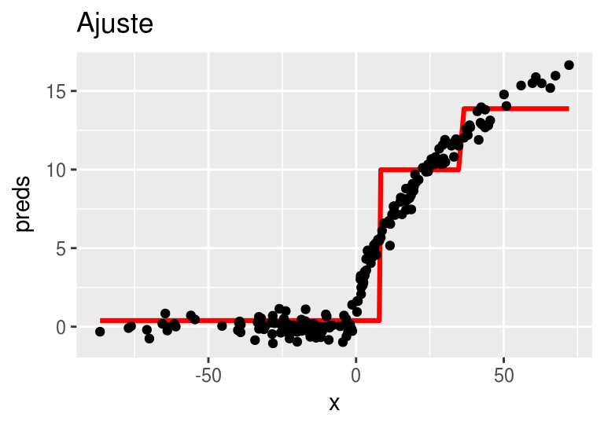

Ajustamos un árbol de regresión a los residuales:


```r
arboles_fsam <- agregar_arbol(arboles_fsam, dat)
```

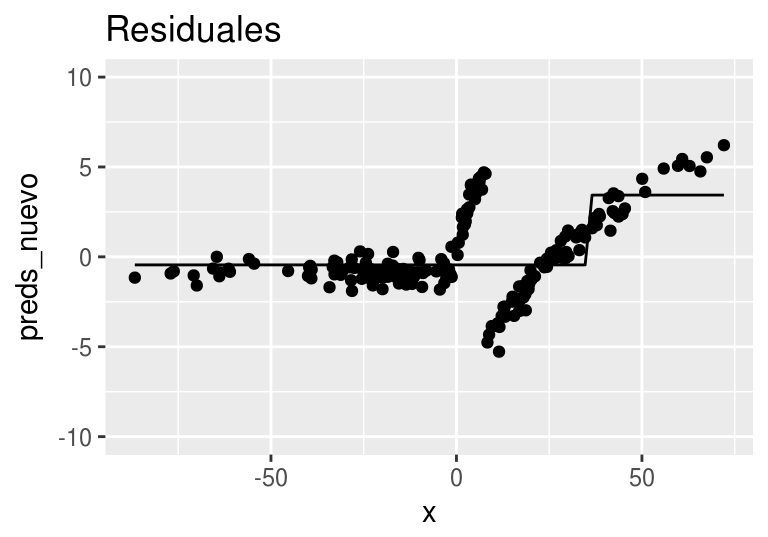


```r
arboles_fsam <- agregar_arbol(arboles_fsam, dat)
```


```r
arboles_fsam <- agregar_arbol(arboles_fsam, dat)
```

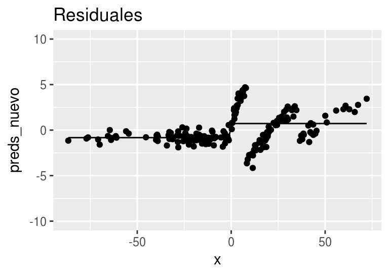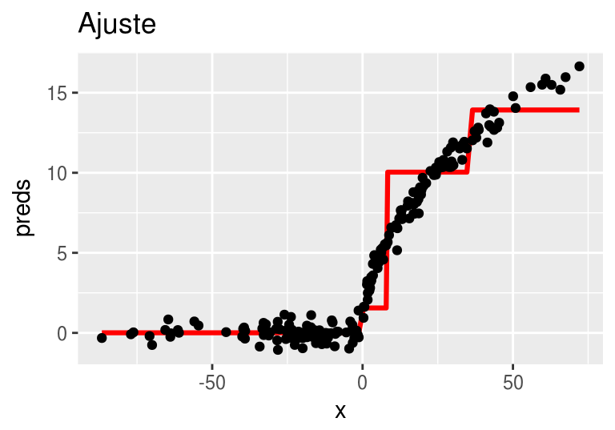


```r
arboles_fsam <- agregar_arbol(arboles_fsam, dat)
```

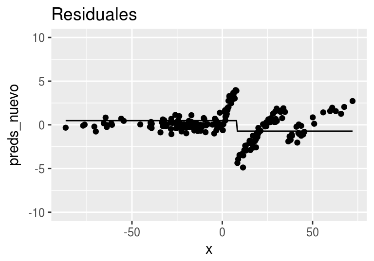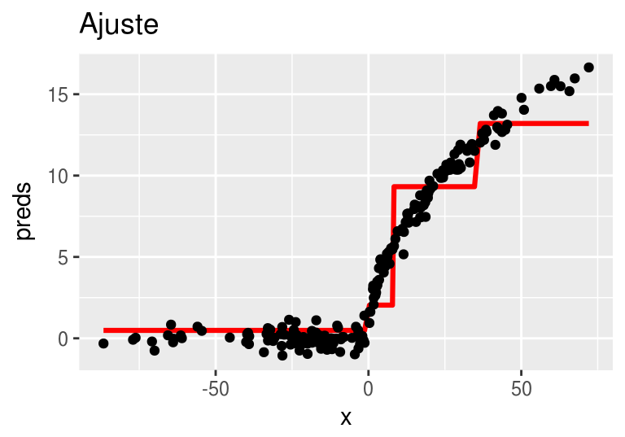


```r
arboles_fsam <- agregar_arbol(arboles_fsam, dat)
```

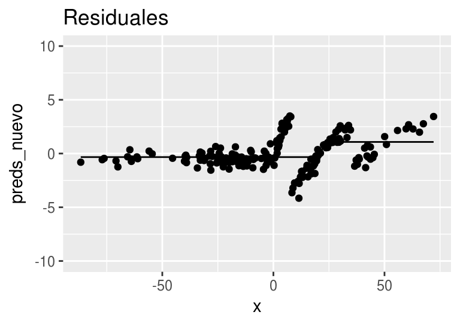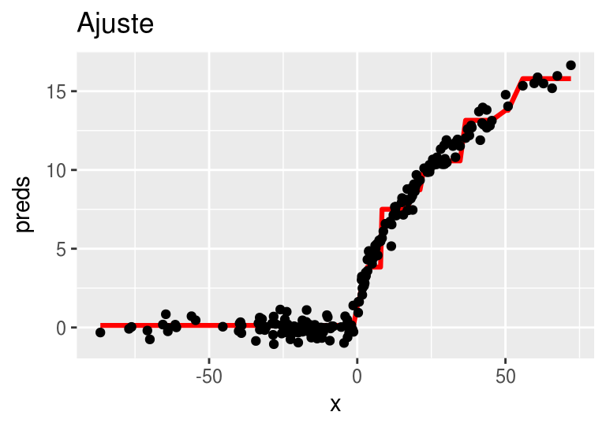

Después de 20 iteraciones obtenemos:


```r
for(j in 1:19){
arboles_fsam <- agregar_arbol(arboles_fsam, dat, plot = FALSE)
}
arboles_fsam <- agregar_arbol(arboles_fsam, dat)
```

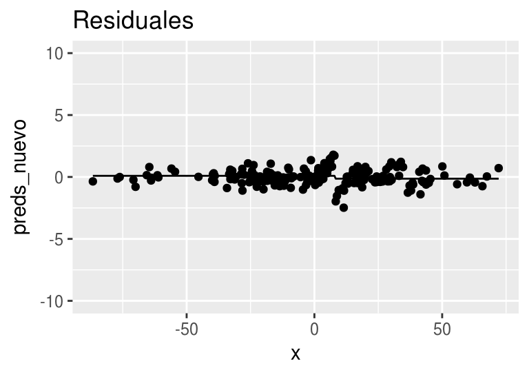


## FSAM para clasificación binaria.

Para problemas de clasificación, no tiene mucho sentido trabajar con un modelo
aditivo sobre las probabilidades:

$$p(x) = \sum_{k=1}^m T_k(x),$$

Así que hacemos lo mismo que en regresión logística. Ponemos

$$f(x) = \sum_{k=1}^m T_k(x),$$

y entonces las probabilidades son
$$p(x) = h(f(x)),$$

donde $h(z)=1/(1+e^{-z})$ es la función logística. La optimización de la etapa $m$ según fsam es

\begin{equation}
T = argmin_{T} \sum_{i=1}^N L(y^{(i)}, f_{m-1}(x^{(i)}) + T(x^{(i)}))
(\#eq:fsam-paso)
\end{equation}

y queremos usar la devianza como función de pérdida. Por razones
de comparación (con nuestro libro de texto y con el algoritmo Adaboost
que mencionaremos más adelante), escogemos usar 
$$y \in \{1,-1\}$$

en lugar de nuestro tradicional $y \in \{1,0\}$. En ese caso, la devianza
binomial se ve como

$$L(y, z) = -\left [ (y+1)\log h(z) - (y-1)\log(1-h(z))\right ],$$
que a su vez se puede escribir como (demostrar):

$$L(y,z) = 2\log(1+e^{-yz})$$
Ahora consideremos cómo se ve nuestro problema de optimización:

$$T = argmin_{T} 2\sum_{i=1}^N \log (1+ e^{-y^{(i)}(f_{m-1}(x^{(i)}) + T(x^{(i)})})$$

Nótese que sólo optimizamos con respecto a $T$, así que
podemos escribir

$$T = argmin_{T} 2\sum_{i=1}^N \log (1+ d_{m,i}e^{- y^{(i)}T(x^{(i)})})$$

Y vemos que el problema es más difícil que en regresión. No podemos usar
un ajuste de árbol usual de regresión o clasificación, *como hicimos en
regresión*. No está claro, por ejemplo, cuál debería ser el residual
que tenemos que ajustar (aunque parece un problema donde los casos
de entrenamiento están ponderados por $d_{m,i}$). Una solución para resolver aproximadamente este problema de minimización, es **gradient boosting**.

## Gradient boosting

La idea de gradient boosting es replicar la idea del residual en regresión, y usar
árboles de regresión para resolver \@ref(eq:fsam-paso).

Gradient boosting es una técnica general para funciones de pérdida
generales.Regresamos entonces a nuestro problema original

$$(\beta_m, b_m) = argmin_{T} \sum_{i=1}^N L(y^{(i)}, f_{m-1}(x^{(i)}) + T(x^{(i)}))$$

La pregunta es: ¿hacia dónde tenemos qué mover la predicción de
$f_{m-1}(x^{(i)})$ sumando
el término $T(x^{(i)})$? Consideremos un solo término de esta suma,
y denotemos $z_i = T(x^{(i)})$. Queremos agregar una cantidad $z_i$
tal que el valor de la pérdida
$$L(y, f_{m-1}(x^{(i)})+z_i)$$
se reduzca. Entonces sabemos que podemos mover la z en la dirección opuesta al gradiente

$$z_i = -\gamma \frac{\partial L}{\partial z}(y^{(i)}, f_{m-1}(x^{(i)}))$$

Sin embargo, necesitamos que las $z_i$ estén generadas por una función $T(x)$ que se pueda evaluar en toda $x$. Quisiéramos que
$$T(x^{(i)})\approx -\gamma \frac{\partial L}{\partial z}(y^{(i)}, f_{m-1}(x^{(i)}))$$
Para tener esta aproximación, podemos poner
$$g_{i,m} = -\frac{\partial L}{\partial z}(y^{(i)}, f_{m-1}(x^{(i)}))$$
e intentar resolver
\begin{equation}
\min_T \sum_{i=1}^n (g_{i,m} - T(x^{(i)}))^2,
(\#eq:min-cuad-boost)
\end{equation}

es decir, intentamos replicar los gradientes lo más que sea posible. **Este problema lo podemos resolver con un árbol usual de regresión**. Finalmente,
podríamos escoger $\nu$ (tamaño de paso) suficientemente chica y ponemos
$$f_m(x) = f_{m-1}(x)+\nu T(x).$$

Podemos hacer un refinamiento adicional que consiste en encontrar los cortes del árbol $T$ según \@ref(eq:min-cuad-boost), pero optimizando por separado los valores que T(x) toma en cada una de las regiones encontradas.

## Algoritmo de gradient boosting

\BeginKnitrBlock{comentario}<div class="comentario">**Gradient boosting** (versión simple)
  
1. Inicializar con $f_0(x) =\gamma$

2. Para $m=0,1,\ldots, M$, 

  - Para $i=1,\ldots, N$, calculamos el residual
  $$r_{i,m}=-\frac{\partial L}{\partial z}(y^{(i)}, f_{m-1}(x^{(i)}))$$
  
  - Ajustamos un árbol de regresión  a la respuesta $r_{1,m},r_{2,m},\ldots, r_{n,m}$. Supongamos que tiene regiones $R_{j,m}$.

  - Resolvemos (optimizamos directamente el valor que toma el árbol en cada región - este es un problema univariado, más fácil de resolver)
  $$\gamma_{j,m} = argmin_\gamma \sum_{x^{(i)}\in R_{j,m}} L(y^{(i)},f_{m-1}(x^{i})+\gamma )$$
    para cada región $R_{j,m}$ del árbol del inciso anterior.
  - Actualizamos $$f_m (x) = f_{m-1}(x) + \sum_j \gamma_{j,m} I(x\in R_{j,m})$$
  3. El predictor final es $f_M(x)$.</div>\EndKnitrBlock{comentario}


## Funciones de pérdida

Para aplicar gradient boosting, tenemos primero que poder calcular
el gradiente de la función de pérdida. Algunos ejemplos populares son:

- Pérdida cuadrática: $L(y,f(x))=(y-f(x))^2$, 
$\frac{\partial L}{\partial z} = -2(y-f(x))$.
- Pérdida absoluta (más robusta a atípicos que la cuadrática) $L(y,f(x))=|y-f(x)|$,
$\frac{\partial L}{\partial z} = signo(y-f(x))$.
- Devianza binomial $L(y, f(x)) = -\log(1+e^{-yf(x)})$, $y\in\{-1,1\}$,
$\frac{\partial L}{\partial z} = I(y=1) - h(f(x))$.
- Adaboost, pérdida exponencial (para clasificación) $L(y,z) = e^{-yf(x)}$,
$y\in\{-1,1\}$,
$\frac{\partial L}{\partial z} = -ye^{-yf(x)}$.

### Discusión: adaboost (opcional)

Adaboost es uno de los algoritmos originales para boosting, y no es necesario
usar gradient boosting para aplicarlo. La razón es que  los árboles de clasificación
$T(x)$ toman valores $T(x)\in \{-1,1\}$, y el paso de optimización
\@ref(eq:fsam-paso) de cada árbol queda

$$T = argmin_{T} \sum_{i=1}^N e^{-y^{(i)}f_{m-1}(x^{(i)})} e^{-y^{(i)}T(x^{(i)})}
$$
$$T = argmin_{T} \sum_{i=1}^N d_{m,i} e^{-y^{(i)}T(x^{(i)})}
$$
De modo que la función objetivo toma dos valores: Si $T(x^{i})$ clasifica
correctamente, entonces $e^{-y^{(i)}T(x^{(i)})}=e^{-1}$, y si
clasifica incorrectamente $e^{-y^{(i)}T(x^{(i)})}=e^{1}$. Podemos entonces
encontrar el árbol $T$ construyendo un árbol usual pero con datos ponderados
por $d_{m,i}$, donde buscamos maximizar la tasa de clasificación correcta (puedes
ver más en nuestro libro de texto, o en [@ESL].

¿Cuáles son las consecuencias de usar la pérdida exponencial? Una es que perdemos
la conexión con los modelos logísticos e interpretación de probabilidad que tenemos
cuando usamos la devianza. Sin embargo, son similares: compara cómo se ve
la devianza (como la formulamos arriba, con $y\in\{-1,1\}$) con la pérdida exponencial.

### Ejemplo {-}

Podemos usar el paquete de R *gbm* para hacer gradient boosting. Para el 
caso de precios de casas de la sección anterior (un problema de regresión).


Fijaremos el número de árboles en 200, de profundidad 3, usando
75\% de la muestra para entrenar y el restante para validación:


```r
library(gbm)
entrena <- read_rds('datos/ameshousing-entrena-procesado.rds')
set.seed(23411)

ajustar_boost <- function(entrena, ...){
  mod_boosting <- gbm(log(vSalePrice) ~.,  data = entrena,
                distribution = 'gaussian',
                n.trees = 200, 
                interaction.depth = 3,
                shrinkage = 1, # tasa de aprendizaje
                bag.fraction = 1,
                train.fraction = 0.75)
  mod_boosting
}

house_boosting <- ajustar_boost(entrena)
dat_entrenamiento <- data_frame(entrena = sqrt(house_boosting$train.error),
                                valida = sqrt(house_boosting$valid.error),
                                n_arbol = 1:length(house_boosting$train.error)) %>%
                      gather(tipo, valor, -n_arbol)
print(house_boosting)
```

```
## gbm(formula = log(vSalePrice) ~ ., distribution = "gaussian", 
##     data = entrena, n.trees = 200, interaction.depth = 3, shrinkage = 1, 
##     bag.fraction = 1, train.fraction = 0.75)
## A gradient boosted model with gaussian loss function.
## 200 iterations were performed.
## The best test-set iteration was 20.
## There were 79 predictors of which 28 had non-zero influence.
```

```r
ggplot(dat_entrenamiento, aes(x=n_arbol, y=valor, colour=tipo, group=tipo)) +
  geom_line()
```

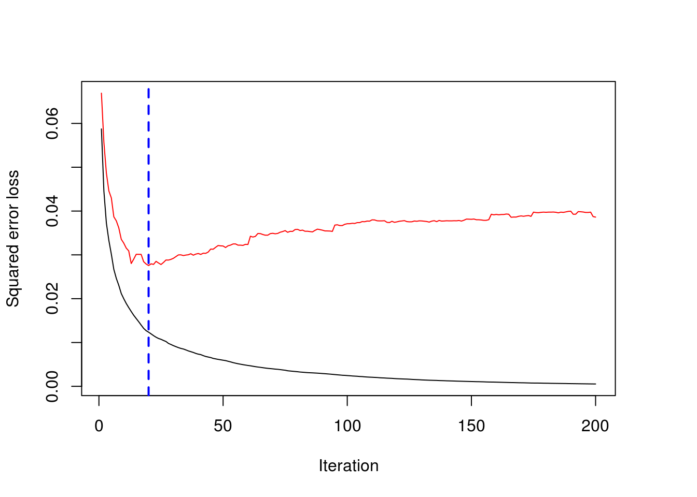

Que se puede graficar también así:

```r
gbm.perf(house_boosting)
```

```
## Using test method...
```

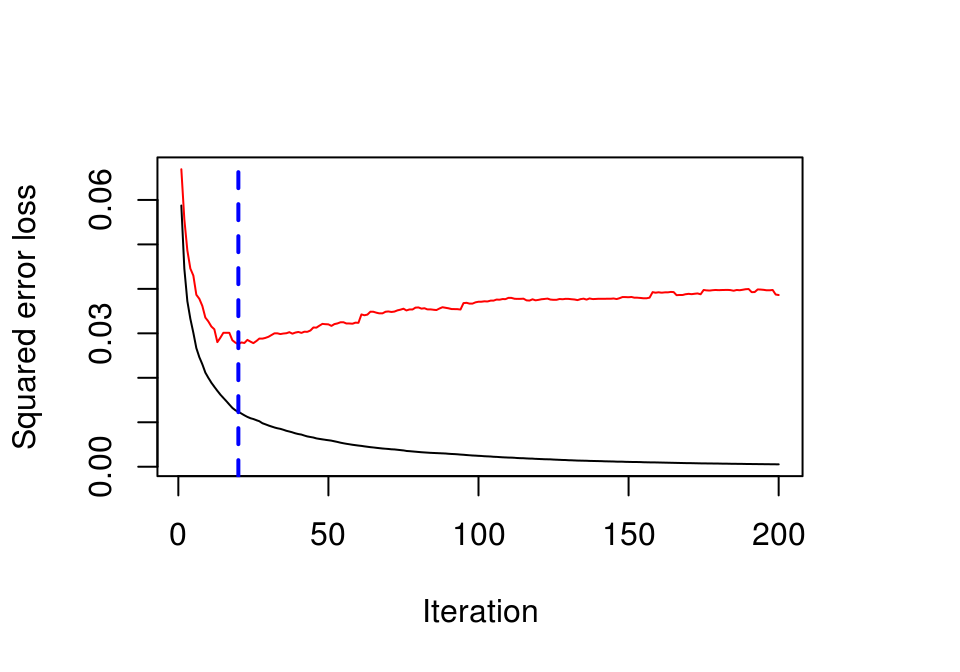

```
## [1] 20
```
Como vemos, tenemos que afinar los parámetros del algoritmo. 


## Modificaciones de Gradient Boosting

Hay algunas adiciones al algoritmo de gradient boosting que podemos
usar para mejorar el desempeño. Los dos métodos que comunmente se
usan son encogimiento (*shrinkage*), que es una especie de tasa de 
aprendizaje, y submuestreo, donde construimos cada árbol adicional 
usando una submuestra de la muestra de entrenamiento.

Ambas podemos verlas como técnicas de regularización, que limitan
sobreajuste producido por el algoritmo agresivo de boosting.


### Tasa de aprendizaje (shrinkage)
Funciona bien modificar el algoritmo usando una tasa de aprendizae
$0<\nu<1$:
$$f_m(x) = f_{m-1}(x) + \nu \sum_j \gamma_{j,m} I(x\in R_{j,m})$$

Este parámetro sirve como una manera de evitar sobreajuste rápido cuando
construimos los predictores. Si este número es muy alto, podemos sobreajustar
rápidamente con pocos árboles, y terminar con predictor de varianza alta. Si este
número es muy bajo, puede ser que necesitemos demasiadas iteraciones para llegar
a buen desempeño.

Igualmente se prueba con varios valores de $0<\nu<1$ (típicamente $\nu<0.1$)
para mejorar el desempeño en validación. **Nota**: cuando hacemos $\nu$ más chica, es necesario hacer $M$ más grande (correr más árboles) para obtener desempeño 
óptimo.

Veamos que efecto tiene en nuestro ejemplo:


```r
modelos_dat <- data_frame(n_modelo = 1:4, shrinkage = c(0.05, 0.1, 0.5, 1))
modelos_dat <- modelos_dat %>% 
  mutate(modelo = map(shrinkage, boost)) %>%
  mutate(eval = map(modelo, eval_modelo))
modelos_dat
```

```
## # A tibble: 4 x 4
##   n_modelo shrinkage    modelo                 eval
##      <int>     <dbl>    <list>               <list>
## 1        1      0.05 <S3: gbm> <tibble [1,000 x 3]>
## 2        2      0.10 <S3: gbm> <tibble [1,000 x 3]>
## 3        3      0.50 <S3: gbm> <tibble [1,000 x 3]>
## 4        4      1.00 <S3: gbm> <tibble [1,000 x 3]>
```

```r
graf_eval <- modelos_dat %>% select(shrinkage, eval) %>% unnest
graf_eval
```

```
## # A tibble: 4,000 x 4
##    shrinkage n_arbol    tipo     valor
##        <dbl>   <int>   <chr>     <dbl>
##  1      0.05       1 entrena 0.3914774
##  2      0.05       2 entrena 0.3795092
##  3      0.05       3 entrena 0.3683144
##  4      0.05       4 entrena 0.3578551
##  5      0.05       5 entrena 0.3480027
##  6      0.05       6 entrena 0.3387286
##  7      0.05       7 entrena 0.3300476
##  8      0.05       8 entrena 0.3210405
##  9      0.05       9 entrena 0.3127008
## 10      0.05      10 entrena 0.3047083
## # ... with 3,990 more rows
```

```r
ggplot(filter(graf_eval, tipo=='valida'), aes(x = n_arbol, y= valor, colour=factor(shrinkage), group =
                        shrinkage)) + geom_line() +
  facet_wrap(~tipo)
```

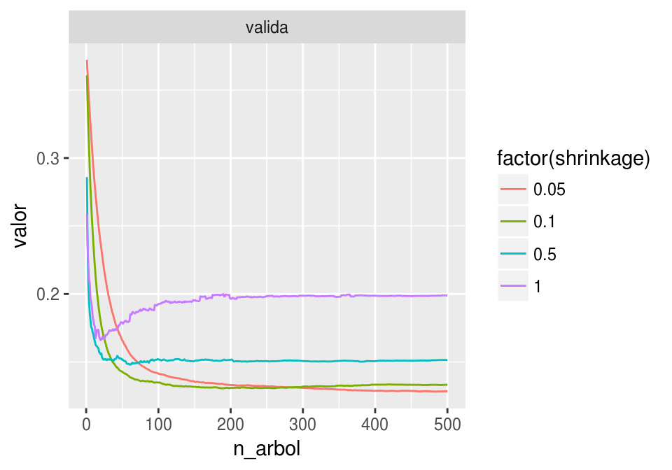

Obsérvese que podemos obtener un mejor resultado de validación afinando
la tasa de aprendizaje. Cuando es muy grande, el modelo rápidamente sobreajusta
cuando agregamos árboles. Si la tasa es demasiado chica, podos tardar
mucho en llegar a un predictor de buen desempeño.

¿Cómo crees que se ven las gráfica de error de entrenamiento?

### Submuestreo (bag.fraction)
Funciona bien construir cada uno de los árboles con submuestras de la muestra
de entrenamiento, como una manera adicional de reducir varianza al construir
nuestro predictor (esta idea es parecida a la de los bosques aleatorios, 
aquí igualmente perturbamos la muestra de entrenamiento en cada paso para evitar
sobreajuste). Adicionalmente, este proceso acelera considerablemente las
iteraciones de boosting, y en algunos casos sin penalización en desempeño.

En boosting generalmente se toman submuestras (una
fracción de alrededor de 0.5 de la muestra de entrenamiento, pero puede
ser más chica para conjuntos grandes de entrenamiento) sin reemplazo.

Este parámetro también puede ser afinado con muestra
de validación o validación cruzada. 


```r
boost <- ajustar_boost(entrena)
modelos_dat <- data_frame(n_modelo = 1:3, 
                          bag.fraction = c(0.25, 0.5, 1),
                          shrinkage = 0.25)
modelos_dat <- modelos_dat %>% 
  mutate(modelo = pmap(., boost)) %>%
  mutate(eval = map(modelo, eval_modelo))
modelos_dat
```

```
## # A tibble: 3 x 5
##   n_modelo bag.fraction shrinkage    modelo                 eval
##      <int>        <dbl>     <dbl>    <list>               <list>
## 1        1         0.25      0.25 <S3: gbm> <tibble [1,000 x 3]>
## 2        2         0.50      0.25 <S3: gbm> <tibble [1,000 x 3]>
## 3        3         1.00      0.25 <S3: gbm> <tibble [1,000 x 3]>
```

```r
graf_eval <- modelos_dat %>% select(bag.fraction, eval) %>% unnest
graf_eval
```

```
## # A tibble: 3,000 x 4
##    bag.fraction n_arbol    tipo     valor
##           <dbl>   <int>   <chr>     <dbl>
##  1         0.25       1 entrena 0.3404206
##  2         0.25       2 entrena 0.2948882
##  3         0.25       3 entrena 0.2582633
##  4         0.25       4 entrena 0.2316890
##  5         0.25       5 entrena 0.2106434
##  6         0.25       6 entrena 0.1946327
##  7         0.25       7 entrena 0.1825413
##  8         0.25       8 entrena 0.1733467
##  9         0.25       9 entrena 0.1652359
## 10         0.25      10 entrena 0.1596591
## # ... with 2,990 more rows
```

```r
ggplot((graf_eval), aes(x = n_arbol, y= valor, colour=factor(bag.fraction), group =
                        bag.fraction)) + geom_line() +
  facet_wrap(~tipo, ncol = 1)
```

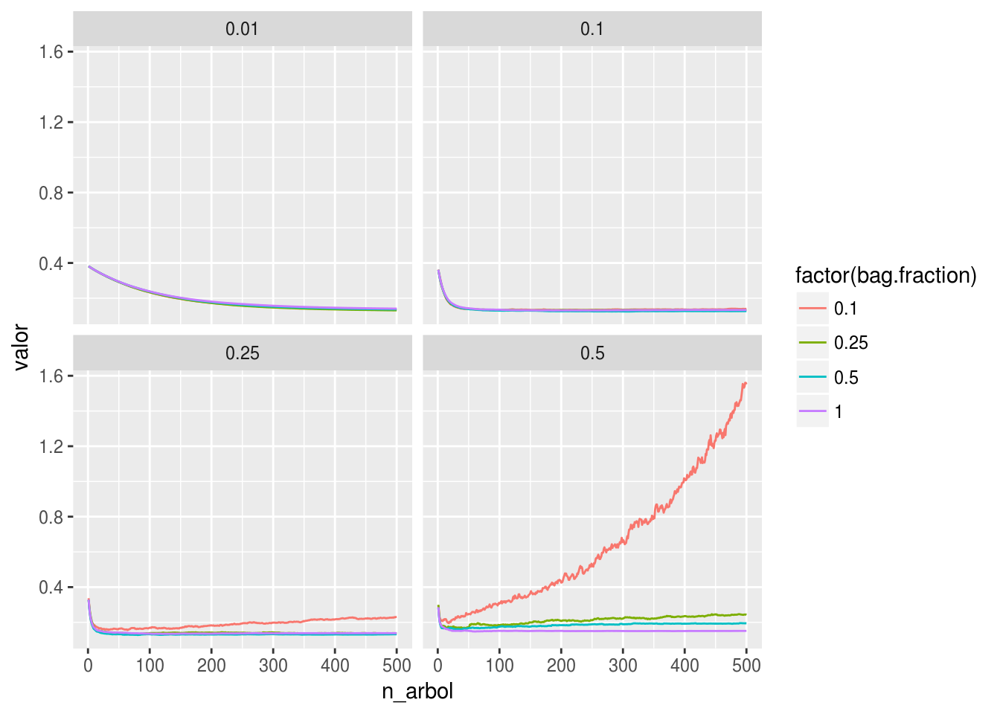

En este ejemplo, podemos reducir el tiempo de ajuste usando una 
fracción de submuestro de 0.5, con quizá algunas mejoras en desempeño.


Ahora veamos los dos parámetros actuando en conjunto:


```r
modelos_dat <- list(bag.fraction = c(0.1, 0.25, 0.5, 1),
                          shrinkage = c(0.01, 0.1, 0.25, 0.5)) %>% expand.grid
modelos_dat <- modelos_dat %>% 
  mutate(modelo = pmap(., boost)) %>%
  mutate(eval = map(modelo, eval_modelo))
graf_eval <- modelos_dat %>% select(shrinkage, bag.fraction, eval) %>% unnest
head(graf_eval)
```

```
##   shrinkage bag.fraction n_arbol    tipo     valor
## 1      0.01          0.1       1 entrena 0.4016655
## 2      0.01          0.1       2 entrena 0.3991252
## 3      0.01          0.1       3 entrena 0.3964301
## 4      0.01          0.1       4 entrena 0.3942135
## 5      0.01          0.1       5 entrena 0.3914665
## 6      0.01          0.1       6 entrena 0.3891097
```

```r
ggplot(filter(graf_eval, tipo =='valida'), aes(x = n_arbol, y= valor, colour=factor(bag.fraction), group =
                        bag.fraction)) + geom_line() +
  facet_wrap(~shrinkage)
```

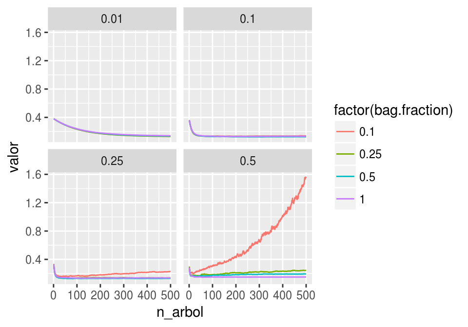

Bag fraction demasiado chico no funciona bien, especialmente si la tasa
de aprendizaje es alta (¿Por qué?). Filtremos para ver con detalle el resto
de los datos:


```r
ggplot(filter(graf_eval, tipo =='valida', bag.fraction>0.1), aes(x = n_arbol, y= valor, colour=factor(bag.fraction), group =
                        bag.fraction)) + geom_line() +
  facet_wrap(~shrinkage) + scale_y_log10()
```

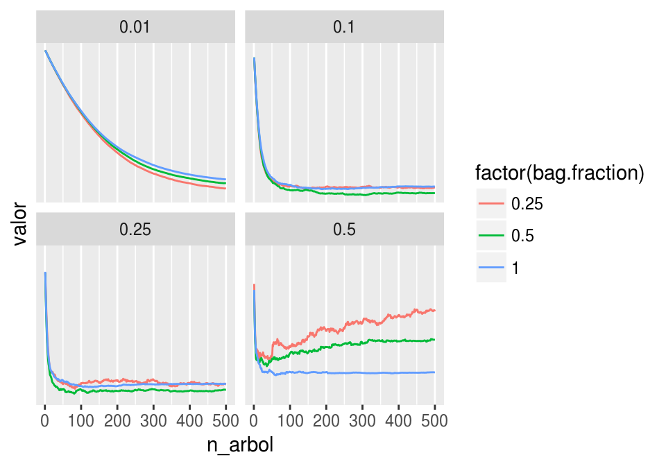


Y parece ser que para este número de iteraciones, una tasa de aprendizaje
de 0.1 junto con un bag fraction de 0.5 funciona bien:


```r
graf_eval %>% filter(tipo=='valida') %>%
  group_by(shrinkage, bag.fraction) %>%
  summarise(valor = min(valor)) %>%
   arrange(valor) %>% head(10)
```

```
## # A tibble: 10 x 3
## # Groups:   shrinkage [3]
##    shrinkage bag.fraction     valor
##        <dbl>        <dbl>     <dbl>
##  1      0.10         0.50 0.1246740
##  2      0.25         0.50 0.1283885
##  3      0.10         1.00 0.1305941
##  4      0.10         0.25 0.1310472
##  5      0.01         0.25 0.1311681
##  6      0.10         0.10 0.1320537
##  7      0.25         0.25 0.1333946
##  8      0.25         1.00 0.1349612
##  9      0.01         0.50 0.1366676
## 10      0.01         0.10 0.1367777
```


### Número de árboles M

Se monitorea el error sobre una muestra de validación cuando agregamos
cada árboles. Escogemos el número de árboles de manera que minimize el
error de validación. Demasiados árboles pueden producir sobreajuste. Ver el ejemplo
de arriba.


### Tamaño de árboles

Los árboles se construyen de tamaño fijo $J$, donde $J$ es el número
de cortes. Usualmente $J=1,2,\ldots, 10$, y es un parámetro que hay que
elegir. $J$ más grande permite interacciones de orden más alto entre 
las variables de entrada. Se intenta con varias $J$ y $M$ para minimizar
el error de vaidación.

### Controlar número de casos para cortes

Igual que en bosques aleatorios, podemos establecer mínimos de muestra en nodos
terminales, o mínimo de casos necesarios para hacer un corte.

### Ejemplo {-}


```r
modelos_dat <- list(bag.fraction = c( 0.25, 0.5, 1),
                          shrinkage = c(0.01, 0.1, 0.25, 0.5),
                    depth = c(1,5,10,12)) %>% expand.grid
modelos_dat <- modelos_dat %>% 
  mutate(modelo = pmap(., boost)) %>%
  mutate(eval = map(modelo, eval_modelo))
graf_eval <- modelos_dat %>% select(shrinkage, bag.fraction, depth, eval) %>% unnest
ggplot(filter(graf_eval, tipo =='valida'), aes(x = n_arbol, y= valor, colour=factor(bag.fraction), group =
                        bag.fraction)) + geom_line() +
  facet_grid(depth~shrinkage) + scale_y_log10()
```

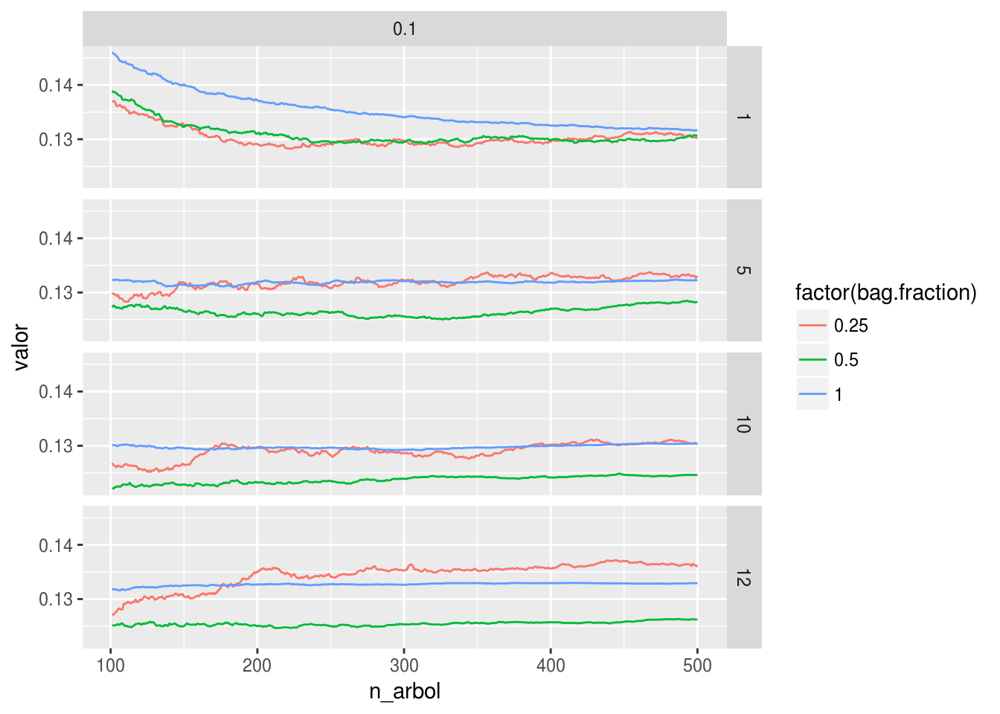


Podemos ver con más detalle donde ocurre el mejor desempeño:


```r
ggplot(filter(graf_eval, tipo =='valida', shrinkage == 0.1, n_arbol>100), aes(x = n_arbol, y= valor, colour=factor(bag.fraction), group =
                        bag.fraction)) + geom_line() +
  facet_grid(depth~shrinkage) 
```

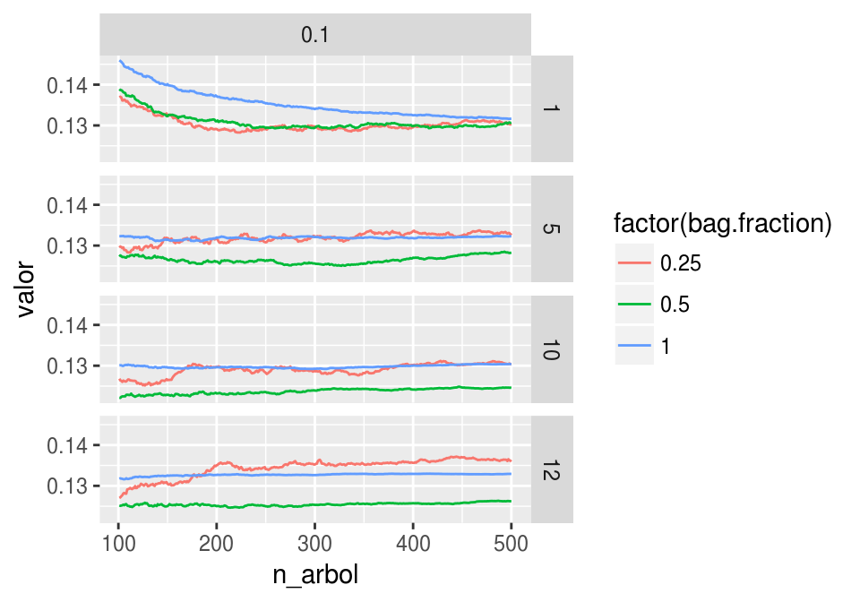


```r
head(arrange(filter(graf_eval,tipo=='valida'), valor))
```

```
##   shrinkage bag.fraction depth n_arbol   tipo     valor
## 1       0.1          0.5    10      98 valida 0.1218075
## 2       0.1          0.5    10      95 valida 0.1218644
## 3       0.1          0.5    10      97 valida 0.1218835
## 4       0.1          0.5    10      96 valida 0.1219046
## 5       0.1          0.5    10     100 valida 0.1220013
## 6       0.1          0.5    10      94 valida 0.1220148
```

### Evaluación con validación cruzada.

Para datos no muy grandes, conviene escoger modelos usando validación cruzada.

Por ejemplo,


```r
set.seed(9983)
rm('modelos_dat')
mod_boosting <- gbm(log(vSalePrice) ~.,  data = entrena,
                distribution = 'gaussian',
                n.trees = 200, 
                interaction.depth = 10,
                shrinkage = 0.1, # tasa de aprendizaje
                bag.fraction = 0.5,
                cv.folds = 10)
gbm.perf(mod_boosting)
```


```r
eval_modelo_2 <- function(modelo){
   dat_eval <- data_frame(entrena = sqrt(modelo$train.error),
                          valida = sqrt(modelo$cv.error),
                          n_arbol = 1:length(modelo$train.error)) %>%
                      gather(tipo, valor, -n_arbol)
   dat_eval
}
dat <- eval_modelo_2(mod_boosting)
sqrt(min(mod_boosting$cv.error))
ggplot(dat, aes(x = n_arbol, y=valor, colour=tipo, group=tipo)) + geom_line()
```

## Gráficas de dependencia parcial

La idea de dependencia parcial que veremos a continuación se puede aplicar a cualquier método de aprendizaje,
y en boosting ayuda a entender el funcionamiento del predictor complejo que resulta
del algoritmo. Aunque podemos evaluar el predictor en distintos valores y observar
cómo se comporta, cuando tenemos varias variables de entrada este proceso no
siempre tiene resultados muy claros o completos. Dependencia parcial es un intento
por entender de manera más sistemática parte del funcionamiento de 
un modelo complejo.


### Dependencia parcial
Supongamos que tenemos un predictor $f(x_1,x_2)$ que depende de dos variables de
entrada. Podemos considerar la función
$${f}_{1}(x_1) = E_{x_2}[f(x_1,x_2)],$$
que es el promedio de $f(x)$ fijando $x_1$ sobre la marginal de $x_2$. Si tenemos
una muestra de entrenamiento, podríamos estimarla promediando sobre la muestra 
de entrenamiento

$$\bar{f}_1(x_1) = \frac{1}{n}\sum_{i=1}^n f(x_1, x_2^{(i)}),$$
que consiste en fijar el valor de $x_1$ y promediar sobre todos los valores
de la muestra de entrenamiento para $x_2$.

### Ejemplo {-}

Construimos un modelo con solamente tres variables para nuestro ejemplo anterior


```r
mod_2 <- gbm(log(vSalePrice) ~ vGrLivArea +vNeighborhood  +vOverallQual,  
                data = entrena,
                distribution = 'gaussian',
                n.trees = 100, 
                interaction.depth = 3,
                shrinkage = 0.1, 
                bag.fraction = 0.5,
                train.fraction = 0.75)
gbm.perf(mod_2)
```

```
## Using test method...
```

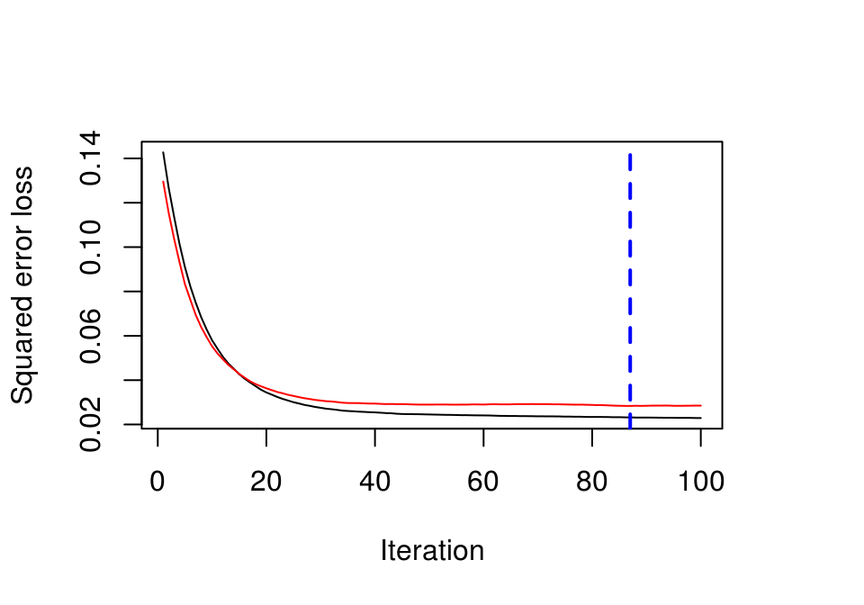

```
## [1] 87
```

Podemos calcular a mano la gráfica de dependencia parcial para 
el tamaño de la "General Living Area". 

```r
dat_dp <- entrena %>% select(vGrLivArea, vNeighborhood, vOverallQual) 
```
Consideramos el rango de la variable:

```r
cuantiles <- quantile(entrena$vGrLivArea, probs= seq(0, 1, 0.1))
cuantiles
```

```
##     0%    10%    20%    30%    40%    50%    60%    70%    80%    90% 
##  334.0  912.0 1066.6 1208.0 1339.0 1464.0 1578.0 1709.3 1869.0 2158.3 
##   100% 
## 5642.0
```

Por ejemplo, vamos evaluar el efecto parcial cuando vGrLivArea = 912. Hacemos


```r
dat_dp_1 <- dat_dp %>% mutate(vGrLivArea = 912) %>%
            mutate(pred = predict(mod_2, .)) %>%
            summarise(mean_pred = mean(pred))
```

```
## Using 87 trees...
```

```r
dat_dp_1
```

```
##   mean_pred
## 1  11.84206
```

Evaluamos en vGrLivArea = 912

```r
dat_dp_1 <- dat_dp %>% mutate(vGrLivArea = 1208) %>%
            mutate(pred = predict(mod_2, .)) %>%
            summarise(mean_pred = mean(pred))
```

```
## Using 87 trees...
```

```r
dat_dp_1
```

```
##   mean_pred
## 1  11.96576
```
(un incremento de alrededor del 10\% en el precio de venta).
Hacemos todos los cuantiles como sigue:


```r
cuantiles <- quantile(entrena$vGrLivArea, probs= seq(0, 1, 0.01))

prom_parcial <- function(x, variable, df, mod){
  variable <- enquo(variable)
  variable_nom <- quo_name(variable)
  salida <- df %>% mutate(!!variable_nom := x) %>% 
    mutate(pred = predict(mod, ., n.trees=100)) %>%
    group_by(!!variable) %>%
    summarise(f_1 = mean(pred)) 
  salida
}
dep_parcial <- map_dfr(cuantiles, 
                       ~prom_parcial(.x, vGrLivArea, entrena, mod_2))
ggplot(dep_parcial, aes(x=vGrLivArea, y= f_1)) + 
  geom_line() + geom_line() + geom_rug(sides='b')
```

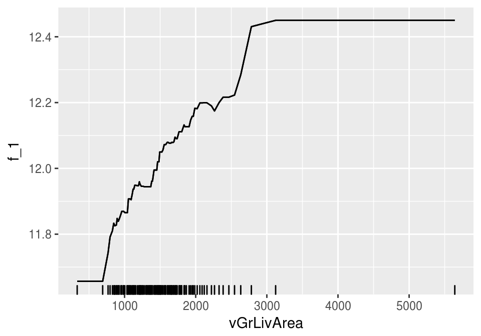
Y transformando a las unidades originales


```r
ggplot(dep_parcial, aes(x=vGrLivArea, y= exp(f_1))) + 
  geom_line() + geom_line() + geom_rug(sides='b')
```

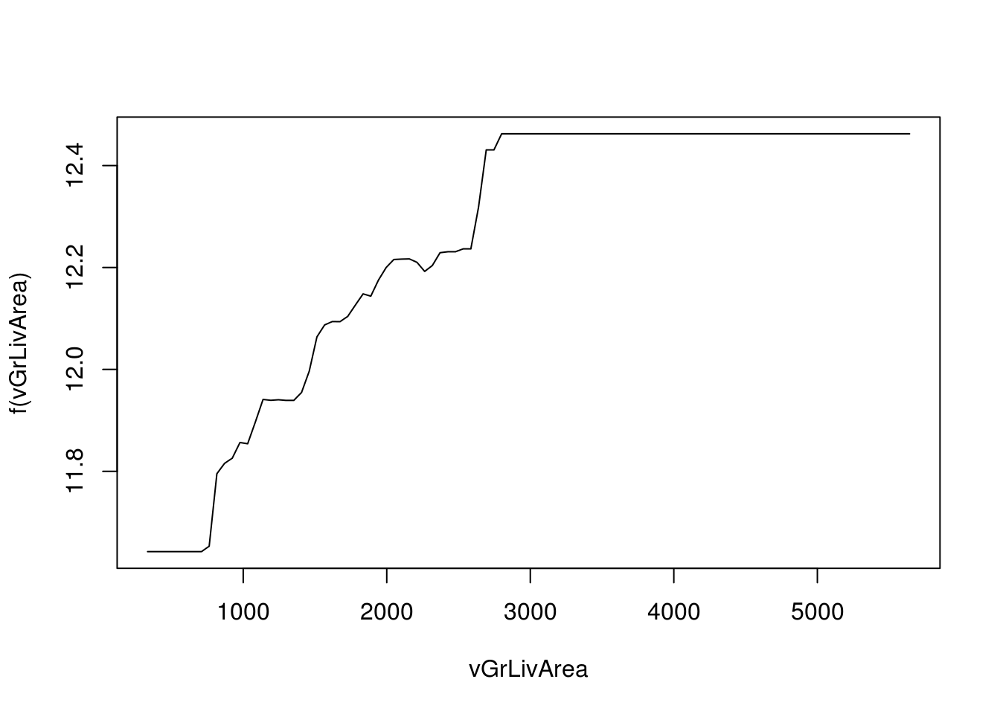
Y vemos que cuando aumenta el area de habitación, aumenta el precio. Podemos hacer esta gráfica más simple haciendo


```r
plot(mod_2, 1) # 1 pues es vGrLivArea la primer variable 
```

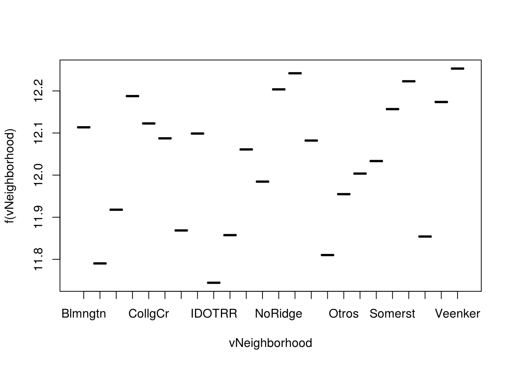

Y para una variable categórica se ve como sigue:


```r
plot(mod_2, 2, return.grid = TRUE) %>% arrange(y)
```

```
##    vNeighborhood        y
## 1         IDOTRR 11.74437
## 2         BrDale 11.79033
## 3        OldTown 11.81014
## 4          SWISU 11.85419
## 5        MeadowV 11.85748
## 6        Edwards 11.86859
## 7        BrkSide 11.91787
## 8          Otros 11.95479
## 9          NAmes 11.98455
## 10        Sawyer 12.00362
## 11       SawyerW 12.03340
## 12       Mitchel 12.06104
## 13        NWAmes 12.08210
## 14       Crawfor 12.08735
## 15       Gilbert 12.09874
## 16       Blmngtn 12.11353
## 17       CollgCr 12.12275
## 18       Somerst 12.15674
## 19        Timber 12.17366
## 20       ClearCr 12.18768
## 21       NoRidge 12.20368
## 22       StoneBr 12.22289
## 23       NridgHt 12.24190
## 24       Veenker 12.25304
```

```r
plot(mod_2, 2, return.grid = FALSE)
```

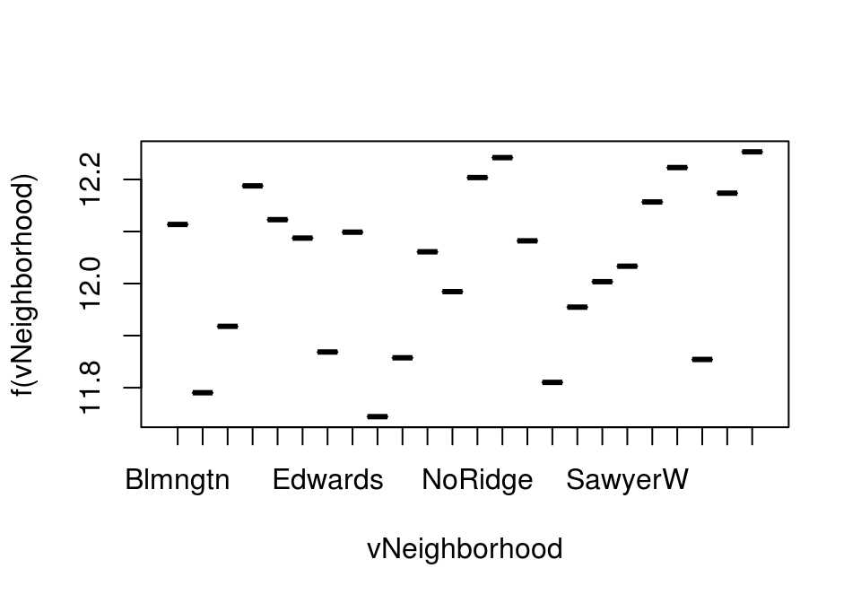

---

En general, si nuestro predictor depende de más variables 
$f(x_1,x_2, \ldots, x_p)$ 
entrada. Podemos considerar las funciones
$${f}_{j}(x_j) = E_{(x_1,x_2, \ldots x_p) - x_j}[f(x_1,x_2, \ldots, x_p)],$$
que es el valor esperado de $f(x)$ fijando $x_j$, y promediando sobre el resto
de las variables. Si tenemos
una muestra de entrenamiento, podríamos estimarla promediando sobre la muestra 
de entrenamiento

$$\bar{f}_j(x_j) = \frac{1}{n}\sum_{i=1}^n f(x_1^{(i)}, x_2^{(i)}, \ldots, x_{j-1}^{(i)},x_{j+1}^{(i)},\ldots, x_p^{(i)}).$$

Podemos hacer también  gráficas de dependencia parcial para más de una variable,
si fijamos un subconjunto de variables y promediamos sobre el resto.


```r
plot(mod_2, c(1,3))
```

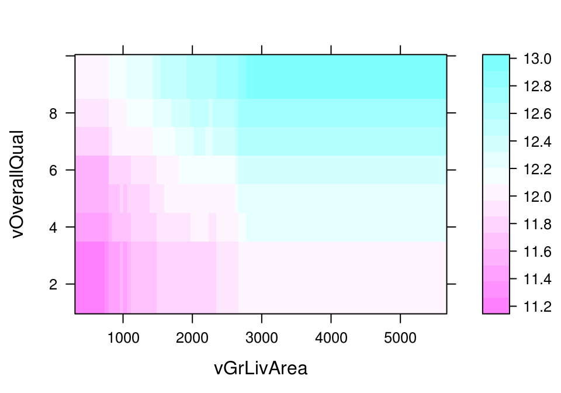

### Discusión

En primer lugar, veamos qué obtenemos de la dependencia parcial
cuando aplicamos al modelo lineal sin interacciones. En el caso de dos variables,

$$f_1(x_1) = E_{x_2}[f(x_1,x_2)] =E_{x_2}[a + bx_1 + cx_2)] = \mu + bx_1,$$
que es equivalente al análisis marginal que hacemos en regresión lineal (
incrementos en la variable $x_1$ con todo lo demás fijo, donde el incremento
marginal de la respuesta es el coeficiente $b$). 

Desde este punto de vista, dependencia parcial da una interpretación similar
a la del análisis usual de coeficientes en regresión lineal, donde pensamos
en "todo lo demás constante".

Nótese también que cuando hay **interacciones** fuertes entre las variables, ningún
análisis marginal (dependencia parcial o examen de coeficientes) da un resultado
fácilmente interpretable - la única solución es considerar el efecto conjunto de las
variables que interactúan. De modo que este tipo de análisis funciona mejor
cuando no hay interacciones grandes entre las variables (es cercano a un modelo
aditivo con efectos no lineales).

#### Ejemplo {-}
Considera qué pasa con las gráficas de dependencia parcial cuando
$f(x_1,x_2) = -10 x_1x_2$, y $x_1$ y $x_2$ tienen media cero. Explica por qué
en este caso es mejor ver el efecto conjunto de las dos variables.

---

Es importante también evitar la interpretación incorrecta de que la función
de dependencia parcial da el valor esperado del predictor condicionado a valores
de la variable cuya dependencia examinamos. Es decir, 
$$f_1(x_1) = E_{x_2}(f(x_1,x_2)) \neq E(f(x_1,x_2)|x_1).$$
La última cantidad es un valor esperado diferente (calculado sobre la
condicional de $x_2$ dada $x_1$), de manera que utiliza información acerca
de la relación que hay entre $x_1$ y $x_2$. La función de dependencia parcial
da el efecto de $x_1$ tomando en cuenta los efectos promedio de las otras variables.


## xgboost y gbm

Los paquetes *xgboost* y *gbm* parecen ser los más populares para hacer
gradient boosting.  *xgboost*,
adicionalmente, parece ser más rápido y más flexible que *gbm* (paralelización, uso de GPU integrado). Existe una lista considerable de competencias de predicción donde el algoritmo/implementación
ganadora es *xgboost*. 


```r
library(xgboost)
```

```
## 
## Attaching package: 'xgboost'
```

```
## The following object is masked from 'package:dplyr':
## 
##     slice
```

```r
x <- entrena %>% select(-vSalePrice) %>% model.matrix(~., .)
x_entrena <- x[1:1100, ]
x_valida <- x[1101:1460, ]
set.seed(1293)
d_entrena <- xgb.DMatrix(x_entrena, label = log(entrena$vSalePrice[1:1100])) 
d_valida <- xgb.DMatrix(x_valida, label = log(entrena$vSalePrice[1101:1460])) 
watchlist <- list(eval = d_valida, train = d_entrena)
params <- list(booster = "gbtree",
               max_depth = 3, 
               eta = 0.03, 
               nthread = 1, 
               subsample = 0.75, 
               lambda = 0.001,
               objective = "reg:linear", 
               eval_metric = "rmse")
bst <- xgb.train(params, d_entrena, nrounds = 1000, watchlist = watchlist, verbose=1)
```

```
## [1]	eval-rmse:11.183367	train-rmse:11.185970 
## [2]	eval-rmse:10.848030	train-rmse:10.850441 
## [3]	eval-rmse:10.522327	train-rmse:10.524883 
## [4]	eval-rmse:10.206756	train-rmse:10.209215 
## [5]	eval-rmse:9.901018	train-rmse:9.903183 
## [6]	eval-rmse:9.604361	train-rmse:9.606353 
## [7]	eval-rmse:9.316499	train-rmse:9.318384 
## [8]	eval-rmse:9.037509	train-rmse:9.038843 
## [9]	eval-rmse:8.766625	train-rmse:8.767856 
## [10]	eval-rmse:8.504042	train-rmse:8.504976 
## [11]	eval-rmse:8.249103	train-rmse:8.249992 
## [12]	eval-rmse:8.001815	train-rmse:8.002570 
## [13]	eval-rmse:7.762049	train-rmse:7.762605 
## [14]	eval-rmse:7.529464	train-rmse:7.529853 
## [15]	eval-rmse:7.303868	train-rmse:7.304183 
## [16]	eval-rmse:7.085173	train-rmse:7.085240 
## [17]	eval-rmse:6.873233	train-rmse:6.872812 
## [18]	eval-rmse:6.667545	train-rmse:6.666743 
## [19]	eval-rmse:6.467870	train-rmse:6.466797 
## [20]	eval-rmse:6.274136	train-rmse:6.272933 
## [21]	eval-rmse:6.085811	train-rmse:6.084670 
## [22]	eval-rmse:5.903286	train-rmse:5.902312 
## [23]	eval-rmse:5.726332	train-rmse:5.725288 
## [24]	eval-rmse:5.555059	train-rmse:5.553725 
## [25]	eval-rmse:5.388524	train-rmse:5.387316 
## [26]	eval-rmse:5.226866	train-rmse:5.225660 
## [27]	eval-rmse:5.070144	train-rmse:5.069087 
## [28]	eval-rmse:4.918210	train-rmse:4.917084 
## [29]	eval-rmse:4.770644	train-rmse:4.769682 
## [30]	eval-rmse:4.627788	train-rmse:4.626754 
## [31]	eval-rmse:4.489161	train-rmse:4.488088 
## [32]	eval-rmse:4.354557	train-rmse:4.353536 
## [33]	eval-rmse:4.223987	train-rmse:4.223086 
## [34]	eval-rmse:4.097580	train-rmse:4.096651 
## [35]	eval-rmse:3.974845	train-rmse:3.973879 
## [36]	eval-rmse:3.855764	train-rmse:3.854761 
## [37]	eval-rmse:3.740262	train-rmse:3.739241 
## [38]	eval-rmse:3.628328	train-rmse:3.627258 
## [39]	eval-rmse:3.520058	train-rmse:3.518757 
## [40]	eval-rmse:3.414457	train-rmse:3.413175 
## [41]	eval-rmse:3.312317	train-rmse:3.310966 
## [42]	eval-rmse:3.213198	train-rmse:3.211770 
## [43]	eval-rmse:3.117117	train-rmse:3.115627 
## [44]	eval-rmse:3.023922	train-rmse:3.022294 
## [45]	eval-rmse:2.933381	train-rmse:2.931745 
## [46]	eval-rmse:2.845738	train-rmse:2.843973 
## [47]	eval-rmse:2.760700	train-rmse:2.758906 
## [48]	eval-rmse:2.678176	train-rmse:2.676355 
## [49]	eval-rmse:2.598284	train-rmse:2.596345 
## [50]	eval-rmse:2.520782	train-rmse:2.518759 
## [51]	eval-rmse:2.445457	train-rmse:2.443495 
## [52]	eval-rmse:2.372283	train-rmse:2.370391 
## [53]	eval-rmse:2.301332	train-rmse:2.299367 
## [54]	eval-rmse:2.232533	train-rmse:2.230658 
## [55]	eval-rmse:2.166043	train-rmse:2.163950 
## [56]	eval-rmse:2.101366	train-rmse:2.099274 
## [57]	eval-rmse:2.038792	train-rmse:2.036566 
## [58]	eval-rmse:1.978027	train-rmse:1.975905 
## [59]	eval-rmse:1.919023	train-rmse:1.916914 
## [60]	eval-rmse:1.861887	train-rmse:1.859752 
## [61]	eval-rmse:1.806416	train-rmse:1.804133 
## [62]	eval-rmse:1.752722	train-rmse:1.750435 
## [63]	eval-rmse:1.700586	train-rmse:1.698211 
## [64]	eval-rmse:1.649718	train-rmse:1.647352 
## [65]	eval-rmse:1.600789	train-rmse:1.598278 
## [66]	eval-rmse:1.553377	train-rmse:1.550703 
## [67]	eval-rmse:1.507320	train-rmse:1.504523 
## [68]	eval-rmse:1.462657	train-rmse:1.459791 
## [69]	eval-rmse:1.418975	train-rmse:1.416199 
## [70]	eval-rmse:1.377086	train-rmse:1.374123 
## [71]	eval-rmse:1.336371	train-rmse:1.333250 
## [72]	eval-rmse:1.296991	train-rmse:1.293647 
## [73]	eval-rmse:1.258685	train-rmse:1.255167 
## [74]	eval-rmse:1.221414	train-rmse:1.217896 
## [75]	eval-rmse:1.185352	train-rmse:1.181752 
## [76]	eval-rmse:1.150467	train-rmse:1.146795 
## [77]	eval-rmse:1.116551	train-rmse:1.112809 
## [78]	eval-rmse:1.083800	train-rmse:1.079873 
## [79]	eval-rmse:1.051880	train-rmse:1.047876 
## [80]	eval-rmse:1.021156	train-rmse:1.016918 
## [81]	eval-rmse:0.991035	train-rmse:0.986742 
## [82]	eval-rmse:0.962071	train-rmse:0.957656 
## [83]	eval-rmse:0.933817	train-rmse:0.929293 
## [84]	eval-rmse:0.906693	train-rmse:0.901907 
## [85]	eval-rmse:0.880243	train-rmse:0.875294 
## [86]	eval-rmse:0.854782	train-rmse:0.849542 
## [87]	eval-rmse:0.830050	train-rmse:0.824504 
## [88]	eval-rmse:0.805921	train-rmse:0.800332 
## [89]	eval-rmse:0.782437	train-rmse:0.776819 
## [90]	eval-rmse:0.759826	train-rmse:0.754110 
## [91]	eval-rmse:0.737987	train-rmse:0.731999 
## [92]	eval-rmse:0.716596	train-rmse:0.710499 
## [93]	eval-rmse:0.695845	train-rmse:0.689677 
## [94]	eval-rmse:0.675893	train-rmse:0.669581 
## [95]	eval-rmse:0.656634	train-rmse:0.650188 
## [96]	eval-rmse:0.637819	train-rmse:0.631238 
## [97]	eval-rmse:0.619622	train-rmse:0.612868 
## [98]	eval-rmse:0.602074	train-rmse:0.595118 
## [99]	eval-rmse:0.585125	train-rmse:0.577886 
## [100]	eval-rmse:0.568653	train-rmse:0.561235 
## [101]	eval-rmse:0.552748	train-rmse:0.545138 
## [102]	eval-rmse:0.537232	train-rmse:0.529475 
## [103]	eval-rmse:0.522264	train-rmse:0.514420 
## [104]	eval-rmse:0.507737	train-rmse:0.499568 
## [105]	eval-rmse:0.493683	train-rmse:0.485270 
## [106]	eval-rmse:0.480088	train-rmse:0.471373 
## [107]	eval-rmse:0.467011	train-rmse:0.458003 
## [108]	eval-rmse:0.454471	train-rmse:0.445108 
## [109]	eval-rmse:0.442196	train-rmse:0.432627 
## [110]	eval-rmse:0.430161	train-rmse:0.420445 
## [111]	eval-rmse:0.418728	train-rmse:0.408734 
## [112]	eval-rmse:0.407583	train-rmse:0.397402 
## [113]	eval-rmse:0.396891	train-rmse:0.386446 
## [114]	eval-rmse:0.386403	train-rmse:0.375683 
## [115]	eval-rmse:0.376224	train-rmse:0.365231 
## [116]	eval-rmse:0.366555	train-rmse:0.355268 
## [117]	eval-rmse:0.357100	train-rmse:0.345474 
## [118]	eval-rmse:0.348049	train-rmse:0.336072 
## [119]	eval-rmse:0.339081	train-rmse:0.326911 
## [120]	eval-rmse:0.330555	train-rmse:0.318151 
## [121]	eval-rmse:0.322332	train-rmse:0.309662 
## [122]	eval-rmse:0.314413	train-rmse:0.301313 
## [123]	eval-rmse:0.306936	train-rmse:0.293350 
## [124]	eval-rmse:0.299666	train-rmse:0.285707 
## [125]	eval-rmse:0.292627	train-rmse:0.278202 
## [126]	eval-rmse:0.285736	train-rmse:0.271015 
## [127]	eval-rmse:0.279120	train-rmse:0.263965 
## [128]	eval-rmse:0.272776	train-rmse:0.257218 
## [129]	eval-rmse:0.266653	train-rmse:0.250740 
## [130]	eval-rmse:0.260639	train-rmse:0.244375 
## [131]	eval-rmse:0.254979	train-rmse:0.238334 
## [132]	eval-rmse:0.249520	train-rmse:0.232493 
## [133]	eval-rmse:0.244305	train-rmse:0.226824 
## [134]	eval-rmse:0.239293	train-rmse:0.221404 
## [135]	eval-rmse:0.234296	train-rmse:0.216137 
## [136]	eval-rmse:0.229649	train-rmse:0.211090 
## [137]	eval-rmse:0.225018	train-rmse:0.206201 
## [138]	eval-rmse:0.220736	train-rmse:0.201420 
## [139]	eval-rmse:0.216580	train-rmse:0.196735 
## [140]	eval-rmse:0.212492	train-rmse:0.192254 
## [141]	eval-rmse:0.208535	train-rmse:0.187981 
## [142]	eval-rmse:0.204758	train-rmse:0.183909 
## [143]	eval-rmse:0.201153	train-rmse:0.179919 
## [144]	eval-rmse:0.197871	train-rmse:0.176156 
## [145]	eval-rmse:0.194602	train-rmse:0.172538 
## [146]	eval-rmse:0.191536	train-rmse:0.169072 
## [147]	eval-rmse:0.188481	train-rmse:0.165594 
## [148]	eval-rmse:0.185642	train-rmse:0.162233 
## [149]	eval-rmse:0.182883	train-rmse:0.159094 
## [150]	eval-rmse:0.180309	train-rmse:0.156101 
## [151]	eval-rmse:0.177700	train-rmse:0.153151 
## [152]	eval-rmse:0.175306	train-rmse:0.150395 
## [153]	eval-rmse:0.173040	train-rmse:0.147771 
## [154]	eval-rmse:0.170899	train-rmse:0.145262 
## [155]	eval-rmse:0.168613	train-rmse:0.142754 
## [156]	eval-rmse:0.166581	train-rmse:0.140343 
## [157]	eval-rmse:0.164577	train-rmse:0.137980 
## [158]	eval-rmse:0.162924	train-rmse:0.135876 
## [159]	eval-rmse:0.161292	train-rmse:0.133715 
## [160]	eval-rmse:0.159499	train-rmse:0.131702 
## [161]	eval-rmse:0.157958	train-rmse:0.129754 
## [162]	eval-rmse:0.156499	train-rmse:0.127893 
## [163]	eval-rmse:0.155177	train-rmse:0.126165 
## [164]	eval-rmse:0.153927	train-rmse:0.124461 
## [165]	eval-rmse:0.152500	train-rmse:0.122801 
## [166]	eval-rmse:0.151255	train-rmse:0.121221 
## [167]	eval-rmse:0.150158	train-rmse:0.119813 
## [168]	eval-rmse:0.149063	train-rmse:0.118423 
## [169]	eval-rmse:0.148007	train-rmse:0.117068 
## [170]	eval-rmse:0.147039	train-rmse:0.115699 
## [171]	eval-rmse:0.146059	train-rmse:0.114400 
## [172]	eval-rmse:0.145131	train-rmse:0.113225 
## [173]	eval-rmse:0.144247	train-rmse:0.112032 
## [174]	eval-rmse:0.143229	train-rmse:0.110904 
## [175]	eval-rmse:0.142309	train-rmse:0.109833 
## [176]	eval-rmse:0.141448	train-rmse:0.108782 
## [177]	eval-rmse:0.140599	train-rmse:0.107804 
## [178]	eval-rmse:0.139951	train-rmse:0.106835 
## [179]	eval-rmse:0.139426	train-rmse:0.106012 
## [180]	eval-rmse:0.138739	train-rmse:0.105105 
## [181]	eval-rmse:0.138129	train-rmse:0.104319 
## [182]	eval-rmse:0.137643	train-rmse:0.103520 
## [183]	eval-rmse:0.137096	train-rmse:0.102771 
## [184]	eval-rmse:0.136695	train-rmse:0.102021 
## [185]	eval-rmse:0.136162	train-rmse:0.101332 
## [186]	eval-rmse:0.135784	train-rmse:0.100630 
## [187]	eval-rmse:0.135153	train-rmse:0.100006 
## [188]	eval-rmse:0.134752	train-rmse:0.099359 
## [189]	eval-rmse:0.134304	train-rmse:0.098714 
## [190]	eval-rmse:0.133908	train-rmse:0.098198 
## [191]	eval-rmse:0.133472	train-rmse:0.097655 
## [192]	eval-rmse:0.133200	train-rmse:0.097155 
## [193]	eval-rmse:0.132919	train-rmse:0.096691 
## [194]	eval-rmse:0.132500	train-rmse:0.096222 
## [195]	eval-rmse:0.132190	train-rmse:0.095725 
## [196]	eval-rmse:0.131938	train-rmse:0.095303 
## [197]	eval-rmse:0.131612	train-rmse:0.094883 
## [198]	eval-rmse:0.131358	train-rmse:0.094440 
## [199]	eval-rmse:0.131160	train-rmse:0.094012 
## [200]	eval-rmse:0.130773	train-rmse:0.093560 
## [201]	eval-rmse:0.130392	train-rmse:0.093120 
## [202]	eval-rmse:0.130193	train-rmse:0.092782 
## [203]	eval-rmse:0.130018	train-rmse:0.092456 
## [204]	eval-rmse:0.129709	train-rmse:0.092056 
## [205]	eval-rmse:0.129464	train-rmse:0.091781 
## [206]	eval-rmse:0.129370	train-rmse:0.091516 
## [207]	eval-rmse:0.129279	train-rmse:0.091226 
## [208]	eval-rmse:0.129123	train-rmse:0.090931 
## [209]	eval-rmse:0.128873	train-rmse:0.090689 
## [210]	eval-rmse:0.128592	train-rmse:0.090422 
## [211]	eval-rmse:0.128390	train-rmse:0.090174 
## [212]	eval-rmse:0.128191	train-rmse:0.089976 
## [213]	eval-rmse:0.128042	train-rmse:0.089730 
## [214]	eval-rmse:0.127812	train-rmse:0.089486 
## [215]	eval-rmse:0.127772	train-rmse:0.089292 
## [216]	eval-rmse:0.127696	train-rmse:0.089040 
## [217]	eval-rmse:0.127402	train-rmse:0.088843 
## [218]	eval-rmse:0.127250	train-rmse:0.088664 
## [219]	eval-rmse:0.127196	train-rmse:0.088456 
## [220]	eval-rmse:0.127058	train-rmse:0.088213 
## [221]	eval-rmse:0.126928	train-rmse:0.088038 
## [222]	eval-rmse:0.126807	train-rmse:0.087839 
## [223]	eval-rmse:0.126666	train-rmse:0.087630 
## [224]	eval-rmse:0.126576	train-rmse:0.087455 
## [225]	eval-rmse:0.126575	train-rmse:0.087251 
## [226]	eval-rmse:0.126453	train-rmse:0.087012 
## [227]	eval-rmse:0.126407	train-rmse:0.086894 
## [228]	eval-rmse:0.126212	train-rmse:0.086739 
## [229]	eval-rmse:0.126148	train-rmse:0.086609 
## [230]	eval-rmse:0.126112	train-rmse:0.086461 
## [231]	eval-rmse:0.125999	train-rmse:0.086229 
## [232]	eval-rmse:0.125916	train-rmse:0.086092 
## [233]	eval-rmse:0.125750	train-rmse:0.085931 
## [234]	eval-rmse:0.125652	train-rmse:0.085789 
## [235]	eval-rmse:0.125581	train-rmse:0.085694 
## [236]	eval-rmse:0.125477	train-rmse:0.085538 
## [237]	eval-rmse:0.125323	train-rmse:0.085363 
## [238]	eval-rmse:0.125244	train-rmse:0.085206 
## [239]	eval-rmse:0.125103	train-rmse:0.085010 
## [240]	eval-rmse:0.125059	train-rmse:0.084839 
## [241]	eval-rmse:0.124946	train-rmse:0.084698 
## [242]	eval-rmse:0.124922	train-rmse:0.084563 
## [243]	eval-rmse:0.124864	train-rmse:0.084399 
## [244]	eval-rmse:0.124706	train-rmse:0.084260 
## [245]	eval-rmse:0.124561	train-rmse:0.084146 
## [246]	eval-rmse:0.124534	train-rmse:0.083968 
## [247]	eval-rmse:0.124403	train-rmse:0.083835 
## [248]	eval-rmse:0.124417	train-rmse:0.083757 
## [249]	eval-rmse:0.124360	train-rmse:0.083682 
## [250]	eval-rmse:0.124340	train-rmse:0.083557 
## [251]	eval-rmse:0.124387	train-rmse:0.083407 
## [252]	eval-rmse:0.124273	train-rmse:0.083294 
## [253]	eval-rmse:0.124222	train-rmse:0.083200 
## [254]	eval-rmse:0.124216	train-rmse:0.083046 
## [255]	eval-rmse:0.124099	train-rmse:0.082856 
## [256]	eval-rmse:0.124086	train-rmse:0.082729 
## [257]	eval-rmse:0.124024	train-rmse:0.082578 
## [258]	eval-rmse:0.123934	train-rmse:0.082505 
## [259]	eval-rmse:0.123849	train-rmse:0.082396 
## [260]	eval-rmse:0.123901	train-rmse:0.082174 
## [261]	eval-rmse:0.123829	train-rmse:0.082047 
## [262]	eval-rmse:0.123696	train-rmse:0.081944 
## [263]	eval-rmse:0.123771	train-rmse:0.081764 
## [264]	eval-rmse:0.123661	train-rmse:0.081604 
## [265]	eval-rmse:0.123723	train-rmse:0.081512 
## [266]	eval-rmse:0.123765	train-rmse:0.081384 
## [267]	eval-rmse:0.123766	train-rmse:0.081230 
## [268]	eval-rmse:0.123731	train-rmse:0.081143 
## [269]	eval-rmse:0.123706	train-rmse:0.081044 
## [270]	eval-rmse:0.123638	train-rmse:0.080949 
## [271]	eval-rmse:0.123564	train-rmse:0.080852 
## [272]	eval-rmse:0.123561	train-rmse:0.080704 
## [273]	eval-rmse:0.123515	train-rmse:0.080591 
## [274]	eval-rmse:0.123490	train-rmse:0.080461 
## [275]	eval-rmse:0.123514	train-rmse:0.080345 
## [276]	eval-rmse:0.123421	train-rmse:0.080258 
## [277]	eval-rmse:0.123351	train-rmse:0.080180 
## [278]	eval-rmse:0.123233	train-rmse:0.080123 
## [279]	eval-rmse:0.123240	train-rmse:0.079971 
## [280]	eval-rmse:0.123177	train-rmse:0.079863 
## [281]	eval-rmse:0.123153	train-rmse:0.079803 
## [282]	eval-rmse:0.123134	train-rmse:0.079740 
## [283]	eval-rmse:0.123115	train-rmse:0.079607 
## [284]	eval-rmse:0.123001	train-rmse:0.079496 
## [285]	eval-rmse:0.123009	train-rmse:0.079360 
## [286]	eval-rmse:0.122994	train-rmse:0.079154 
## [287]	eval-rmse:0.122864	train-rmse:0.079067 
## [288]	eval-rmse:0.122789	train-rmse:0.078955 
## [289]	eval-rmse:0.122765	train-rmse:0.078871 
## [290]	eval-rmse:0.122724	train-rmse:0.078797 
## [291]	eval-rmse:0.122792	train-rmse:0.078655 
## [292]	eval-rmse:0.122767	train-rmse:0.078552 
## [293]	eval-rmse:0.122722	train-rmse:0.078462 
## [294]	eval-rmse:0.122704	train-rmse:0.078383 
## [295]	eval-rmse:0.122601	train-rmse:0.078297 
## [296]	eval-rmse:0.122605	train-rmse:0.078228 
## [297]	eval-rmse:0.122586	train-rmse:0.078139 
## [298]	eval-rmse:0.122567	train-rmse:0.078061 
## [299]	eval-rmse:0.122582	train-rmse:0.078019 
## [300]	eval-rmse:0.122533	train-rmse:0.077904 
## [301]	eval-rmse:0.122433	train-rmse:0.077847 
## [302]	eval-rmse:0.122423	train-rmse:0.077783 
## [303]	eval-rmse:0.122366	train-rmse:0.077723 
## [304]	eval-rmse:0.122399	train-rmse:0.077579 
## [305]	eval-rmse:0.122250	train-rmse:0.077434 
## [306]	eval-rmse:0.122253	train-rmse:0.077337 
## [307]	eval-rmse:0.122209	train-rmse:0.077224 
## [308]	eval-rmse:0.122113	train-rmse:0.077034 
## [309]	eval-rmse:0.122148	train-rmse:0.076988 
## [310]	eval-rmse:0.122094	train-rmse:0.076833 
## [311]	eval-rmse:0.122133	train-rmse:0.076676 
## [312]	eval-rmse:0.122019	train-rmse:0.076605 
## [313]	eval-rmse:0.122084	train-rmse:0.076458 
## [314]	eval-rmse:0.122090	train-rmse:0.076424 
## [315]	eval-rmse:0.122117	train-rmse:0.076371 
## [316]	eval-rmse:0.122070	train-rmse:0.076279 
## [317]	eval-rmse:0.122019	train-rmse:0.076147 
## [318]	eval-rmse:0.121993	train-rmse:0.076030 
## [319]	eval-rmse:0.122035	train-rmse:0.075942 
## [320]	eval-rmse:0.121964	train-rmse:0.075850 
## [321]	eval-rmse:0.121940	train-rmse:0.075687 
## [322]	eval-rmse:0.121860	train-rmse:0.075602 
## [323]	eval-rmse:0.121853	train-rmse:0.075555 
## [324]	eval-rmse:0.121803	train-rmse:0.075502 
## [325]	eval-rmse:0.121752	train-rmse:0.075335 
## [326]	eval-rmse:0.121736	train-rmse:0.075250 
## [327]	eval-rmse:0.121738	train-rmse:0.075189 
## [328]	eval-rmse:0.121717	train-rmse:0.075117 
## [329]	eval-rmse:0.121633	train-rmse:0.075041 
## [330]	eval-rmse:0.121628	train-rmse:0.074992 
## [331]	eval-rmse:0.121646	train-rmse:0.074922 
## [332]	eval-rmse:0.121563	train-rmse:0.074865 
## [333]	eval-rmse:0.121499	train-rmse:0.074779 
## [334]	eval-rmse:0.121496	train-rmse:0.074722 
## [335]	eval-rmse:0.121473	train-rmse:0.074687 
## [336]	eval-rmse:0.121445	train-rmse:0.074597 
## [337]	eval-rmse:0.121461	train-rmse:0.074565 
## [338]	eval-rmse:0.121492	train-rmse:0.074494 
## [339]	eval-rmse:0.121397	train-rmse:0.074431 
## [340]	eval-rmse:0.121353	train-rmse:0.074378 
## [341]	eval-rmse:0.121402	train-rmse:0.074337 
## [342]	eval-rmse:0.121354	train-rmse:0.074212 
## [343]	eval-rmse:0.121266	train-rmse:0.074134 
## [344]	eval-rmse:0.121218	train-rmse:0.074059 
## [345]	eval-rmse:0.121213	train-rmse:0.073919 
## [346]	eval-rmse:0.121197	train-rmse:0.073782 
## [347]	eval-rmse:0.121169	train-rmse:0.073707 
## [348]	eval-rmse:0.121110	train-rmse:0.073593 
## [349]	eval-rmse:0.120970	train-rmse:0.073566 
## [350]	eval-rmse:0.120959	train-rmse:0.073479 
## [351]	eval-rmse:0.120916	train-rmse:0.073416 
## [352]	eval-rmse:0.120953	train-rmse:0.073364 
## [353]	eval-rmse:0.120933	train-rmse:0.073320 
## [354]	eval-rmse:0.120906	train-rmse:0.073206 
## [355]	eval-rmse:0.120859	train-rmse:0.073055 
## [356]	eval-rmse:0.120814	train-rmse:0.072954 
## [357]	eval-rmse:0.120791	train-rmse:0.072881 
## [358]	eval-rmse:0.120797	train-rmse:0.072791 
## [359]	eval-rmse:0.120785	train-rmse:0.072672 
## [360]	eval-rmse:0.120648	train-rmse:0.072599 
## [361]	eval-rmse:0.120640	train-rmse:0.072511 
## [362]	eval-rmse:0.120631	train-rmse:0.072433 
## [363]	eval-rmse:0.120640	train-rmse:0.072374 
## [364]	eval-rmse:0.120591	train-rmse:0.072320 
## [365]	eval-rmse:0.120649	train-rmse:0.072254 
## [366]	eval-rmse:0.120623	train-rmse:0.072196 
## [367]	eval-rmse:0.120624	train-rmse:0.072106 
## [368]	eval-rmse:0.120690	train-rmse:0.072027 
## [369]	eval-rmse:0.120698	train-rmse:0.071934 
## [370]	eval-rmse:0.120690	train-rmse:0.071884 
## [371]	eval-rmse:0.120683	train-rmse:0.071799 
## [372]	eval-rmse:0.120573	train-rmse:0.071709 
## [373]	eval-rmse:0.120569	train-rmse:0.071582 
## [374]	eval-rmse:0.120548	train-rmse:0.071523 
## [375]	eval-rmse:0.120563	train-rmse:0.071455 
## [376]	eval-rmse:0.120438	train-rmse:0.071371 
## [377]	eval-rmse:0.120439	train-rmse:0.071304 
## [378]	eval-rmse:0.120379	train-rmse:0.071237 
## [379]	eval-rmse:0.120389	train-rmse:0.071135 
## [380]	eval-rmse:0.120390	train-rmse:0.071085 
## [381]	eval-rmse:0.120313	train-rmse:0.071015 
## [382]	eval-rmse:0.120285	train-rmse:0.070960 
## [383]	eval-rmse:0.120225	train-rmse:0.070905 
## [384]	eval-rmse:0.120224	train-rmse:0.070794 
## [385]	eval-rmse:0.120200	train-rmse:0.070695 
## [386]	eval-rmse:0.120113	train-rmse:0.070638 
## [387]	eval-rmse:0.120049	train-rmse:0.070614 
## [388]	eval-rmse:0.120076	train-rmse:0.070502 
## [389]	eval-rmse:0.120052	train-rmse:0.070460 
## [390]	eval-rmse:0.120081	train-rmse:0.070360 
## [391]	eval-rmse:0.120054	train-rmse:0.070329 
## [392]	eval-rmse:0.119985	train-rmse:0.070212 
## [393]	eval-rmse:0.120111	train-rmse:0.070136 
## [394]	eval-rmse:0.120068	train-rmse:0.070077 
## [395]	eval-rmse:0.120064	train-rmse:0.069998 
## [396]	eval-rmse:0.120084	train-rmse:0.069939 
## [397]	eval-rmse:0.120096	train-rmse:0.069883 
## [398]	eval-rmse:0.120046	train-rmse:0.069825 
## [399]	eval-rmse:0.120078	train-rmse:0.069789 
## [400]	eval-rmse:0.120143	train-rmse:0.069707 
## [401]	eval-rmse:0.120135	train-rmse:0.069651 
## [402]	eval-rmse:0.120235	train-rmse:0.069563 
## [403]	eval-rmse:0.120228	train-rmse:0.069473 
## [404]	eval-rmse:0.120210	train-rmse:0.069368 
## [405]	eval-rmse:0.120142	train-rmse:0.069347 
## [406]	eval-rmse:0.120203	train-rmse:0.069248 
## [407]	eval-rmse:0.120252	train-rmse:0.069166 
## [408]	eval-rmse:0.120307	train-rmse:0.069091 
## [409]	eval-rmse:0.120271	train-rmse:0.069025 
## [410]	eval-rmse:0.120240	train-rmse:0.068916 
## [411]	eval-rmse:0.120308	train-rmse:0.068826 
## [412]	eval-rmse:0.120244	train-rmse:0.068742 
## [413]	eval-rmse:0.120219	train-rmse:0.068670 
## [414]	eval-rmse:0.120242	train-rmse:0.068632 
## [415]	eval-rmse:0.120219	train-rmse:0.068606 
## [416]	eval-rmse:0.120195	train-rmse:0.068559 
## [417]	eval-rmse:0.120173	train-rmse:0.068503 
## [418]	eval-rmse:0.120201	train-rmse:0.068420 
## [419]	eval-rmse:0.120228	train-rmse:0.068372 
## [420]	eval-rmse:0.120262	train-rmse:0.068329 
## [421]	eval-rmse:0.120197	train-rmse:0.068264 
## [422]	eval-rmse:0.120151	train-rmse:0.068171 
## [423]	eval-rmse:0.120147	train-rmse:0.068085 
## [424]	eval-rmse:0.120185	train-rmse:0.068000 
## [425]	eval-rmse:0.120143	train-rmse:0.067926 
## [426]	eval-rmse:0.120179	train-rmse:0.067883 
## [427]	eval-rmse:0.120118	train-rmse:0.067845 
## [428]	eval-rmse:0.120235	train-rmse:0.067781 
## [429]	eval-rmse:0.120233	train-rmse:0.067710 
## [430]	eval-rmse:0.120219	train-rmse:0.067667 
## [431]	eval-rmse:0.120148	train-rmse:0.067587 
## [432]	eval-rmse:0.120132	train-rmse:0.067521 
## [433]	eval-rmse:0.120151	train-rmse:0.067448 
## [434]	eval-rmse:0.120039	train-rmse:0.067387 
## [435]	eval-rmse:0.120066	train-rmse:0.067346 
## [436]	eval-rmse:0.120045	train-rmse:0.067312 
## [437]	eval-rmse:0.120045	train-rmse:0.067240 
## [438]	eval-rmse:0.120052	train-rmse:0.067180 
## [439]	eval-rmse:0.119990	train-rmse:0.067064 
## [440]	eval-rmse:0.119973	train-rmse:0.066980 
## [441]	eval-rmse:0.119889	train-rmse:0.066878 
## [442]	eval-rmse:0.119852	train-rmse:0.066841 
## [443]	eval-rmse:0.119835	train-rmse:0.066788 
## [444]	eval-rmse:0.119773	train-rmse:0.066747 
## [445]	eval-rmse:0.119830	train-rmse:0.066701 
## [446]	eval-rmse:0.119778	train-rmse:0.066647 
## [447]	eval-rmse:0.119784	train-rmse:0.066599 
## [448]	eval-rmse:0.119775	train-rmse:0.066509 
## [449]	eval-rmse:0.119807	train-rmse:0.066440 
## [450]	eval-rmse:0.119806	train-rmse:0.066383 
## [451]	eval-rmse:0.119865	train-rmse:0.066342 
## [452]	eval-rmse:0.119848	train-rmse:0.066277 
## [453]	eval-rmse:0.119796	train-rmse:0.066188 
## [454]	eval-rmse:0.119850	train-rmse:0.066084 
## [455]	eval-rmse:0.119840	train-rmse:0.065997 
## [456]	eval-rmse:0.119785	train-rmse:0.065925 
## [457]	eval-rmse:0.119741	train-rmse:0.065843 
## [458]	eval-rmse:0.119765	train-rmse:0.065792 
## [459]	eval-rmse:0.119755	train-rmse:0.065730 
## [460]	eval-rmse:0.119741	train-rmse:0.065662 
## [461]	eval-rmse:0.119725	train-rmse:0.065609 
## [462]	eval-rmse:0.119734	train-rmse:0.065561 
## [463]	eval-rmse:0.119710	train-rmse:0.065514 
## [464]	eval-rmse:0.119688	train-rmse:0.065436 
## [465]	eval-rmse:0.119664	train-rmse:0.065383 
## [466]	eval-rmse:0.119630	train-rmse:0.065288 
## [467]	eval-rmse:0.119618	train-rmse:0.065198 
## [468]	eval-rmse:0.119555	train-rmse:0.065158 
## [469]	eval-rmse:0.119534	train-rmse:0.065097 
## [470]	eval-rmse:0.119499	train-rmse:0.065047 
## [471]	eval-rmse:0.119471	train-rmse:0.065005 
## [472]	eval-rmse:0.119515	train-rmse:0.064898 
## [473]	eval-rmse:0.119475	train-rmse:0.064843 
## [474]	eval-rmse:0.119444	train-rmse:0.064804 
## [475]	eval-rmse:0.119513	train-rmse:0.064734 
## [476]	eval-rmse:0.119541	train-rmse:0.064697 
## [477]	eval-rmse:0.119512	train-rmse:0.064626 
## [478]	eval-rmse:0.119459	train-rmse:0.064566 
## [479]	eval-rmse:0.119431	train-rmse:0.064519 
## [480]	eval-rmse:0.119414	train-rmse:0.064446 
## [481]	eval-rmse:0.119459	train-rmse:0.064396 
## [482]	eval-rmse:0.119469	train-rmse:0.064348 
## [483]	eval-rmse:0.119440	train-rmse:0.064313 
## [484]	eval-rmse:0.119419	train-rmse:0.064240 
## [485]	eval-rmse:0.119422	train-rmse:0.064177 
## [486]	eval-rmse:0.119457	train-rmse:0.064101 
## [487]	eval-rmse:0.119428	train-rmse:0.064038 
## [488]	eval-rmse:0.119406	train-rmse:0.063976 
## [489]	eval-rmse:0.119392	train-rmse:0.063904 
## [490]	eval-rmse:0.119401	train-rmse:0.063834 
## [491]	eval-rmse:0.119395	train-rmse:0.063805 
## [492]	eval-rmse:0.119376	train-rmse:0.063730 
## [493]	eval-rmse:0.119365	train-rmse:0.063688 
## [494]	eval-rmse:0.119368	train-rmse:0.063600 
## [495]	eval-rmse:0.119387	train-rmse:0.063532 
## [496]	eval-rmse:0.119421	train-rmse:0.063484 
## [497]	eval-rmse:0.119466	train-rmse:0.063433 
## [498]	eval-rmse:0.119462	train-rmse:0.063391 
## [499]	eval-rmse:0.119413	train-rmse:0.063363 
## [500]	eval-rmse:0.119421	train-rmse:0.063324 
## [501]	eval-rmse:0.119401	train-rmse:0.063295 
## [502]	eval-rmse:0.119394	train-rmse:0.063227 
## [503]	eval-rmse:0.119338	train-rmse:0.063156 
## [504]	eval-rmse:0.119320	train-rmse:0.063093 
## [505]	eval-rmse:0.119336	train-rmse:0.063027 
## [506]	eval-rmse:0.119319	train-rmse:0.062961 
## [507]	eval-rmse:0.119278	train-rmse:0.062897 
## [508]	eval-rmse:0.119300	train-rmse:0.062840 
## [509]	eval-rmse:0.119255	train-rmse:0.062808 
## [510]	eval-rmse:0.119256	train-rmse:0.062759 
## [511]	eval-rmse:0.119249	train-rmse:0.062702 
## [512]	eval-rmse:0.119302	train-rmse:0.062653 
## [513]	eval-rmse:0.119326	train-rmse:0.062540 
## [514]	eval-rmse:0.119336	train-rmse:0.062477 
## [515]	eval-rmse:0.119320	train-rmse:0.062452 
## [516]	eval-rmse:0.119298	train-rmse:0.062357 
## [517]	eval-rmse:0.119332	train-rmse:0.062284 
## [518]	eval-rmse:0.119452	train-rmse:0.062226 
## [519]	eval-rmse:0.119462	train-rmse:0.062201 
## [520]	eval-rmse:0.119471	train-rmse:0.062128 
## [521]	eval-rmse:0.119514	train-rmse:0.062075 
## [522]	eval-rmse:0.119515	train-rmse:0.062056 
## [523]	eval-rmse:0.119479	train-rmse:0.061963 
## [524]	eval-rmse:0.119484	train-rmse:0.061865 
## [525]	eval-rmse:0.119483	train-rmse:0.061789 
## [526]	eval-rmse:0.119456	train-rmse:0.061727 
## [527]	eval-rmse:0.119450	train-rmse:0.061676 
## [528]	eval-rmse:0.119446	train-rmse:0.061625 
## [529]	eval-rmse:0.119489	train-rmse:0.061572 
## [530]	eval-rmse:0.119480	train-rmse:0.061549 
## [531]	eval-rmse:0.119471	train-rmse:0.061490 
## [532]	eval-rmse:0.119489	train-rmse:0.061405 
## [533]	eval-rmse:0.119501	train-rmse:0.061346 
## [534]	eval-rmse:0.119672	train-rmse:0.061270 
## [535]	eval-rmse:0.119665	train-rmse:0.061186 
## [536]	eval-rmse:0.119566	train-rmse:0.061126 
## [537]	eval-rmse:0.119592	train-rmse:0.061090 
## [538]	eval-rmse:0.119542	train-rmse:0.061020 
## [539]	eval-rmse:0.119515	train-rmse:0.060941 
## [540]	eval-rmse:0.119524	train-rmse:0.060909 
## [541]	eval-rmse:0.119646	train-rmse:0.060873 
## [542]	eval-rmse:0.119654	train-rmse:0.060842 
## [543]	eval-rmse:0.119672	train-rmse:0.060740 
## [544]	eval-rmse:0.119655	train-rmse:0.060684 
## [545]	eval-rmse:0.119646	train-rmse:0.060624 
## [546]	eval-rmse:0.119605	train-rmse:0.060566 
## [547]	eval-rmse:0.119578	train-rmse:0.060524 
## [548]	eval-rmse:0.119572	train-rmse:0.060451 
## [549]	eval-rmse:0.119583	train-rmse:0.060401 
## [550]	eval-rmse:0.119566	train-rmse:0.060363 
## [551]	eval-rmse:0.119549	train-rmse:0.060324 
## [552]	eval-rmse:0.119528	train-rmse:0.060270 
## [553]	eval-rmse:0.119511	train-rmse:0.060187 
## [554]	eval-rmse:0.119515	train-rmse:0.060134 
## [555]	eval-rmse:0.119474	train-rmse:0.060095 
## [556]	eval-rmse:0.119488	train-rmse:0.060059 
## [557]	eval-rmse:0.119492	train-rmse:0.059988 
## [558]	eval-rmse:0.119507	train-rmse:0.059932 
## [559]	eval-rmse:0.119567	train-rmse:0.059876 
## [560]	eval-rmse:0.119552	train-rmse:0.059840 
## [561]	eval-rmse:0.119539	train-rmse:0.059761 
## [562]	eval-rmse:0.119513	train-rmse:0.059726 
## [563]	eval-rmse:0.119553	train-rmse:0.059688 
## [564]	eval-rmse:0.119597	train-rmse:0.059655 
## [565]	eval-rmse:0.119595	train-rmse:0.059636 
## [566]	eval-rmse:0.119617	train-rmse:0.059543 
## [567]	eval-rmse:0.119739	train-rmse:0.059491 
## [568]	eval-rmse:0.119736	train-rmse:0.059441 
## [569]	eval-rmse:0.119731	train-rmse:0.059355 
## [570]	eval-rmse:0.119677	train-rmse:0.059330 
## [571]	eval-rmse:0.119743	train-rmse:0.059270 
## [572]	eval-rmse:0.119802	train-rmse:0.059205 
## [573]	eval-rmse:0.119794	train-rmse:0.059164 
## [574]	eval-rmse:0.119830	train-rmse:0.059114 
## [575]	eval-rmse:0.119805	train-rmse:0.059064 
## [576]	eval-rmse:0.119801	train-rmse:0.059027 
## [577]	eval-rmse:0.119758	train-rmse:0.058982 
## [578]	eval-rmse:0.119747	train-rmse:0.058942 
## [579]	eval-rmse:0.119723	train-rmse:0.058914 
## [580]	eval-rmse:0.119751	train-rmse:0.058863 
## [581]	eval-rmse:0.119803	train-rmse:0.058799 
## [582]	eval-rmse:0.119811	train-rmse:0.058745 
## [583]	eval-rmse:0.119840	train-rmse:0.058674 
## [584]	eval-rmse:0.119826	train-rmse:0.058634 
## [585]	eval-rmse:0.119812	train-rmse:0.058593 
## [586]	eval-rmse:0.119794	train-rmse:0.058535 
## [587]	eval-rmse:0.119780	train-rmse:0.058492 
## [588]	eval-rmse:0.119820	train-rmse:0.058462 
## [589]	eval-rmse:0.119833	train-rmse:0.058420 
## [590]	eval-rmse:0.119801	train-rmse:0.058371 
## [591]	eval-rmse:0.119802	train-rmse:0.058341 
## [592]	eval-rmse:0.119783	train-rmse:0.058300 
## [593]	eval-rmse:0.119765	train-rmse:0.058263 
## [594]	eval-rmse:0.119728	train-rmse:0.058247 
## [595]	eval-rmse:0.119748	train-rmse:0.058185 
## [596]	eval-rmse:0.119764	train-rmse:0.058165 
## [597]	eval-rmse:0.119786	train-rmse:0.058123 
## [598]	eval-rmse:0.119829	train-rmse:0.058079 
## [599]	eval-rmse:0.119812	train-rmse:0.058013 
## [600]	eval-rmse:0.119787	train-rmse:0.057969 
## [601]	eval-rmse:0.119771	train-rmse:0.057929 
## [602]	eval-rmse:0.119761	train-rmse:0.057859 
## [603]	eval-rmse:0.119776	train-rmse:0.057803 
## [604]	eval-rmse:0.119719	train-rmse:0.057770 
## [605]	eval-rmse:0.119669	train-rmse:0.057736 
## [606]	eval-rmse:0.119673	train-rmse:0.057671 
## [607]	eval-rmse:0.119709	train-rmse:0.057600 
## [608]	eval-rmse:0.119706	train-rmse:0.057541 
## [609]	eval-rmse:0.119661	train-rmse:0.057512 
## [610]	eval-rmse:0.119355	train-rmse:0.057484 
## [611]	eval-rmse:0.119310	train-rmse:0.057422 
## [612]	eval-rmse:0.119310	train-rmse:0.057360 
## [613]	eval-rmse:0.119328	train-rmse:0.057331 
## [614]	eval-rmse:0.119296	train-rmse:0.057272 
## [615]	eval-rmse:0.119282	train-rmse:0.057250 
## [616]	eval-rmse:0.119289	train-rmse:0.057170 
## [617]	eval-rmse:0.119278	train-rmse:0.057117 
## [618]	eval-rmse:0.119297	train-rmse:0.057054 
## [619]	eval-rmse:0.119268	train-rmse:0.057005 
## [620]	eval-rmse:0.119277	train-rmse:0.056955 
## [621]	eval-rmse:0.119313	train-rmse:0.056888 
## [622]	eval-rmse:0.119351	train-rmse:0.056846 
## [623]	eval-rmse:0.119392	train-rmse:0.056811 
## [624]	eval-rmse:0.119368	train-rmse:0.056731 
## [625]	eval-rmse:0.119282	train-rmse:0.056671 
## [626]	eval-rmse:0.119265	train-rmse:0.056625 
## [627]	eval-rmse:0.119246	train-rmse:0.056559 
## [628]	eval-rmse:0.119057	train-rmse:0.056540 
## [629]	eval-rmse:0.119084	train-rmse:0.056507 
## [630]	eval-rmse:0.119088	train-rmse:0.056461 
## [631]	eval-rmse:0.119067	train-rmse:0.056389 
## [632]	eval-rmse:0.119101	train-rmse:0.056362 
## [633]	eval-rmse:0.119105	train-rmse:0.056298 
## [634]	eval-rmse:0.119114	train-rmse:0.056242 
## [635]	eval-rmse:0.119117	train-rmse:0.056226 
## [636]	eval-rmse:0.119071	train-rmse:0.056196 
## [637]	eval-rmse:0.119064	train-rmse:0.056177 
## [638]	eval-rmse:0.119013	train-rmse:0.056135 
## [639]	eval-rmse:0.118999	train-rmse:0.056096 
## [640]	eval-rmse:0.119005	train-rmse:0.056061 
## [641]	eval-rmse:0.118980	train-rmse:0.055993 
## [642]	eval-rmse:0.118993	train-rmse:0.055958 
## [643]	eval-rmse:0.119034	train-rmse:0.055909 
## [644]	eval-rmse:0.119050	train-rmse:0.055856 
## [645]	eval-rmse:0.118991	train-rmse:0.055804 
## [646]	eval-rmse:0.118942	train-rmse:0.055738 
## [647]	eval-rmse:0.118926	train-rmse:0.055677 
## [648]	eval-rmse:0.118904	train-rmse:0.055655 
## [649]	eval-rmse:0.118938	train-rmse:0.055647 
## [650]	eval-rmse:0.118903	train-rmse:0.055596 
## [651]	eval-rmse:0.118931	train-rmse:0.055538 
## [652]	eval-rmse:0.118942	train-rmse:0.055477 
## [653]	eval-rmse:0.119069	train-rmse:0.055414 
## [654]	eval-rmse:0.119057	train-rmse:0.055361 
## [655]	eval-rmse:0.119032	train-rmse:0.055350 
## [656]	eval-rmse:0.118992	train-rmse:0.055290 
## [657]	eval-rmse:0.118975	train-rmse:0.055249 
## [658]	eval-rmse:0.119033	train-rmse:0.055174 
## [659]	eval-rmse:0.118997	train-rmse:0.055151 
## [660]	eval-rmse:0.119130	train-rmse:0.055118 
## [661]	eval-rmse:0.119093	train-rmse:0.055067 
## [662]	eval-rmse:0.119101	train-rmse:0.055009 
## [663]	eval-rmse:0.119103	train-rmse:0.054939 
## [664]	eval-rmse:0.119124	train-rmse:0.054913 
## [665]	eval-rmse:0.119108	train-rmse:0.054898 
## [666]	eval-rmse:0.119149	train-rmse:0.054847 
## [667]	eval-rmse:0.119149	train-rmse:0.054795 
## [668]	eval-rmse:0.119143	train-rmse:0.054769 
## [669]	eval-rmse:0.119144	train-rmse:0.054717 
## [670]	eval-rmse:0.119160	train-rmse:0.054666 
## [671]	eval-rmse:0.119146	train-rmse:0.054633 
## [672]	eval-rmse:0.119176	train-rmse:0.054580 
## [673]	eval-rmse:0.119173	train-rmse:0.054525 
## [674]	eval-rmse:0.119153	train-rmse:0.054490 
## [675]	eval-rmse:0.119166	train-rmse:0.054460 
## [676]	eval-rmse:0.119118	train-rmse:0.054425 
## [677]	eval-rmse:0.119112	train-rmse:0.054401 
## [678]	eval-rmse:0.118957	train-rmse:0.054388 
## [679]	eval-rmse:0.118943	train-rmse:0.054340 
## [680]	eval-rmse:0.118944	train-rmse:0.054324 
## [681]	eval-rmse:0.118898	train-rmse:0.054271 
## [682]	eval-rmse:0.118893	train-rmse:0.054224 
## [683]	eval-rmse:0.118895	train-rmse:0.054164 
## [684]	eval-rmse:0.118880	train-rmse:0.054135 
## [685]	eval-rmse:0.118854	train-rmse:0.054082 
## [686]	eval-rmse:0.118849	train-rmse:0.054066 
## [687]	eval-rmse:0.118842	train-rmse:0.054029 
## [688]	eval-rmse:0.118880	train-rmse:0.053957 
## [689]	eval-rmse:0.118901	train-rmse:0.053879 
## [690]	eval-rmse:0.118870	train-rmse:0.053837 
## [691]	eval-rmse:0.118933	train-rmse:0.053799 
## [692]	eval-rmse:0.118912	train-rmse:0.053779 
## [693]	eval-rmse:0.118853	train-rmse:0.053728 
## [694]	eval-rmse:0.118866	train-rmse:0.053708 
## [695]	eval-rmse:0.118842	train-rmse:0.053641 
## [696]	eval-rmse:0.118831	train-rmse:0.053607 
## [697]	eval-rmse:0.118822	train-rmse:0.053564 
## [698]	eval-rmse:0.118824	train-rmse:0.053536 
## [699]	eval-rmse:0.118801	train-rmse:0.053472 
## [700]	eval-rmse:0.118789	train-rmse:0.053404 
## [701]	eval-rmse:0.118837	train-rmse:0.053357 
## [702]	eval-rmse:0.118842	train-rmse:0.053320 
## [703]	eval-rmse:0.118837	train-rmse:0.053278 
## [704]	eval-rmse:0.118837	train-rmse:0.053225 
## [705]	eval-rmse:0.118829	train-rmse:0.053199 
## [706]	eval-rmse:0.118871	train-rmse:0.053156 
## [707]	eval-rmse:0.118848	train-rmse:0.053105 
## [708]	eval-rmse:0.118849	train-rmse:0.053068 
## [709]	eval-rmse:0.118865	train-rmse:0.053049 
## [710]	eval-rmse:0.118862	train-rmse:0.053022 
## [711]	eval-rmse:0.118842	train-rmse:0.052971 
## [712]	eval-rmse:0.118884	train-rmse:0.052939 
## [713]	eval-rmse:0.118874	train-rmse:0.052873 
## [714]	eval-rmse:0.118841	train-rmse:0.052848 
## [715]	eval-rmse:0.118822	train-rmse:0.052810 
## [716]	eval-rmse:0.118788	train-rmse:0.052746 
## [717]	eval-rmse:0.118768	train-rmse:0.052699 
## [718]	eval-rmse:0.118766	train-rmse:0.052686 
## [719]	eval-rmse:0.118749	train-rmse:0.052635 
## [720]	eval-rmse:0.118758	train-rmse:0.052589 
## [721]	eval-rmse:0.118706	train-rmse:0.052545 
## [722]	eval-rmse:0.118704	train-rmse:0.052503 
## [723]	eval-rmse:0.118732	train-rmse:0.052468 
## [724]	eval-rmse:0.118699	train-rmse:0.052430 
## [725]	eval-rmse:0.118737	train-rmse:0.052372 
## [726]	eval-rmse:0.118760	train-rmse:0.052344 
## [727]	eval-rmse:0.118776	train-rmse:0.052299 
## [728]	eval-rmse:0.118759	train-rmse:0.052263 
## [729]	eval-rmse:0.118712	train-rmse:0.052226 
## [730]	eval-rmse:0.118722	train-rmse:0.052196 
## [731]	eval-rmse:0.118688	train-rmse:0.052153 
## [732]	eval-rmse:0.118656	train-rmse:0.052109 
## [733]	eval-rmse:0.118656	train-rmse:0.052076 
## [734]	eval-rmse:0.118694	train-rmse:0.052030 
## [735]	eval-rmse:0.118694	train-rmse:0.051994 
## [736]	eval-rmse:0.118674	train-rmse:0.051969 
## [737]	eval-rmse:0.118667	train-rmse:0.051921 
## [738]	eval-rmse:0.118630	train-rmse:0.051878 
## [739]	eval-rmse:0.118614	train-rmse:0.051831 
## [740]	eval-rmse:0.118573	train-rmse:0.051813 
## [741]	eval-rmse:0.118567	train-rmse:0.051759 
## [742]	eval-rmse:0.118557	train-rmse:0.051707 
## [743]	eval-rmse:0.118557	train-rmse:0.051655 
## [744]	eval-rmse:0.118546	train-rmse:0.051598 
## [745]	eval-rmse:0.118579	train-rmse:0.051581 
## [746]	eval-rmse:0.118567	train-rmse:0.051540 
## [747]	eval-rmse:0.118580	train-rmse:0.051485 
## [748]	eval-rmse:0.118611	train-rmse:0.051448 
## [749]	eval-rmse:0.118621	train-rmse:0.051402 
## [750]	eval-rmse:0.118590	train-rmse:0.051359 
## [751]	eval-rmse:0.118577	train-rmse:0.051342 
## [752]	eval-rmse:0.118599	train-rmse:0.051315 
## [753]	eval-rmse:0.118619	train-rmse:0.051274 
## [754]	eval-rmse:0.118619	train-rmse:0.051244 
## [755]	eval-rmse:0.118655	train-rmse:0.051213 
## [756]	eval-rmse:0.118654	train-rmse:0.051161 
## [757]	eval-rmse:0.118650	train-rmse:0.051123 
## [758]	eval-rmse:0.118666	train-rmse:0.051092 
## [759]	eval-rmse:0.118639	train-rmse:0.051049 
## [760]	eval-rmse:0.118634	train-rmse:0.050959 
## [761]	eval-rmse:0.118630	train-rmse:0.050884 
## [762]	eval-rmse:0.118616	train-rmse:0.050846 
## [763]	eval-rmse:0.118593	train-rmse:0.050793 
## [764]	eval-rmse:0.118607	train-rmse:0.050774 
## [765]	eval-rmse:0.118557	train-rmse:0.050740 
## [766]	eval-rmse:0.118564	train-rmse:0.050718 
## [767]	eval-rmse:0.118518	train-rmse:0.050676 
## [768]	eval-rmse:0.118493	train-rmse:0.050658 
## [769]	eval-rmse:0.118477	train-rmse:0.050622 
## [770]	eval-rmse:0.118463	train-rmse:0.050575 
## [771]	eval-rmse:0.118467	train-rmse:0.050546 
## [772]	eval-rmse:0.118430	train-rmse:0.050517 
## [773]	eval-rmse:0.118437	train-rmse:0.050503 
## [774]	eval-rmse:0.118443	train-rmse:0.050440 
## [775]	eval-rmse:0.118433	train-rmse:0.050400 
## [776]	eval-rmse:0.118534	train-rmse:0.050355 
## [777]	eval-rmse:0.118537	train-rmse:0.050329 
## [778]	eval-rmse:0.118553	train-rmse:0.050299 
## [779]	eval-rmse:0.118546	train-rmse:0.050254 
## [780]	eval-rmse:0.118515	train-rmse:0.050202 
## [781]	eval-rmse:0.118506	train-rmse:0.050175 
## [782]	eval-rmse:0.118494	train-rmse:0.050154 
## [783]	eval-rmse:0.118512	train-rmse:0.050108 
## [784]	eval-rmse:0.118493	train-rmse:0.050086 
## [785]	eval-rmse:0.118517	train-rmse:0.050018 
## [786]	eval-rmse:0.118546	train-rmse:0.049973 
## [787]	eval-rmse:0.118535	train-rmse:0.049937 
## [788]	eval-rmse:0.118538	train-rmse:0.049874 
## [789]	eval-rmse:0.118546	train-rmse:0.049860 
## [790]	eval-rmse:0.118559	train-rmse:0.049811 
## [791]	eval-rmse:0.118524	train-rmse:0.049758 
## [792]	eval-rmse:0.118483	train-rmse:0.049717 
## [793]	eval-rmse:0.118484	train-rmse:0.049690 
## [794]	eval-rmse:0.118465	train-rmse:0.049649 
## [795]	eval-rmse:0.118452	train-rmse:0.049618 
## [796]	eval-rmse:0.118491	train-rmse:0.049576 
## [797]	eval-rmse:0.118500	train-rmse:0.049560 
## [798]	eval-rmse:0.118496	train-rmse:0.049514 
## [799]	eval-rmse:0.118513	train-rmse:0.049470 
## [800]	eval-rmse:0.118488	train-rmse:0.049427 
## [801]	eval-rmse:0.118451	train-rmse:0.049381 
## [802]	eval-rmse:0.118451	train-rmse:0.049354 
## [803]	eval-rmse:0.118431	train-rmse:0.049336 
## [804]	eval-rmse:0.118458	train-rmse:0.049301 
## [805]	eval-rmse:0.118447	train-rmse:0.049290 
## [806]	eval-rmse:0.118520	train-rmse:0.049221 
## [807]	eval-rmse:0.118480	train-rmse:0.049169 
## [808]	eval-rmse:0.118481	train-rmse:0.049104 
## [809]	eval-rmse:0.118487	train-rmse:0.049039 
## [810]	eval-rmse:0.118497	train-rmse:0.048990 
## [811]	eval-rmse:0.118484	train-rmse:0.048954 
## [812]	eval-rmse:0.118541	train-rmse:0.048918 
## [813]	eval-rmse:0.118548	train-rmse:0.048881 
## [814]	eval-rmse:0.118530	train-rmse:0.048813 
## [815]	eval-rmse:0.118524	train-rmse:0.048770 
## [816]	eval-rmse:0.118495	train-rmse:0.048756 
## [817]	eval-rmse:0.118514	train-rmse:0.048744 
## [818]	eval-rmse:0.118493	train-rmse:0.048693 
## [819]	eval-rmse:0.118478	train-rmse:0.048660 
## [820]	eval-rmse:0.118465	train-rmse:0.048645 
## [821]	eval-rmse:0.118473	train-rmse:0.048595 
## [822]	eval-rmse:0.118434	train-rmse:0.048547 
## [823]	eval-rmse:0.118479	train-rmse:0.048525 
## [824]	eval-rmse:0.118483	train-rmse:0.048515 
## [825]	eval-rmse:0.118483	train-rmse:0.048457 
## [826]	eval-rmse:0.118520	train-rmse:0.048442 
## [827]	eval-rmse:0.118551	train-rmse:0.048397 
## [828]	eval-rmse:0.118569	train-rmse:0.048356 
## [829]	eval-rmse:0.118579	train-rmse:0.048336 
## [830]	eval-rmse:0.118577	train-rmse:0.048309 
## [831]	eval-rmse:0.118587	train-rmse:0.048269 
## [832]	eval-rmse:0.118541	train-rmse:0.048253 
## [833]	eval-rmse:0.118564	train-rmse:0.048204 
## [834]	eval-rmse:0.118542	train-rmse:0.048180 
## [835]	eval-rmse:0.118525	train-rmse:0.048117 
## [836]	eval-rmse:0.118516	train-rmse:0.048083 
## [837]	eval-rmse:0.118529	train-rmse:0.048042 
## [838]	eval-rmse:0.118496	train-rmse:0.048007 
## [839]	eval-rmse:0.118461	train-rmse:0.047939 
## [840]	eval-rmse:0.118456	train-rmse:0.047898 
## [841]	eval-rmse:0.118439	train-rmse:0.047849 
## [842]	eval-rmse:0.118397	train-rmse:0.047819 
## [843]	eval-rmse:0.118387	train-rmse:0.047784 
## [844]	eval-rmse:0.118402	train-rmse:0.047769 
## [845]	eval-rmse:0.118403	train-rmse:0.047750 
## [846]	eval-rmse:0.118388	train-rmse:0.047709 
## [847]	eval-rmse:0.118407	train-rmse:0.047673 
## [848]	eval-rmse:0.118408	train-rmse:0.047638 
## [849]	eval-rmse:0.118414	train-rmse:0.047606 
## [850]	eval-rmse:0.118409	train-rmse:0.047595 
## [851]	eval-rmse:0.118418	train-rmse:0.047538 
## [852]	eval-rmse:0.118411	train-rmse:0.047504 
## [853]	eval-rmse:0.118416	train-rmse:0.047479 
## [854]	eval-rmse:0.118413	train-rmse:0.047431 
## [855]	eval-rmse:0.118433	train-rmse:0.047399 
## [856]	eval-rmse:0.118424	train-rmse:0.047361 
## [857]	eval-rmse:0.118475	train-rmse:0.047316 
## [858]	eval-rmse:0.118505	train-rmse:0.047286 
## [859]	eval-rmse:0.118496	train-rmse:0.047262 
## [860]	eval-rmse:0.118527	train-rmse:0.047212 
## [861]	eval-rmse:0.118589	train-rmse:0.047178 
## [862]	eval-rmse:0.118569	train-rmse:0.047126 
## [863]	eval-rmse:0.118559	train-rmse:0.047086 
## [864]	eval-rmse:0.118561	train-rmse:0.047047 
## [865]	eval-rmse:0.118653	train-rmse:0.047021 
## [866]	eval-rmse:0.118644	train-rmse:0.046993 
## [867]	eval-rmse:0.118649	train-rmse:0.046942 
## [868]	eval-rmse:0.118636	train-rmse:0.046893 
## [869]	eval-rmse:0.118641	train-rmse:0.046841 
## [870]	eval-rmse:0.118608	train-rmse:0.046784 
## [871]	eval-rmse:0.118604	train-rmse:0.046766 
## [872]	eval-rmse:0.118590	train-rmse:0.046711 
## [873]	eval-rmse:0.118589	train-rmse:0.046671 
## [874]	eval-rmse:0.118579	train-rmse:0.046638 
## [875]	eval-rmse:0.118566	train-rmse:0.046631 
## [876]	eval-rmse:0.118581	train-rmse:0.046588 
## [877]	eval-rmse:0.118584	train-rmse:0.046542 
## [878]	eval-rmse:0.118581	train-rmse:0.046502 
## [879]	eval-rmse:0.118615	train-rmse:0.046456 
## [880]	eval-rmse:0.118635	train-rmse:0.046426 
## [881]	eval-rmse:0.118648	train-rmse:0.046383 
## [882]	eval-rmse:0.118648	train-rmse:0.046337 
## [883]	eval-rmse:0.118643	train-rmse:0.046310 
## [884]	eval-rmse:0.118637	train-rmse:0.046303 
## [885]	eval-rmse:0.118612	train-rmse:0.046272 
## [886]	eval-rmse:0.118566	train-rmse:0.046221 
## [887]	eval-rmse:0.118562	train-rmse:0.046175 
## [888]	eval-rmse:0.118562	train-rmse:0.046137 
## [889]	eval-rmse:0.118581	train-rmse:0.046125 
## [890]	eval-rmse:0.118544	train-rmse:0.046076 
## [891]	eval-rmse:0.118568	train-rmse:0.046018 
## [892]	eval-rmse:0.118578	train-rmse:0.045990 
## [893]	eval-rmse:0.118599	train-rmse:0.045942 
## [894]	eval-rmse:0.118601	train-rmse:0.045917 
## [895]	eval-rmse:0.118593	train-rmse:0.045877 
## [896]	eval-rmse:0.118595	train-rmse:0.045818 
## [897]	eval-rmse:0.118583	train-rmse:0.045798 
## [898]	eval-rmse:0.118575	train-rmse:0.045758 
## [899]	eval-rmse:0.118580	train-rmse:0.045715 
## [900]	eval-rmse:0.118593	train-rmse:0.045685 
## [901]	eval-rmse:0.118577	train-rmse:0.045658 
## [902]	eval-rmse:0.118582	train-rmse:0.045605 
## [903]	eval-rmse:0.118578	train-rmse:0.045557 
## [904]	eval-rmse:0.118547	train-rmse:0.045524 
## [905]	eval-rmse:0.118528	train-rmse:0.045507 
## [906]	eval-rmse:0.118551	train-rmse:0.045488 
## [907]	eval-rmse:0.118647	train-rmse:0.045463 
## [908]	eval-rmse:0.118670	train-rmse:0.045405 
## [909]	eval-rmse:0.118698	train-rmse:0.045347 
## [910]	eval-rmse:0.118702	train-rmse:0.045322 
## [911]	eval-rmse:0.118706	train-rmse:0.045281 
## [912]	eval-rmse:0.118657	train-rmse:0.045255 
## [913]	eval-rmse:0.118675	train-rmse:0.045232 
## [914]	eval-rmse:0.118665	train-rmse:0.045206 
## [915]	eval-rmse:0.118668	train-rmse:0.045162 
## [916]	eval-rmse:0.118646	train-rmse:0.045132 
## [917]	eval-rmse:0.118657	train-rmse:0.045105 
## [918]	eval-rmse:0.118714	train-rmse:0.045090 
## [919]	eval-rmse:0.118683	train-rmse:0.045051 
## [920]	eval-rmse:0.118699	train-rmse:0.044985 
## [921]	eval-rmse:0.118685	train-rmse:0.044948 
## [922]	eval-rmse:0.118689	train-rmse:0.044897 
## [923]	eval-rmse:0.118665	train-rmse:0.044860 
## [924]	eval-rmse:0.118657	train-rmse:0.044835 
## [925]	eval-rmse:0.118651	train-rmse:0.044792 
## [926]	eval-rmse:0.118631	train-rmse:0.044741 
## [927]	eval-rmse:0.118626	train-rmse:0.044696 
## [928]	eval-rmse:0.118609	train-rmse:0.044677 
## [929]	eval-rmse:0.118615	train-rmse:0.044658 
## [930]	eval-rmse:0.118615	train-rmse:0.044611 
## [931]	eval-rmse:0.118653	train-rmse:0.044581 
## [932]	eval-rmse:0.118697	train-rmse:0.044541 
## [933]	eval-rmse:0.118683	train-rmse:0.044519 
## [934]	eval-rmse:0.118707	train-rmse:0.044480 
## [935]	eval-rmse:0.118698	train-rmse:0.044436 
## [936]	eval-rmse:0.118712	train-rmse:0.044393 
## [937]	eval-rmse:0.118739	train-rmse:0.044341 
## [938]	eval-rmse:0.118756	train-rmse:0.044301 
## [939]	eval-rmse:0.118759	train-rmse:0.044279 
## [940]	eval-rmse:0.118766	train-rmse:0.044230 
## [941]	eval-rmse:0.118745	train-rmse:0.044206 
## [942]	eval-rmse:0.118720	train-rmse:0.044169 
## [943]	eval-rmse:0.118710	train-rmse:0.044127 
## [944]	eval-rmse:0.118720	train-rmse:0.044123 
## [945]	eval-rmse:0.118731	train-rmse:0.044106 
## [946]	eval-rmse:0.118717	train-rmse:0.044073 
## [947]	eval-rmse:0.118698	train-rmse:0.044011 
## [948]	eval-rmse:0.118705	train-rmse:0.043969 
## [949]	eval-rmse:0.118702	train-rmse:0.043914 
## [950]	eval-rmse:0.118721	train-rmse:0.043892 
## [951]	eval-rmse:0.118730	train-rmse:0.043861 
## [952]	eval-rmse:0.118725	train-rmse:0.043838 
## [953]	eval-rmse:0.118726	train-rmse:0.043829 
## [954]	eval-rmse:0.118730	train-rmse:0.043805 
## [955]	eval-rmse:0.118726	train-rmse:0.043758 
## [956]	eval-rmse:0.118750	train-rmse:0.043717 
## [957]	eval-rmse:0.118738	train-rmse:0.043693 
## [958]	eval-rmse:0.118722	train-rmse:0.043660 
## [959]	eval-rmse:0.118712	train-rmse:0.043634 
## [960]	eval-rmse:0.118722	train-rmse:0.043616 
## [961]	eval-rmse:0.118718	train-rmse:0.043582 
## [962]	eval-rmse:0.118706	train-rmse:0.043562 
## [963]	eval-rmse:0.118715	train-rmse:0.043552 
## [964]	eval-rmse:0.118699	train-rmse:0.043512 
## [965]	eval-rmse:0.118676	train-rmse:0.043493 
## [966]	eval-rmse:0.118722	train-rmse:0.043471 
## [967]	eval-rmse:0.118739	train-rmse:0.043439 
## [968]	eval-rmse:0.118727	train-rmse:0.043427 
## [969]	eval-rmse:0.118724	train-rmse:0.043397 
## [970]	eval-rmse:0.118727	train-rmse:0.043360 
## [971]	eval-rmse:0.118731	train-rmse:0.043333 
## [972]	eval-rmse:0.118739	train-rmse:0.043304 
## [973]	eval-rmse:0.118723	train-rmse:0.043294 
## [974]	eval-rmse:0.118726	train-rmse:0.043260 
## [975]	eval-rmse:0.118718	train-rmse:0.043212 
## [976]	eval-rmse:0.118698	train-rmse:0.043185 
## [977]	eval-rmse:0.118672	train-rmse:0.043151 
## [978]	eval-rmse:0.118666	train-rmse:0.043127 
## [979]	eval-rmse:0.118685	train-rmse:0.043107 
## [980]	eval-rmse:0.118647	train-rmse:0.043073 
## [981]	eval-rmse:0.118622	train-rmse:0.043029 
## [982]	eval-rmse:0.118590	train-rmse:0.042989 
## [983]	eval-rmse:0.118616	train-rmse:0.042973 
## [984]	eval-rmse:0.118608	train-rmse:0.042952 
## [985]	eval-rmse:0.118609	train-rmse:0.042934 
## [986]	eval-rmse:0.118611	train-rmse:0.042919 
## [987]	eval-rmse:0.118564	train-rmse:0.042890 
## [988]	eval-rmse:0.118594	train-rmse:0.042867 
## [989]	eval-rmse:0.118597	train-rmse:0.042856 
## [990]	eval-rmse:0.118595	train-rmse:0.042835 
## [991]	eval-rmse:0.118606	train-rmse:0.042778 
## [992]	eval-rmse:0.118625	train-rmse:0.042735 
## [993]	eval-rmse:0.118644	train-rmse:0.042725 
## [994]	eval-rmse:0.118662	train-rmse:0.042676 
## [995]	eval-rmse:0.118637	train-rmse:0.042642 
## [996]	eval-rmse:0.118684	train-rmse:0.042610 
## [997]	eval-rmse:0.118679	train-rmse:0.042580 
## [998]	eval-rmse:0.118695	train-rmse:0.042545 
## [999]	eval-rmse:0.118685	train-rmse:0.042508 
## [1000]	eval-rmse:0.118696	train-rmse:0.042480
```

```r
eval <- bst$evaluation_log %>% gather(tipo, rmse, -iter)
ggplot(eval, aes(x=iter, y=rmse, colour=tipo, group= tipo)) + geom_line() +
  scale_y_log10()
```

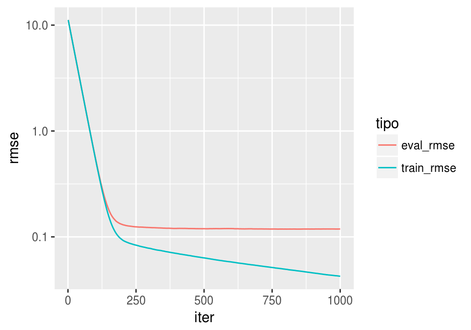


## Tarea {-}


1. Revisa el script que vimos en clase de aplicación de bosques para
predecir precios de casa (bosque-housing.Rmd). Argumenta por qué es mejor
el segundo método para limpiar faltantes que el primero. Considera
 - Cómo respeta cada método la división entrenamiento y validación
 - El desempeño de cada método
 
2. Considera las importancia de variables de bosque-housing.Rmd. Muestra
las importancias basadas en permutaciones escaladas y no escaladas. ¿Con
qué valores en el objeto randomForest se escalan las importancias?

3. Grafica importancias de Gini (MeanDecreaseGini) y de permutaciones. 
¿Los resultados son similiares? Explica qué significa MeanDecreaseGini en el
contexto de un problema de regresión.

4. Considera nuestra primera corrida de gradient boosting
en las notas para el ejemplo de los precios de las casas. Corre este ejemplo
usando pérdida absoluta ($|y-f(x)|$) en lugar de pérdida cuadrática
($(y-f(x))^2$)

- Grafica las curvas de entrenamiento y validación conforme se agregan árboles
- Explica teóricamente cuál es la diferencia del algoritmo cuando utilizas estas
dos pérdidas.
- Da razones por las que pérdida absoluta puede ser una mejor selección para
algunos problemas de regresión.


