# Reducción de dimensionalidad

En esta parte veremos métodos no supervisados: no existe variable a predecir.
En estos métodos buscamos reexpresiones útiles de nuestros datos para que
sean más fáciles de entender o de explorar, para intentar comprimirlos, para
poder usarlos de manera más conveniente en procesos posteriores (por ejemplo,
predicción).

En esta parte veremos técnicas de reducción de dimensionalidad, 
en particular la descomposición en valores singulares, que es una de las más útiles.
La descomposición en valores singulares puede verse como un tipo de
descomposición aditiva en matrices de rango uno, así que comenzaremos
explicando estos conceptos.


## Descomposición aditiva en matrices de rango 1


Supongamos que tenemos una matriz de datos $X$ de tamaño $n\times p$ (todas
son variables numéricas). En los renglones tenemos los casos ($n$) y
las columnas son las variables $p$. 
Típicamente pensamos que las columnas o variables están
todas definidas en una misma escala:
por ejemplo, cantidades de dinero, poblaciones, número de eventos, etc. Cuando no
es así, entonces normalizamos las variables de alguna forma para no tener unidades.

### Matrices de rango 1

Una de las estructuras de datos más simples que podemos imaginar (que sea interesante)
para un tabla de este tipo es que se trata de una matriz de datos de rango 1.
Es  generada por un *score* de individuos que determina mediante un *peso* el valor
de una variable. Es decir, el individuo $i$ en la variable $j$ es

$$X_{ij} = \sigma u_i v_j$$

Donde $u=(u_1,u_2,\ldots, u_n)$ son los *scores* de los individuos y 
$v = (v_1, v_2, \ldots, v_p)$ son los pesos de las variables. Tanto
$u$ como $v$ son vectores normalizados, es decir $||u||=||v||=1$. La constante
$\sigma$ nos permite pensar que los vectores $u$ y $v$ están normalizados.


Esto se puede escribir, en notación matricial, como

$$X = \sigma u v^t$$
donde consideramos a $u$ y $v$ como matrices columna.

\BeginKnitrBlock{comentario}<div class="comentario">
- Una matriz de rango uno (o en general de rango bajo) es más simple de analizar.
En rango 1, tenemos que entender la variación de $n+p$ datos (componentes de $u$ y $v$),
mientras que en una matriz general tenemos que entender $n\times p$ datos.

- Cada variable $j$ de las observaciones es un reescalamiento del índice o score $u$
  de las personas por el factor $\sigma v_j$. 
Igualmente, cada caso $i$ de las observaciones es un reescalamiento del índice o peso
$v$ de las variables por el factor $\sigma u_i$.

- $u$ y $v$ representan una dimensión (dimensión latente, componente) de estos datos.</div>\EndKnitrBlock{comentario}


### Ejemplo: una matriz de rango 1 de preferencias {-}

Supongamos que las columnas de $X$ son películas ($p$), los renglones ($n$)
personas, y la entrada $X_{ij}$ es la afinidad de la persona $i$ por la película $j$.
Vamos a suponer que estos datos tienen una estructura ficticia de rango 1, basada
en las preferencias de las personas por películas de ciencia ficción.

Construimos los pesos de las películas que refleja qué tanto son de 
ciencia ficción o no.  Podemos pensar que cada uno de estos valores el el *peso* de la película en 
la dimensión de ciencia ficción.


```r
library(tidyverse)
peliculas_nom <- c('Gladiator','Memento','X-Men','Scream','Amores Perros',
               'Billy Elliot', 'Lord of the Rings','Mulholland drive',
                'Amelie','Planet of the Apes')
# variable latente que describe el contenido de ciencia ficción de cada 
v <- c(-1.5, -0.5, 4, -1,-3,  -3, 0, 1, -0.5, 3.5)
normalizar <- function(x){
  norma <- sqrt(sum(x^2))
  if(norma > 0){
    x_norm <- x/norma
  } else {
    x_norm <- x
  }
  x_norm
}
v <- normalizar(v)
peliculas <- data_frame(pelicula = peliculas_nom, v = v) %>% arrange(v)
peliculas
```

```
## # A tibble: 10 x 2
##              pelicula         v
##                 <chr>     <dbl>
##  1      Amores Perros -0.420084
##  2       Billy Elliot -0.420084
##  3          Gladiator -0.210042
##  4             Scream -0.140028
##  5            Memento -0.070014
##  6             Amelie -0.070014
##  7  Lord of the Rings  0.000000
##  8   Mulholland drive  0.140028
##  9 Planet of the Apes  0.490098
## 10              X-Men  0.560112
```

Ahora pensamos que tenemos con individuos con *scores* de qué tanto les gusta
la ciencia ficción


```r
set.seed(102)
u <- rnorm(15, 0, 1)
u <- normalizar(u)
personas <- data_frame(persona = 1:15, u = u)
head(personas)
```

```
## # A tibble: 6 x 2
##   persona           u
##     <int>       <dbl>
## 1       1  0.04215632
## 2       2  0.18325375
## 3       3 -0.31599557
## 4       4  0.46314650
## 5       5  0.28921210
## 6       6  0.28037223
```

Podemos entonces construir la afinidad de cada persona por cada película (matriz
$n\times p$ ) multiplicando
el *score* de cada persona (en la dimensión ciencia ficción) por el
peso de la película (en la dimensión ciencia ficción). Por ejemplo, para
una persona, tenemos que su índice es


```r
personas$u[2]
```

```
## [1] 0.1832537
```

Esta persona tiene afinidad por la ciencia ficción, así que sus niveles de gusto
por las películas son (multiplicando por $\sigma = 100$, que en este caso es
una constante arbitraria seleccionada para el ejemplo):

```r
data_frame(pelicula=peliculas$pelicula,  afinidad= 100*personas$u[2]*peliculas$v) %>%
  arrange(desc(afinidad))
```

```
## # A tibble: 10 x 2
##              pelicula  afinidad
##                 <chr>     <dbl>
##  1              X-Men 10.264263
##  2 Planet of the Apes  8.981230
##  3   Mulholland drive  2.566066
##  4  Lord of the Rings  0.000000
##  5            Memento -1.283033
##  6             Amelie -1.283033
##  7             Scream -2.566066
##  8          Gladiator -3.849099
##  9      Amores Perros -7.698197
## 10       Billy Elliot -7.698197
```

Consideremos otra persona


```r
personas$u[15]
```

```
## [1] -0.05320133
```

Esta persona tiene disgusto ligero por la ciencia ficción, y sus scores
de las películas son:


```r
data_frame(pelicula=peliculas$pelicula,  afinidad= 100*personas$u[15]*peliculas$v)
```

```
## # A tibble: 10 x 2
##              pelicula   afinidad
##                 <chr>      <dbl>
##  1      Amores Perros  2.2349029
##  2       Billy Elliot  2.2349029
##  3          Gladiator  1.1174515
##  4             Scream  0.7449676
##  5            Memento  0.3724838
##  6             Amelie  0.3724838
##  7  Lord of the Rings  0.0000000
##  8   Mulholland drive -0.7449676
##  9 Planet of the Apes -2.6073868
## 10              X-Men -2.9798706
```

Si fuera tan simple el gusto por las películas (simplemente depende si contienen
ciencia ficción o no, y si a la persona le gusta o no), la matriz $X$ de observaciones
sería

$$X_1 = \sigma uv^t$$
donde consideramos a $u$ y $v$ como vectores columna. El producto es
de una matriz de $n\times 1$ contra una de $1\times p$, lo cual da una matriz de $n\timesp$.


Podemos calcular como:


```r
X = 100*tcrossprod(personas$u, peliculas$v ) # tcrossprod(x,y) da x %*% t(y)
colnames(X) <- peliculas$pelicula
head(round(X, 1))
```

```
##      Amores Perros Billy Elliot Gladiator Scream Memento Amelie
## [1,]          -1.8         -1.8      -0.9   -0.6    -0.3   -0.3
## [2,]          -7.7         -7.7      -3.8   -2.6    -1.3   -1.3
## [3,]          13.3         13.3       6.6    4.4     2.2    2.2
## [4,]         -19.5        -19.5      -9.7   -6.5    -3.2   -3.2
## [5,]         -12.1        -12.1      -6.1   -4.0    -2.0   -2.0
## [6,]         -11.8        -11.8      -5.9   -3.9    -2.0   -2.0
##      Lord of the Rings Mulholland drive Planet of the Apes X-Men
## [1,]                 0              0.6                2.1   2.4
## [2,]                 0              2.6                9.0  10.3
## [3,]                 0             -4.4              -15.5 -17.7
## [4,]                 0              6.5               22.7  25.9
## [5,]                 0              4.0               14.2  16.2
## [6,]                 0              3.9               13.7  15.7
```

O usando data.frames como


```r
peliculas %>% crossing(personas) %>% mutate(afinidad = round(100*u*v, 2)) %>%
  select(persona, pelicula, afinidad) %>%
  spread(pelicula, afinidad) 
```

```
## # A tibble: 15 x 11
##    persona Amelie `Amores Perros` `Billy Elliot` Gladiator
##  *   <int>  <dbl>           <dbl>          <dbl>     <dbl>
##  1       1  -0.30           -1.77          -1.77     -0.89
##  2       2  -1.28           -7.70          -7.70     -3.85
##  3       3   2.21           13.27          13.27      6.64
##  4       4  -3.24          -19.46         -19.46     -9.73
##  5       5  -2.02          -12.15         -12.15     -6.07
##  6       6  -1.96          -11.78         -11.78     -5.89
##  7       7  -1.47           -8.79          -8.79     -4.40
##  8       8  -0.41           -2.49          -2.49     -1.24
##  9       9  -0.90           -5.39          -5.39     -2.70
## 10      10  -3.11          -18.67         -18.67     -9.34
## 11      11  -2.36          -14.17         -14.17     -7.09
## 12      12  -0.19           -1.13          -1.13     -0.57
## 13      13   1.03            6.15           6.15      3.08
## 14      14   2.08           12.45          12.45      6.23
## 15      15   0.37            2.23           2.23      1.12
## # ... with 6 more variables: `Lord of the Rings` <dbl>, Memento <dbl>,
## #   `Mulholland drive` <dbl>, `Planet of the Apes` <dbl>, Scream <dbl>,
## #   `X-Men` <dbl>
```


Nótese que en este ejemplo podemos simplificar mucho el análisis: en lugar de ver
la tabla completa, podemos simplemente considerar los dos vectores de índices (pesos
 y scores), y trabajar como si fuera un problema de una sola dimensión.

---

## Aproximación con matrices de rango 1.

En general, las matrices de datos reales no son de rango 1. Más bien nos interesa
saber si se puede hacer una buena aproximación de rango 1.


\BeginKnitrBlock{comentario}<div class="comentario">El problema que nos interesa es el inverso: si tenemos la tabla $X$, ¿cómo sabemos
si se puede escribir aproximadamente en la forma simple de una matriz de rango uno? 
Nótese que si lo
pudiéramos hacer, esto simplificaría mucho nuestro análisis de estos datos, y 
obtendríamos información valiosa.</div>\EndKnitrBlock{comentario}


Medimos la diferencia entre una matriz de datos general $X$ y una matriz
de rango 1 $\sigma uv^t$ mediante la norma Frobenius:

$$ ||X-\sigma uv^t||^2_F = \sum_{i,j} (X_{i,j} - \sigma u_iv_j)^2$$

Nos interesa resolver

$$\min_{\sigma, u,v} || X - \sigma uv^t ||_F^2$$

donde $\sigma$ es un escalar, $u$ es un vector columna de tamaño $n$ y $v$ es un
vector columna de tamaño $p$. Suponemos que los vectores $u$ y $v$ tienen norma uno.
Esto no es necesario - podemos absorber constantes en $\sigma$.


### Ejemplo {-}

Por ejemplo, la siguiente tabla tiene gastos personales en distintos rubros en distintos 
años para todo Estados Unidos (en dólares nominales).


```r
library(tidyverse)
X_arr <- USPersonalExpenditure[, c(1,3,5)]
X_arr
```

```
##                       1940  1950  1960
## Food and Tobacco    22.200 59.60 86.80
## Household Operation 10.500 29.00 46.20
## Medical and Health   3.530  9.71 21.10
## Personal Care        1.040  2.45  5.40
## Private Education    0.341  1.80  3.64
```

En este ejemplo  podríamos tener la intuición de que la proporción de gasto
se ha mantenido aproximadamente constante en cada año, y que todos los rubros
han aumentado debido a la inflación. Podríamos intentar hacer
varias normalizaciones para probar esta idea, pero quisiéramos idear una
estrategia general.

Digamos que el vector $u$ denota los niveles generales de cada rubro (es un vector
de longitud 5), y el vector $v$ denota los niveles generales de cada año
(un vector de longitud 3). Queremos ver si es razonable aproximar
$$X\approx uv^t$$

**Observación**: En este caso, la ecuación de arriba $X_{i,j} = u_iv_j$  expresa
que hay niveles generales para cada rubro $i$ a lo largo de todos los años, y para obtener
una aproximación ajustamos con un factor $v_j$ de inflación el año $j$

La mejor manera de entender este problema es con álgebra lineal, como veremos más adelante.
Por el momento intentemos aproximar directamente, intentando resolver (podemos normalizar
$u$ y $v$ más tarde y encontrar la $\sigma$):

$$\min_{u,v} \sum_{i,j} (X_{i,j} - u_iv_j)^2 = \min_{u,v} ||X-uv^t||^2_F$$

**Observación**:Este problema tiene varios mínimos, pues podemos mover constantes de $u$
a $v$ (tiene múltiples soluciones). Hay varias maneras de lidiar con esto (por ejemplo,
normalizando). Por el momento, corremos la optimización para encontrar una solución:


```r
error <- function(pars){
  v <- pars[1:3]
  u <- pars[4:8]
  mean((X_arr - tcrossprod(u, v))^2) #tcrossprod da x %*% t(y)
}
optim_decomp <- optim(rep(0.1, 5 + 3), error, method ='BFGS')
```


```r
v_años <- optim_decomp$par[1:3]
u_rubros <- optim_decomp$par[4:8]
```


La matriz $X_1=uv^t$ que obtuvimos es:


```r
X_1 <- tcrossprod(u_rubros, v_años)
round(X_1, 1)
```

```
##      [,1] [,2] [,3]
## [1,] 21.6 58.4 87.8
## [2,] 11.1 30.1 45.3
## [3,]  4.7 12.6 18.9
## [4,]  1.2  3.2  4.8
## [5,]  0.8  2.2  3.3
```

Podemos ver qué tan buena es la aproximación:


```r
R <- X_arr - X_1
qplot(as.numeric(X_1), as.numeric(as.matrix(X_arr))) + geom_abline(colour='red')
```

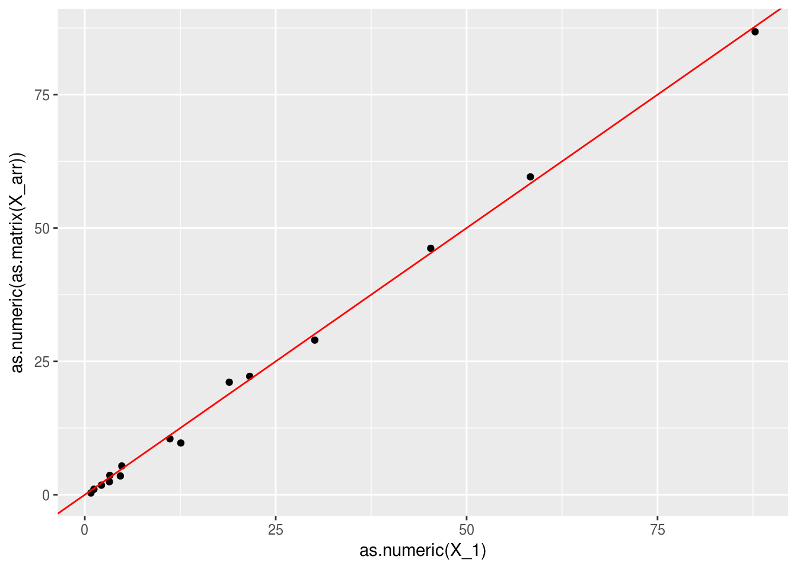

```r
round(R,2)
```

```
##                      1940  1950  1960
## Food and Tobacco     0.60  1.25 -0.98
## Household Operation -0.65 -1.11  0.90
## Medical and Health  -1.12 -2.87  2.18
## Personal Care       -0.15 -0.77  0.55
## Private Education   -0.46 -0.38  0.36
```


donde vemos que nuestra aproximación explica en buena parte la variación
de los datos en la tabla $X$. La descomposición que obtuvimos es de la forma
$$X = uv^t + R$$
donde $R$ tiene norma Frobenius relativamente chica.


**Observaciones**: 

- Este método nos da un ordenamiento de rubros de gasto según su nivel general, y
un ordenamiento de años según su nivel general de gasto.


```r
data_frame(rubro = rownames(X_arr), nivel = u_rubros) %>% arrange(desc(nivel))
```

```
## # A tibble: 5 x 2
##                 rubro     nivel
##                 <chr>     <dbl>
## 1    Food and Tobacco 9.7404116
## 2 Household Operation 5.0268356
## 3  Medical and Health 2.0992569
## 4       Personal Care 0.5380014
## 5   Private Education 0.3634288
```

```r
data_frame(año = colnames(X_arr), nivel = v_años)
```

```
## # A tibble: 3 x 2
##     año    nivel
##   <chr>    <dbl>
## 1  1940 2.217377
## 2  1950 5.990600
## 3  1960 9.011784
```

- Pudimos explicar estos datos usando esos dos índices (5+3=7 números) en lugar
de toda la tabla(5(3)=15 números).

- Una vez explicado esto, podemos concentrarnos en los patrones que hemos aislado
en la matriz $R$. Podríamos repetir buscando una aproximación igual a la que acabomos 
de hacer para la matriz $X$, o podríamos hacer distintos tipos de análisis.

---


### Suma de matrices de rango 1.

La matriz de datos $X$ muchas veces no puede aproximarse bien con una sola matriz
de rango 1. Podríamos entonces buscar descomponer los datos en más de una dimensión
latente:

$$X = \sigma_1 u_1v_1^t + \sigma_2 u_2v_2^t+\ldots+ \sigma_k u_kv_k^t$$

### Ejemplo: películas {-}

En nuestro ejemplo anterior, claramente debe haber otras dimensiones latentes
que expliquen la afinidad por una película. Por ejemplo, quizá podríamos considerar
el gusto por películas *mainstream* vs películas independientes.


```r
peliculas_nom <- c('Gladiator','Memento','X-Men','Scream','Amores Perros',
               'Billy Elliot', 'Lord of the Rings','Mulholland drive',
                'Amelie','Planet of the Apes')
# variable latente que describe el contenido de ciencia ficción de cada 
v_1 <- c(-1.5, -0.5, 4, -1,-3,  -3, 0, 1, -0.5, 3.5)
v_2 <- c(4.1, 0.2, 3.5, 1.5, -3.0, -2.5, 2.0, -4.5, -1.0, 2.6) #mainstream o no
v_1 <- normalizar(v_1)
v_2 <- normalizar(v_2)
peliculas <- data_frame(pelicula = peliculas_nom, v_1 = v_1, v_2 = v_2) %>% arrange(v_2)
peliculas
```

```
## # A tibble: 10 x 3
##              pelicula       v_1         v_2
##                 <chr>     <dbl>       <dbl>
##  1   Mulholland drive  0.140028 -0.50754390
##  2      Amores Perros -0.420084 -0.33836260
##  3       Billy Elliot -0.420084 -0.28196884
##  4             Amelie -0.070014 -0.11278753
##  5            Memento -0.070014  0.02255751
##  6             Scream -0.140028  0.16918130
##  7  Lord of the Rings  0.000000  0.22557507
##  8 Planet of the Apes  0.490098  0.29324759
##  9              X-Men  0.560112  0.39475637
## 10          Gladiator -0.210042  0.46242889
```

Y las personas tienen también *scores* en esta nueva dimensión, que aquí simulamos al azar


```r
personas <- personas %>% mutate(u_1 = u, u_2 = normalizar(rnorm(15, 0, 1))) %>% select(-u)
head(personas)
```

```
## # A tibble: 6 x 3
##   persona         u_1         u_2
##     <int>       <dbl>       <dbl>
## 1       1  0.04215632 -0.06231047
## 2       2  0.18325375 -0.37654521
## 3       3 -0.31599557  0.41966960
## 4       4  0.46314650 -0.40146285
## 5       5  0.28921210  0.12705318
## 6       6  0.28037223  0.18002499
```
Por ejemplo, la segunda persona persona le gusta la  ciencia ficción,
y pero prefiere fuertemente películas  independientes.

Podemos graficar a las personas según su interés en ciencia ficción y mainstream:


```r
ggplot(personas, aes(x = u_1, y=u_2)) + geom_point() +
  geom_vline(xintercept = 0, colour='red') + 
  geom_hline(yintercept = 0, colour='red') + xlab('Ciencia ficción')+
  ylab('Mainstream')
```

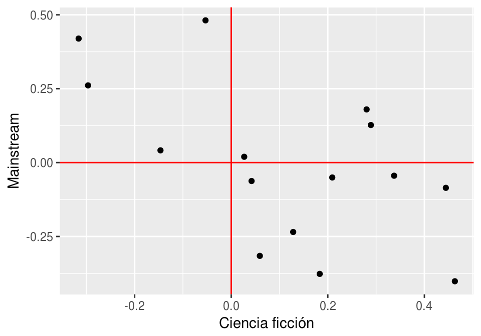


Y también podemos graficar las películas


```r
ggplot(peliculas, aes(x = v_1, y=v_2, label = pelicula)) + geom_point() +
  geom_vline(xintercept = 0, colour='red') + 
  geom_hline(yintercept = 0, colour='red')+ xlab('Ciencia ficción')+
  ylab('Mainstream') + geom_text()
```

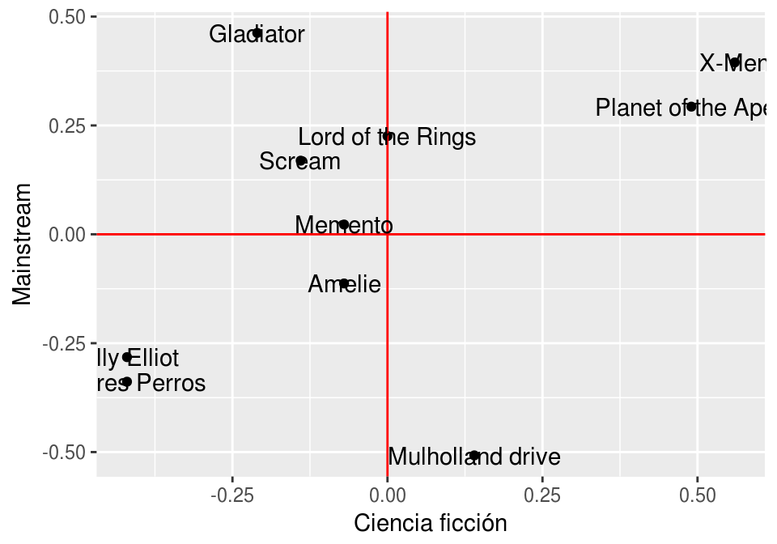


¿Cómo calculariamos ahora la afinidad de una persona por una película? Necesitamos
calcular (dando el mismo peso a las dos dimensiones)
$$X_{i,j} = \sigma_1 u_{1,i} v_{1,j} + \sigma_2 u_{2,i} v_{2,j}$$

Usamos la notación $u_{k,i}$ para denotar la componente $i$ del vector $u_k$.

Antes pusimos $\sigma_1=100$. Supongamos que la siguiente componente es un poco
menos importante que la primera. Podriamos escoger $\sigma_2=70$, por ejemplo.

Podríamos hacer

```r
library(purrr)
library(stringr)
personas_larga <- personas %>% gather(dimension, u, u_1:u_2) %>%
  separate(dimension, c('x','dim'), '_') %>% select(-x)
head(personas_larga)
```

```
## # A tibble: 6 x 3
##   persona   dim           u
##     <int> <chr>       <dbl>
## 1       1     1  0.04215632
## 2       2     1  0.18325375
## 3       3     1 -0.31599557
## 4       4     1  0.46314650
## 5       5     1  0.28921210
## 6       6     1  0.28037223
```

```r
peliculas_larga <- peliculas %>% gather(dimension, v, v_1:v_2) %>%
  separate(dimension, c('x','dim'), '_') %>% select(-x)
head(peliculas_larga)
```

```
## # A tibble: 6 x 3
##           pelicula   dim         v
##              <chr> <chr>     <dbl>
## 1 Mulholland drive     1  0.140028
## 2    Amores Perros     1 -0.420084
## 3     Billy Elliot     1 -0.420084
## 4           Amelie     1 -0.070014
## 5          Memento     1 -0.070014
## 6           Scream     1 -0.140028
```

```r
sigma_df <- data_frame(dim = c('1','2'), sigma = c(100,70))
```


```r
df_dim <- personas_larga %>% left_join(peliculas_larga) %>%
                        left_join(sigma_df) %>%
                        mutate(afinidad = sigma*u*v)
```

```
## Joining, by = "dim"
## Joining, by = "dim"
```

```r
df_agg <- df_dim %>% group_by(persona, pelicula) %>%
  summarise(afinidad = round(sum(afinidad),2))
df_agg %>% spread(pelicula, afinidad)
```

```
## # A tibble: 15 x 11
## # Groups:   persona [15]
##    persona Amelie `Amores Perros` `Billy Elliot` Gladiator
##  *   <int>  <dbl>           <dbl>          <dbl>     <dbl>
##  1       1   0.20           -0.30          -0.54     -2.90
##  2       2   1.69            1.22          -0.27    -16.04
##  3       3  -1.10            3.33           4.99     20.22
##  4       4  -0.07           -9.95         -11.53    -22.72
##  5       5  -3.03          -15.16         -14.66     -1.96
##  6       6  -3.38          -16.04         -15.33     -0.06
##  7       7  -1.07           -7.60          -7.80     -6.02
##  8       8   2.08            4.99           3.74    -11.46
##  9       9   0.95            0.17          -0.76    -10.29
## 10      10  -2.44          -16.65         -16.99    -12.10
## 11      11  -2.01          -13.12         -13.30     -8.52
## 12      12  -0.34           -1.60          -1.52      0.07
## 13      13   0.70            5.17           5.33      4.42
## 14      14   0.01            6.27           7.30     14.68
## 15      15  -3.43           -9.17          -7.27     16.70
## # ... with 6 more variables: `Lord of the Rings` <dbl>, Memento <dbl>,
## #   `Mulholland drive` <dbl>, `Planet of the Apes` <dbl>, Scream <dbl>,
## #   `X-Men` <dbl>
```


**Observación**: Piensa qué harías si vieras esta tabla directamente, e imagina
cómo simplificaría la comprensión y análisis si conocieras las matrices de rango 1
con las que se construyó este ejemplo.


Consideremos la persona 2:


```r
filter(personas, persona==2)
```

```
## # A tibble: 1 x 3
##   persona       u_1        u_2
##     <int>     <dbl>      <dbl>
## 1       2 0.1832537 -0.3765452
```

Que tiene gusto por la ciencia ficción y le gustan películas independientes.
Sus afinidades son:

```r
filter(df_agg, persona==2) %>% arrange(desc(afinidad))
```

```
## # A tibble: 10 x 3
## # Groups:   persona [1]
##    persona           pelicula afinidad
##      <int>              <chr>    <dbl>
##  1       2   Mulholland drive    15.94
##  2       2             Amelie     1.69
##  3       2 Planet of the Apes     1.25
##  4       2      Amores Perros     1.22
##  5       2              X-Men    -0.14
##  6       2       Billy Elliot    -0.27
##  7       2            Memento    -1.88
##  8       2  Lord of the Rings    -5.95
##  9       2             Scream    -7.03
## 10       2          Gladiator   -16.04
```

Explicaríamos así esta descomposición: 

- Cada persona $i$ tiene un nivel de gusto por 
ciencia ficción ($u_{1,i}$) y otro nivel de gusto por películas independientes ($u_{2,i}$).
- Cada película $j$ tiene una calificación o peso en la dimensión de ciencia ficción ($v_{1,i}$)
y un peso en la dimensión de independiente  ($v_{2,i}$)

La afinidad de una persona $i$ por una película $j$ se calcula como

$$ \sigma_1 u_{1,i}v_{1,j}  + \sigma_2 u_{2,i}v_{2,j}$$


\BeginKnitrBlock{comentario}<div class="comentario">- Una matriz de rango 2 es una suma (o suma ponderada) de matrices de rango 1
- Las explicaciones de matrices de rango aplican para cada sumando (ver arriba)
- En este caso, hay dos dimensiones latentes que explican los datos: preferencia por independientes
y preferencia por ciencia ficción. En este ejemplo ficticio estas componentes explica del todo
a los datos.</div>\EndKnitrBlock{comentario}

---


## Aproximación con matrices de rango bajo

\BeginKnitrBlock{comentario}<div class="comentario">Nuestro problema generalmente es el inverso: si tenemos la matriz de datos $X$,
¿podemos encontrar un número bajo $k$ de dimensiones de forma que $X$ se escribe (o aproxima) como suma de
matrices de $k$ matrices rango 1? Lograr esto sería muy bueno, pues otra vez
simplificamos el análisis a solo un número de dimensiones $k$ (muy) menor a $p$,
el número de variables, sin perder mucha información (con buen grado de aproximación).

Adicionalmente, las dimensiones encontradas pueden mostrar  patrones interesantes que iluminan los datos,
esqpecialmente en términos de aquellas dimensiones que aportan mucho a la aproximación.</div>\EndKnitrBlock{comentario}


En general, buscamos encontrar una aproximación de la matriz $X$ mediante una
suma de matrices de rango 1

$$X \approx \sigma_1 u_1v_1^t + \sigma_2 v_2v_2^t+\ldots+ \sigma_k u_kv_k^t.$$

A esta aproximación le llamamos una *aproximación de rango* $k$. Hay muchas maneras de hacer esto, y probablemente la mayoría de ellas no
son muy interesantes. Podemos más concretamente preguntar,  ¿cuál es la mejor aproximación
de rango $k$ que hay?

$$\min_{X_k} || X - X_k ||_F^2$$
donde consideramos la distancia entre $X$ y $X_k$ con la norma de Frobenius,
que está definida por:

$$|| A  ||_F^2 = \sum_{i,j} a_{i,j}^2$$ 
y es una medida de qué tan cerca están las dos matrices $A$ y $B$, componente
a componente. 


### Discusión: aproximación de rango 1.

Empecemos resolviendo el problema más simple, que es

$$\min_{\sigma,u,v} || X - \sigma uv^t ||_F^2$$

donde $\sigma$ es un escalar, $u$ es un vector columna de tamaño $n$ y $v$ es un
vector columna de tamaño $p$. Suponemos que los vectores $u$ y $v$ tienen norma uno.

El objetivo que queremos minimizar es
$$\sum_{i,j} (X_{i,j} - \sigma u_iv_j)^2$$

Derivando con respecto a $u_i$ y $v_j$, e igualando a cero, obtenemos (la sigma
podemos quitarla en la derivada, pues multiplica todo el lado derecho):

$$\frac{\partial}{\partial u_i} = -2\sigma\sum_{j} (X_{i,j} - \sigma u_iv_j)v_j = 0$$
$$\frac{\partial}{\partial v_j} = -2\sigma\sum_{i} (X_{i,j} - \sigma u_iv_j)u_i = 0$$
Que simplificando (y usando que la norma de $u$ y $v$ es igual a 1: $\sum_iu_i^2 = \sum_j v_j^2=1$) quedan:
$$\sum_j X_{i,j}v_j =  \sigma u_i,$$
$$\sum_i X_{i,j}u_i =\sigma  v_j,$$
O en forma matricial 
\begin{equation}
Xv = \sigma u
(\#eq:valor-propio-derecho)
\end{equation}


\begin{equation}
u^t X= \sigma v^t.
(\#eq:valor-propio-izquierdo)
\end{equation}

Podemos resolver este par de ecuaciones para encontrar la solución al problema
de optimización de arriba. Este problema tiene varias soluciones (con distintas $\sigma$), 
pero veremos cómo podemos escoger la que de mejor la aproximación (adelanto:
escoger las solución con $\sigma^2$ más grande). 

\BeginKnitrBlock{comentario}<div class="comentario">A un par de vectores $(u,v)$ que cumplen esta propiedad les llamamos **vector propio
izquierdo** ($u$) y **vector propio derecho** ($v$), con **valor singular** asociado $\sigma$.
Por convención, tomamos $\sigma \geq 0$ (si no, podemos multiplicar a $u$ por menos, por ejemplo).</div>\EndKnitrBlock{comentario}

Y tenemos un resultado importante que nos será útil, y que explica el nombre de estos 
vectores:

\BeginKnitrBlock{comentario}<div class="comentario">Si $(u,v)$ son vectores propios de $X$ asociados a $\sigma$, entonces

- $v$ es un vector propio de la matriz cuadrada $X^tX$ ($p\times p$) con valor propio $\sigma^2$.

- $u$ es un vector propio de la matrix cuadrada $XX^t$ ($n\times n$) con valor propio $\sigma^2$.</div>\EndKnitrBlock{comentario}


**Observaciones**:

- La demostración es fácil pues aplicando $X^t$ a ambos lados de \@ref(eq:valor-propio-derecho), obtenemos
$X^t X v= \sigma X^t u$, que implica $(X^t X) v= \sigma (u^tX)^t = \sigma^2 v$. Podemos
hacer lo mismo para \@ref(eq:valor-propio-izquierdo).

- Nótese que $X^tX$ es una matriz simétrica. Por el teorema espectral, existe una base
ortogonal de vectores propios (usual) $v_1, v_2, \ldots, v_p$ con valores propios
reales. Adicionalmente, como $X^tX$ es positivo-definida, 
entonces todos estos vectores propios tienen valor propio no negativos.


#### Ejemplo {--}
Verifiquemos en el ejemplo del gasto en rubros. Si comparamos $Xv$ con $u$, vemos
que son colineales (es decir, $Xv=\sigma u$):

```r
# qplot(Xv, u), si Xv=sigma*u entonces Xv y u deben ser proporcionales
qplot(as.matrix(X_arr) %*% v_años, u_rubros) + geom_smooth(method='lm')
```

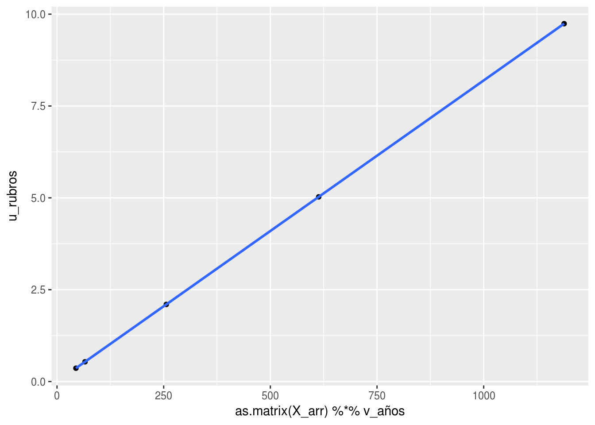

Y también

```r
# qplot(u^tX, v^t), si u^tXv=sigma*v entonces Xv y u deben ser proporcionales
qplot(t(as.matrix(X_arr)) %*% u_rubros, (v_años) ) + geom_smooth(method='lm')
```

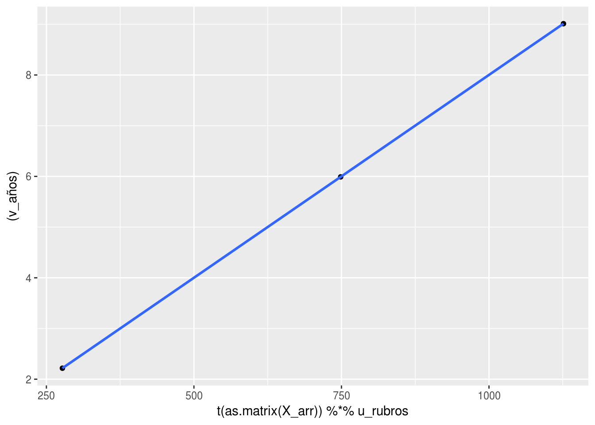


Ahora normalizamos $u$ y $v$ para encontrar $\sigma$:

```r
u_rubros_norm <- normalizar(u_rubros)
v_años_norm <- normalizar(v_años)
(as.matrix(X_arr) %*% v_años_norm)/u_rubros_norm
```

```
##                         [,1]
## Food and Tobacco    123.4858
## Household Operation 123.4855
## Medical and Health  123.4864
## Personal Care       123.4891
## Private Education   123.4799
```

Y efectivamente vemos que $(u,v)$ (normalizados) forman satisfacen las ecuaciones mostradas arriba,
con $\sigma$ igual a:

```r
first((as.matrix(X_arr) %*% v_años_norm)/u_rubros_norm)
```

```
## [1] 123.4858
```

---

Si hay varias soluciones, ¿cuál $\sigma$ escogemos?

Supongamos que encontramos  dos vectores propios $(u,v)$ (izquierdo y derecho)  con 
valor propio asociado $\sigma$.
Podemos evaluar la calidad de la aproximación usando
la igualdad
$$\||A||_F^2 = traza (AA^t)$$
que es fácil de demostrar, pues la componente $(i,i)$ de $AA^t$  está dada por
el producto punto del renglon $i$ de A por el renglón $i$ de $A$, que es $\sum_{i,j}a_{i,j}^2.$

Entonces tenemos que

$$||X-\sigma uv^t||_F^2 = \mathrm{Tr} ((X-\sigma uv^t)(X-\sigma uv^t)^t)$$

que es igual a 

$$ \mathrm{Tr} (XX^t) - 2\sigma \mathrm{Tr} ( X(vu^t)) + \sigma^2\mathrm{Tr}(uv^tvu^t)$$ 

Como $u$ y $v$ tienen norma 1, tenemos que $v^tv=1$, y 
$\textrm{Tr(uu^t)} = \sum_i u_i^2 = 1$.
Adicionalmente, usando el hecho de que $Xv=\sigma u$ obtenemos

$$ ||X-\sigma uv^t||_F^2 = \mathrm{Tr} (XX^t) - \sigma^2$$
que es una igualdad interesante: quiere decir que **la mejor aproximación 
se encuentra encontrando el par de valores propios tal que el valor propio
asociado $\sigma$ tiene el valor $\sigma^2$ más grande posible.** La cantidad
a la cantidad $\mathrm{Tr} (XX^t)$ está dada por
$$\mathrm{Tr} (XX^t) = ||X||_F^2 = \sum_{i,j} X_{i,j}^2,$$
que es una medida del "tamaño" de la matriz $X$.


### Discusión: aproximaciones de rango más alto

Vamos a repetir el análisis para dimensión 2, repitiendo el proceso que hicimos arriba.
Denotamos como $u_1$ y $v_1$ los vectores $u$ y $v$ que encontramos en el paso anterior.
Ahora buscamos minimizar

$$\min_{u_2,v_2} || X - \sigma_1 u_1 v_1^t - \sigma_2 u_2 v_2^{t} ||_F^2$$
Repetimos el argumento de arriba y derivando respecto a las componentes de $u_2,v_2$,
y usando el hecho de que $(u_1, v_1)$ son vectores propios derecho e izquierdo asociados
a $\sigma_1$, obtenemos:

- $v_2$ es ortogonal a $v_1$.
- $u_2$ es ortogonal a $u_1$.
- $(u_2, v_2)$ tienen que ser vectores propios derecho e izquierdo asociados a $\sigma_2\geq 0$.


Usando el hecho de que $v_1$ y $v_2$ son ortogonales, podemos
podemos demostrar igual que arriba que

$$|| X - \sigma_1 u_1 v_1^t - \sigma_2 u_2 v_2^{t} ||_F^2 = \textrm{Tr} (XX^t) - (\sigma_1^2 + \sigma_2^2)$$
De modo que obtenemos la mejor aproximación escogiendo los dos valores de $\sigma_1^2$ y $\sigma_2^2$
más grandes para los que hay solución de \@ref(eq:valor-propio-derecho) y \@ref(eq:valor-propio-izquierdo) y

**Observaciones**:

- Aunque aquí usamos un argumento incremental o *greedy* 
(comenzando con la mejor aproximación de rango 1),
es posible demostrar que la mejor aproximación de rango 2 se puede construir de este modo. Ver
por ejemplo [estas notas](https://www.cs.cmu.edu/~venkatg/teaching/CStheory-infoage/book-chapter-4.pdf).
- En el caso de dimensión 2, vemos que **la solución es incremental**: $\sigma_1, u_1, v_1$ son los
mismos que para la solución de dimensión 1. En dimensión 2, tenemos que buscar el siguiente
valor singular más grande después de $\sigma_1$, de forma que tenemos $\sigma_1^2 \geq \sigma_2^2$.
La solución entonces es agregar $\sigma_2 u_2 v_2^t$, donde $(u_2,v_2)$ es el par de vectores
propios izquierdo y derecho.

Ahora podemos enunciar nuestro teorema:

\BeginKnitrBlock{comentario}<div class="comentario">**Aproximación de matrices mediante valores singulares**
  
Sea $X$ una matriz $n\times p$, y supongamos que $p\leq n$. Entonces, para cada $k \leq p$, 
  la mejor aproximación de rango $k$ a la  matriz $X$ se puede escribir como
una suma $X_k$ de $k$ matrices de rango 1:
$$X_k =  \sigma_1 u_1v_1^t + \sigma_2 u_2v_2^t + \ldots \sigma_k u_kv_k^t,$$
donde 

- La calidad de la aproximación está dada por 
$$||X-X_k||^2_F = ||X||^2_F - 
  (\sigma_1^2+ \sigma_2^2 + \cdots + \sigma_k^2),$$ de forma que cada aproximación 
es sucesivamente mejor.
- $\sigma_1^2 \geq \sigma_2^2 \geq \cdots  \geq \sigma_k^2\geq 0$
- Los vectores $(u_i,v_i)$ son un par de vectores propios izquierdo y derechos para $X$ con valor singular $\sigma_i$.
- $v_1,\ldots, v_k$ son vectores ortogonales de norma 1
- $u_1,\ldots, u_k$ son vectores ortogonales de norma 1
</div>\EndKnitrBlock{comentario}

**Observaciones**:

1. Normalmente no optimizamos como hicimos en el ejemplo de la matriz de gastos
para encontrar las aproximación de rango bajo,
sino que se usan algoritmos para encontrar vectores propios de $X^tX$ (que son las $v$'s),
o más generalmente algoritmos basados en álgebra lineal 
que intentan encontrar directamente los pares de vectores (u_i, v_i), y otros algoritmos
numéricos (por ejemplo, basados en iteraciones).


2. Un resultado interesante (que faltaría por demostrar) es que si tomamos la aproximación de 
rango $p$ (cuando $p\leq n$), obtenemos que
$$X= \sigma_1 u_1v_1^t + \sigma_2 u_2v_2^t + \ldots \sigma_p u_pv_p^t$$
es decir, la aproximación es exacta. Esto es un fraseo del 
**teorema de descomposición en valores singulares**, que normalmente se expresa
de otra forma (ver más adelante).

### Ejemplo {-}
Consideremos el ejemplo de los gastos. Podemos usar la función *svd* de R

```r
svd_gasto <- svd(X_arr)
```

El objeto de salida contiene los valores singulares (en *d*). Nótese que ya habíamos
calculado por fuerza bruta el primer valor singular:


```r
sigma <- svd_gasto$d
sigma
```

```
## [1] 123.4857584   4.5673718   0.3762533
```

Los vectores $v_1,v_2,v_3$ (pesos de las variables) en nuestras tres nuevas dimensiones, 
que son las columnas de


```r
v <- svd_gasto$v
rownames(v) <- colnames(X_arr)
v
```

```
##            [,1]       [,2]        [,3]
## 1940 -0.2007388 -0.3220495 -0.92519623
## 1950 -0.5423269 -0.7499672  0.37872247
## 1960 -0.8158342  0.5777831 -0.02410854
```
y los vectores $u_1,u_2,u_3$, que son los scores de los rubros en cada dimensión


```r
dim(svd_gasto$u)
```

```
## [1] 5 3
```

```r
u <- (svd_gasto$u)
rownames(u) <- rownames(X_arr)
u
```

```
##                            [,1]       [,2]       [,3]
## Food and Tobacco    -0.87130286 -0.3713244 -0.1597823
## Household Operation -0.44966139  0.3422116  0.4108311
## Medical and Health  -0.18778444  0.8259030 -0.2584369
## Personal Care       -0.04812680  0.2074885 -0.4372590
## Private Education   -0.03250802  0.1408623  0.7400691
```

Podemos considerar ahora la segunda dimensión que encontramos. 

- En los scores: $u_2$ tiene valores altos en el rubro 3 (salud), y valores negativos en rubro 1. Es un patrón
de gasto más alto en todo menos en comida (que es el rubro 1), especialmente en salud.

- Ahora vemos $v_2$:  tiene un valor alto en el año 60 (3a entrada), y valores más negativos para
los dos primeros años (40 y 50)

- Así que decimos que en los 60, el ingreso se desplazó hacia salud (y otros rubros en general),
reduciéndose el de comida.

 Si multiplicamos podemos ver la contribución de esta matriz de rango 1 (en billones (US) de dólares):

```r
d <- svd_gasto$d
(d[2]*tcrossprod(svd_gasto$u[,2], svd_gasto$v[,2])) %>% round(1)
```

```
##      [,1] [,2] [,3]
## [1,]  0.5  1.3 -1.0
## [2,] -0.5 -1.2  0.9
## [3,] -1.2 -2.8  2.2
## [4,] -0.3 -0.7  0.5
## [5,] -0.2 -0.5  0.4
```

Este es un efecto relativamente chico (comparado con el patrón estable de la primera
dimensión), pero ilumina todavía un aspecto adicional de esta tablita.

La norma de la diferencia entre la matriz $X$ y la aproximación de rango 2 podemos calcularla
de dos maneras:


```r
sum(X_arr^2) - sum(d[1:2]^2)
```

```
## [1] 0.1415665
```
O calculando la aproximación y la diferencia directamente. Podemos hacerlo de la siguiente forma


```r
X_arr_2 <- d[1]*tcrossprod(u[,1], v[,1]) + d[2]*tcrossprod(u[,2], v[,2])
sum((X_arr - X_arr_2)^2)
```

```
## [1] 0.1415665
```
Pero podemos calcular la aproximación $X_2$ en forma matricial, haciendo

```r
X_arr_2 <- u[,1:2] %*% diag(d[1:2]) %*% t(v[,1:2])
sum((X_arr - X_arr_2)^2)
```

```
## [1] 0.1415665
```

## Descomposición en valores singulares (SVD o DVS)

Aunque ya hemos enunciado los resultados, podemos enunciar el teorema de descomposición
en valores singulares en términos matriciales.

Supongamos entonces que tenemos una aproximación de rango $k$

$$X_k = \sigma_1 u_1v_1^t + \sigma_2 u_2v_2^t + \ldots \sigma_k u_kv_k^t$$

Se puede ver que esta aproximación se escribe como (considera todos los vectores
como vectores columna)

$$ X_k = (u_1,u_2, \ldots, u_k) \left(     
{\begin{array}{ccccc}
\sigma_1 & 0 & \cdots & \cdots & 0 \\
0 & \sigma_2 & 0 &\cdots & 0 \\
\vdots & & & \vdots\\
0 & 0 & 0 & \cdots & \sigma_k  \\
\end{array} }
\right)
\left (
\begin{array}{c}
v_1^t \\
v_2^t \\
\vdots \\
v_k^t
\end{array}
\right)
$$

o más simplemente, como

$$X_k = U_k \Sigma_k V_k^t$$
donde $U_k$ ($n\times k$) contiene los vectores $u_i$ en sus columnas, 
$V_k$ ($k\times p$) contiene los vectores $v_j$ en sus columnas, y
la matriz $\Sigma_k$ es la matriz diagonal con los primeros $\sigma_1\geq \sigma_2\geq\cdots \sigma_k$
valores singulares.

Ver el ejemplo anterior para ver cómo los cálculos son iguales.

\BeginKnitrBlock{comentario}<div class="comentario">**Descomposición en valores singulares**
  
Sea $X$ una matriz de $n\times p$ con $p\leq n$. Entonces existe una factorización
$$X=U\Sigma V^t,$$

- $\Sigma$ es una matriz diagonal con valores no-negativos (valores singulares).
Los valores singulares de $\Sigma$ estan ordenados en orden decreciente.
    
- Las columnas de U y V son vectores ortogonales unitarios. La i-ésima columna
$u_i$ de $V$ y la í-esima columna $v_i$ de $V$ son pares de vectores propios $(u_i, v_i)$ izquierdo y derecho de $X$  con valor singular $\sigma_i = \Sigma_{i,i}$
</div>\EndKnitrBlock{comentario}

- Una vez que tenemos esta descomposición, podemos extraer la aproximación que
nos sea útil: una aproximación  $X_k$ de orden $k$ se escribe como
$$X_k = U_k\Sigma_k V_k^t$$
donde $U_k$ contiene las primeras $k$ columnas de $U$, $V_k$ las primeras $k$
columnas de $V$, y $\Sigma_k$ es la submatriz cuadrada $k\times k$ de los primeros
$k$ renglones y columnas de $\Sigma$ :


```r
knitr::include_graphics("imagenes/svd.png")
```


- Frecuenta el teorema de aproximación óptima (teorema de Ekhart-Young) 
se deriva de la descomposición en valores singulares, que se demuestra antes
usando técnicas de álgebra lineal.


## Interpretación geométrica

La descomposición en valores singulares también se puede interpretar geométricamente.
Para ver cómo funciona, primero observamos que:

\BeginKnitrBlock{comentario}<div class="comentario">Los vectores $v_1,v_2, \ldots, v_p$ están en el espacio de variables o columnas
(son de dimensión $p$). La componente de la proyección 
(ver [proyeccción de vectores](https://en.wikipedia.org/wiki/Vector_projection) )
de la matriz de datos sobre una de estas dimensiones está dada por
$$Xv_j,$$
que son iguales a los scores de los casos
$$\sigma_j u_j$$. </div>\EndKnitrBlock{comentario}

Por ejemplo, la projeccion del rengón $x_i$ de la matriz $X$ es
$(x_i^tv_j) v_j$ ($x_i^tv_j$ es un escalar, la componente de la proyección).

Consideremos unos datos simulados


```r
set.seed(3221)
x_1 <- rnorm(200,2, 1)
x_2 <- rnorm(200,0,1) + x_1
datos <- data_frame(x_1, x_2)
ggplot(datos, aes(x=x_1, y=x_2)) + geom_point() +
  geom_vline(xintercept = 0, colour='red') +
 geom_hline(yintercept = 0, colour='red')
```


Hacemos descomposición en valores singulares y graficamos 

```r
svd_x <- svd(datos)
v <- svd_x$v %>% t %>% as.data.frame() 
u <- svd_x$u %>% data.frame
colnames(v) <- c('x_1','x_2')
colnames(u) <- c('x_1','x_2')
d <- svd_x$d
v
```

```
##          x_1        x_2
## 1 -0.6726219 -0.7399864
## 2 -0.7399864  0.6726219
```

Graficamos ahora los dos vectores $v_1$ y $v_2$


```r
ggplot(datos) + geom_point(aes(x=x_1, y=x_2)) +
  geom_vline(xintercept = 0, colour='red') +
 geom_hline(yintercept = 0, colour='red') + 
  geom_segment(data = v, aes(xend= -5*x_1, yend=-5*x_2, x=0, y=0), col='red', size=1.1,
               arrow = arrow(length = unit(0.3,"cm")))  +
  coord_equal()
```

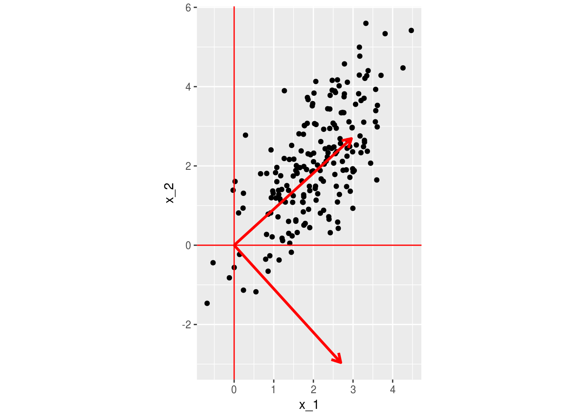


- El primer vector es el "que pasa más cercano a los puntos", en el sentido de que la distancia
entre los datos proyectados al vector y los datos es lo más chica posible (mejor aproximación). La
proyección de los datos sobre $v$ es igual a $Xv_1=\sigma_1 u_1$, es decir, está dada por 
$\sigma u_1$

- Las proyecciones de los datos sobre el segundo vector $v_2$ están dadas igualmente por 
$\sigma_2 u_2$. Sumamos esta proyección a la de la primera dimensión para obtener una mejor
aproximación a los datos (en este caso, exacta).

Por ejemplo, seleccionemos el primer punto y obtengamos sus proyecciones:


```r
proy_1 <- (d[1])*u[1,1]*v[1,] #v_1 por el score en la dimensión 1 u[1,1]
proy_2 <- (d[2])*u[1,2]*v[2,] #v_2 por el score en la dimensión 1 u[1,1]
proy_2 + proy_1
```

```
##        x_1      x_2
## 2 3.030313 1.883698
```

```r
datos[1,]
```

```
## # A tibble: 1 x 2
##        x_1      x_2
##      <dbl>    <dbl>
## 1 3.030313 1.883698
```

Podemos graficar la aproximación sucesiva:


```r
datos$selec <- c('seleccionado', rep('no_seleccionado', nrow(datos)-1))
ggplot(datos) + geom_point(aes(x=x_1, y=x_2, colour=selec, size=selec)) +
  geom_vline(xintercept = 0, colour='red') +
 geom_hline(yintercept = 0, colour='red') + 
  geom_segment(aes(xend= proy_1[1], yend=proy_1[2], x=0, y=0), col='red', size=1.1,
               arrow = arrow(length = unit(0.3,"cm")))  +
  geom_segment(aes(xend= proy_2[1] + proy_1[1], yend=proy_2[2] + proy_1[2], 
                     x=proy_1[1], y=proy_1[2]), 
                col='red', size=1.1,
                arrow = arrow(length = unit(0.2,"cm")))  +
  coord_equal()
```


\BeginKnitrBlock{comentario}<div class="comentario">- Las aproximaciones de la descomposión en valores singulares mediante matrices de rango 1 puede
entenderse como la búsqueda sucesiva de subespacios de dimensión baja, donde al proyectar los datos perdemos
poca información. 
- Las proyecciones sucesivas se hacen sobre vectores ortogonales, y en este sentido
la DVS separa la información en partes que no tienen contenido común (desde el punto
 de vista lineal).</div>\EndKnitrBlock{comentario}

Finalmente, muchas veces graficamos las proyecciones en el nuevo espacio creado
por las dimensiones de la DVS.


```r
proyecciones <- data_frame(dim_1 = d[1]*u[,1], dim_2 = d[2]*u[,2],
                          selec = datos$selec) 
ggplot(proyecciones, aes(x = dim_1, y = dim_2, size=selec, colour=selec)) + 
  geom_point() 
```

```
## Warning: Using size for a discrete variable is not advised.
```


## SVD para películas de netflix

Vamos a intentar encontrar dimensiones latentes para los datos del concurso
de predicción de Netflix (una de las componentes de las soluciones ganadoras
fue descomposición en valores singulares).


```r
#no correr en notas - son unas 50 millones de evaluaciones
# puedes bajar los datos y reproducir desde datos originales bajando el archivo
# https://s3.amazonaws.com/netflix-am2017/muestra_calificaciones_1.csv
if(FALSE){
  evals <- read_csv('datos/netflix/muestra_calificaciones_1.csv')
  evals
}
```


```r
peliculas_nombres <- read_csv('datos/netflix/peliculas_1.csv')
```

```
## Parsed with column specification:
## cols(
##   pelicula_id = col_integer(),
##   year = col_integer(),
##   name = col_character()
## )
```

```r
peliculas_nombres
```

```
## # A tibble: 646 x 3
##    pelicula_id  year                                name
##          <int> <int>                               <chr>
##  1           1  2003              Something's Gotta Give
##  2           2  1992                      Reservoir Dogs
##  3           3  2003                    X2: X-Men United
##  4           4  2004                        Taking Lives
##  5           5  1959                  North by Northwest
##  6           6  2004 Harold and Kumar Go to White Castle
##  7           7  2001               Bridget Jones's Diary
##  8           8  2000                       High Fidelity
##  9           9  2000                      Pay It Forward
## 10          10  1999                               Dogma
## # ... with 636 more rows
```

Hay muchas peliculas que no son evaluadas por ningún usuario. Aquí tenemos que decidir
cómo tratar estos datos: si los rellenamos con 0, la implicación es que un usuario
tiene bajo interés en una película que no ha visto. Hay otras opciones (y quizá un
método que trate apropiadamente los datos faltantes es mejor).


```r
#no correr en notas
library(Matrix)
library(methods)
library(irlba)
if(FALSE){
  evals <- evals %>% group_by(usuario_id) %>% mutate(calif_centrada = calif - mean(calif))
  #Usamos matriz rala - de otra manera la matriz es demasiado grande
  evals_mat <- sparseMatrix(i = evals$usuario_id, j=evals$pelicula_id, x = evals$calif)
  svd_parcial <- irlba(evals_mat, 4)
  saveRDS(svd_parcial, file ='cache_obj/svd_netflix.rds')
}
```


```r
svd_parcial <- readRDS('cache_obj/svd_netflix.rds')
svd_parcial$d
```

```
## [1] 16853.865  5346.353  4170.122  3970.022
```


```r
#no correr en notas
if(FALSE){
V_peliculas <- data_frame(v_1 = svd_parcial$v[,1], v_2 = svd_parcial$v[,2],
                     v_3 = svd_parcial$v[,3], v_4 = svd_parcial$v[,4],
                     pelicula_id=1:ncol(evals_mat)) %>% 
                left_join(peliculas_nombres)
U_usuarios <- data_frame(u_1 = svd_parcial$u[,1], v_2=svd_parcial$u[,2],
                         u_3 = svd_parcial$u[,3], u_4 = svd_parcial$u[,4],
                         usuario_id = 1:nrow(evals_mat))
saveRDS(V_peliculas, file = 'cache_obj/v_peliculas.rds')
saveRDS(U_usuarios, file = 'cache_obj/u_usuarios.rds')
}
```


```r
V_peliculas <- readRDS('cache_obj/v_peliculas.rds')
U_usuarios <- readRDS('cache_obj/u_usuarios.rds')
```

Veamos primero las componentes 2, 3 y 4. 


```r
qplot(svd_parcial$u[,2])
```

```
## `stat_bin()` using `bins = 30`. Pick better value with `binwidth`.
```

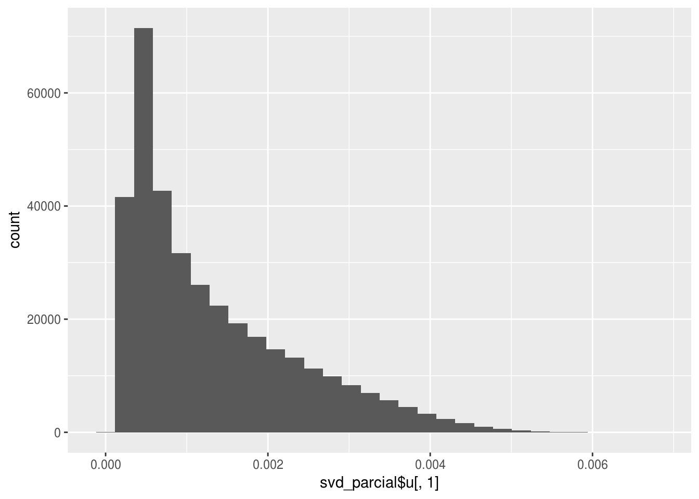

```r
qplot(svd_parcial$v[,2])#
```

```
## `stat_bin()` using `bins = 30`. Pick better value with `binwidth`.
```

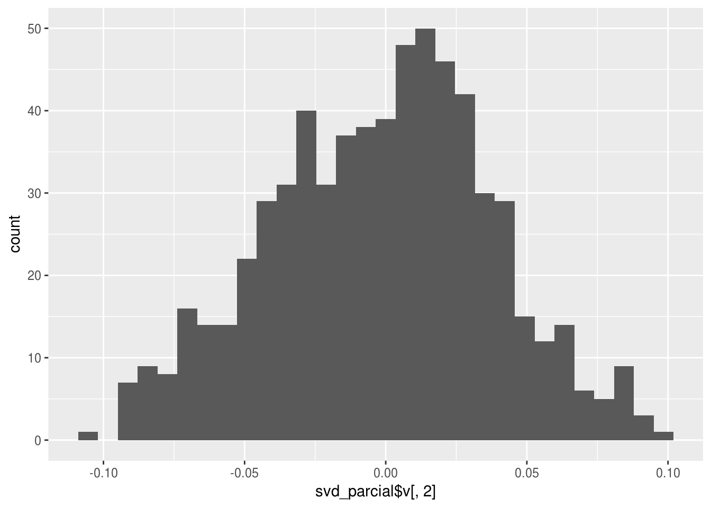


```r
pel_graf <- V_peliculas %>% mutate(dist_0 = sqrt(v_2^2 + v_3^2)) 
muestra <- pel_graf %>% mutate(etiqueta = ifelse(dist_0 > 0.08, name, ''))
ggplot(muestra, aes(x=v_2, y=v_3, label=etiqueta)) + geom_point(alpha=0.2) + 
  geom_text(size=2.5) + xlab('Mainstream vs Independiente') + ylab('Violenta/Acción vs Drama')
```

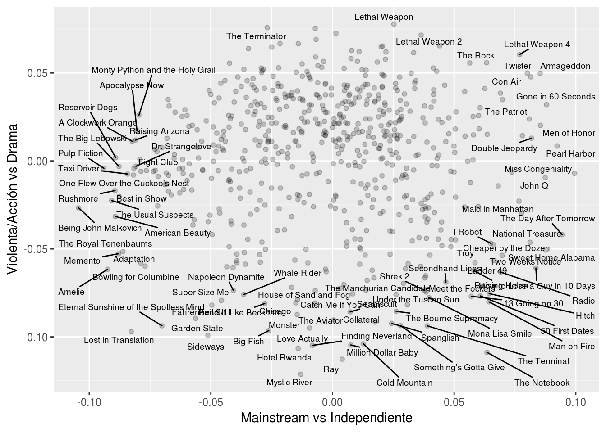


```r
pel_graf <- V_peliculas %>% mutate(dist_0 = sqrt(v_3^2 + v_4^2)) 
muestra <- pel_graf %>% mutate(etiqueta = ifelse(dist_0 > 0.08, name, ''))
ggplot(muestra, aes(x=v_3, y=v_4, label=etiqueta)) + geom_point(alpha=0.2) + 
  geom_text(size=2.5)  + xlab('Violenta/Acción vs Drama') + ylab('Fantasía/Ciencia Ficción')
```

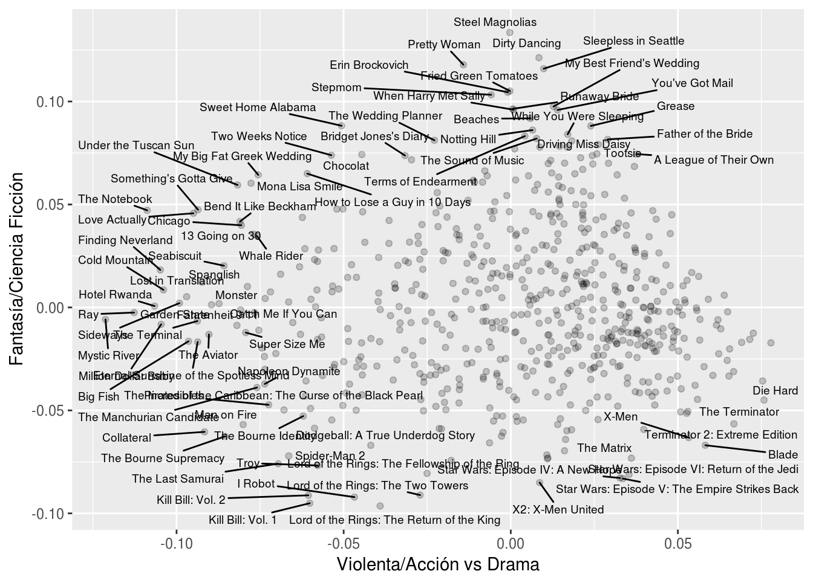


Dejamos la primer componente porque es más bien consecuencia de cómo construimos
la matriz que buscamos descomponer:


```r
qplot(svd_parcial$u[,1])
```

```
## `stat_bin()` using `bins = 30`. Pick better value with `binwidth`.
```


```r
qplot(svd_parcial$v[,1])
```

```
## `stat_bin()` using `bins = 30`. Pick better value with `binwidth`.
```


Esta componente está asociada con el número de evaluaciones que tiene cada
usuario y que tiene cada persona


```r
if(FALSE){
  evals_num_u <- evals %>% group_by(usuario_id) %>% summarise(num_evals = n())
  saveRDS(evals_num_u, 'cache_obj/evals_num_u.rds')
}
```


```r
evals_num_u <- readRDS('cache_obj/evals_num_u.rds')
qplot(evals_num_u$num_evals, svd_parcial$u[,1])
```

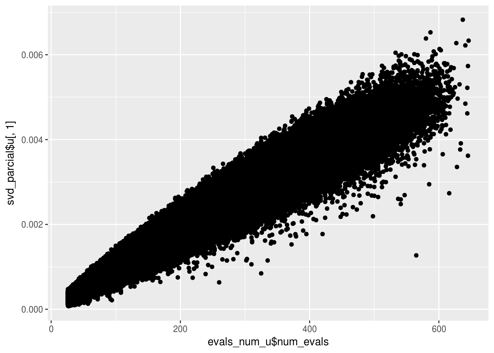


```r
if(FALSE){
  evals_num_p <- evals %>% group_by(pelicula_id) %>% summarise(num_evals = n(), calif_prom=mean(calif))
  saveRDS(evals_num_p, 'cache_obj/evals_num_p.rds')
}
```


```r
evals_num_p <- readRDS('cache_obj/evals_num_p.rds')
qplot(evals_num_p$num_evals, svd_parcial$v[,1])
```


Esta dimensión aparece pues la primera aproximación de rango 1 intenta replicar
los valores "bajos" de pocas evaluaciones tanto en usuarios como en películas.
En realidad es una distorsión producida por cómo hemos tratado los datos ("imputando"
cero cuando no existe una evaluación).

### Calidad de representación de SVD.

Podemos hacer varios cálculos para entender qué tan buena es nuestra aproximación de
rango bajo $X_k$. Por ejemplo, podríamos calcular las diferencias de $X-X_k$ y presentarlas
de distinta forma.

### Ejemplo{-}
En el ejemplo de rubros de gasto, podríamos mostrar las diferencias en billones (us)
de dólares, donde vemos que la aproximación es bastante buena


```r
qplot(as.numeric(X_arr-X_arr_2))
```

```
## `stat_bin()` using `bins = 30`. Pick better value with `binwidth`.
```


Que podríamos resumir, por ejemplo, con la media de errores absolutos:


```r
mean(abs(as.numeric(X_arr-X_arr_2)))
```

```
## [1] 0.06683576
```

Otra opción es usar la norma Frobenius, calculando para la apoximación de rango 1


```r
1 - (sum(X_arr^2) - sum(svd_gasto$d[1]^2))/sum(X_arr^2)
```

```
## [1] 0.9986246
```

Lo que indica que capturamos 99.8\% de la información, y para la de rango 2:
d

```r
1-(sum(X_arr^2) - sum(svd_gasto$d[1:2]^2))/sum(X_arr^2)
```

```
## [1] 0.9999907
```

Lo que indica que estos datos (en 3 variables), podemos entenderlos mediante
un análisis de dos dimensiones

---

\BeginKnitrBlock{comentario}<div class="comentario">Podemos medir la calidad de la representación de $X$ ($n\times p$ con $p < n$) 
de una aproximación $X_k$ de SVD mediante
$$1-\frac{||X-X_k||_2^F}{||X||_2^F}  = \frac{\sigma_1^2 + \sigma_2^2 + \cdots \sigma_k^2}{|sigma_1^2 + \sigma_2^2 + \cdots \sigma_p^2},$$
que es un valor entre 0 y 1. Cuanto más cercana a 1 está, mejor es la representación.</div>\EndKnitrBlock{comentario}

**Observaciones**: Dependiendo de nuestro objetivo, nos interesa alcanzar distintos
niveles de calidad de representación. Por ejemplo, algunas reglas de dedo:

- Si queremos usar los datos para un proceso posterior, o dar una descripción 
casi completa de los datos, quizá buscamos calidad $>0.9$ o mayor.

- Si nos interesa extraer los patrones más importantes, podemos considerar valores de calidad
mucho más chicos, entendiendo que hay una buena parte de la información que no se explican
por nuestra aproximación.


#### Ejemplo {-}
Para el problema de Netflix podemos calcular la calidad de representación dada por
las primeras 4 dimensiones


```r
#norma_X  <- sum(evals$calif^2)
norma_X <- 738958222
sum(svd_parcial$d^2)/norma_X
```

```
## [1] 0.4679388
```

Lo que indica que todavía hay mucha información por explorar en los datos de netflix. La
contribución a este porcentaje de cada dimensión


```r
(svd_parcial$d[1]^2)/norma_X
```

```
## [1] 0.3843962
```

```r
(svd_parcial$d[2]^2)/norma_X
```

```
## [1] 0.0386808
```

```r
(svd_parcial$d[3]^2)/norma_X
```

```
## [1] 0.02353302
```

```r
(svd_parcial$d[3]^2)/norma_X
```

```
## [1] 0.02353302
```

## Componentes principales

Componentes principales es la descomposición en valores singulares aplicada
a una matriz de datos centrada por columna. Esta operación convierte el problema
de aproximación de matrices de rango bajo en uno de aproximaciones que buscan
explicar la mayoría de la *covarianza* de las variables de la matriz de datos $X$. 


Consideremos entonces una matriz de datos $X$ de tamaño $n\times p$. Definimos
la **matrix centrada** por columna $\tilde{X}$ , que se calcula como
$$\tilde{X}_{i,j} = X_{i,j} - \mu_j$$
donde $\mu_j = \frac{1}{n} \sum_j X_{i,j}$.


- La primera diferencia entre svd y svd con columnas centradas (componentes principales) 
es que en svd las proyecciones se hacen pasando por el origen, pero en componentes principales se
hacen a partir del centroide de los datos

### Ejemplo {-}

Veamos primero el último ejemplo simulado que hicimos anterioremnte. Primero centramos
los datos por columna:


```r
datos_c <- scale(datos %>% select(-selec), scale = FALSE) %>% as.data.frame
ggplot(datos_c, aes(x=x_1, y=x_2)) + geom_point() +
  geom_vline(xintercept = 0, colour='red') +
 geom_hline(yintercept = 0, colour='red')
```


Y ahora calculamos la descomposición en valores singulares


```r
svd_x <- svd(datos_c)
v <- svd_x$v %>% t %>% as.data.frame() 
u <- svd_x$u %>% data.frame
colnames(v) <- c('x_1','x_2')
colnames(u) <- c('x_1','x_2')
d <- svd_x$d
v
```

```
##        x_1       x_2
## 1 0.507328  0.861753
## 2 0.861753 -0.507328
```

Notemos que los resultados son similares, pero no son los mismos.

Graficamos ahora los dos vectores $v_1$ y $v_2$, que en este contexto
se llaman *direcciones principales*


```r
ggplot(datos_c) + geom_point(aes(x=x_1, y=x_2)) +
  geom_vline(xintercept = 0, colour='red') +
 geom_hline(yintercept = 0, colour='red') + 
  geom_segment(data = v, aes(xend= 5*x_1, yend=5*x_2, x=0, y=0), col='red', size=1.1,
               arrow = arrow(length = unit(0.3,"cm")))  +
  coord_equal()
```

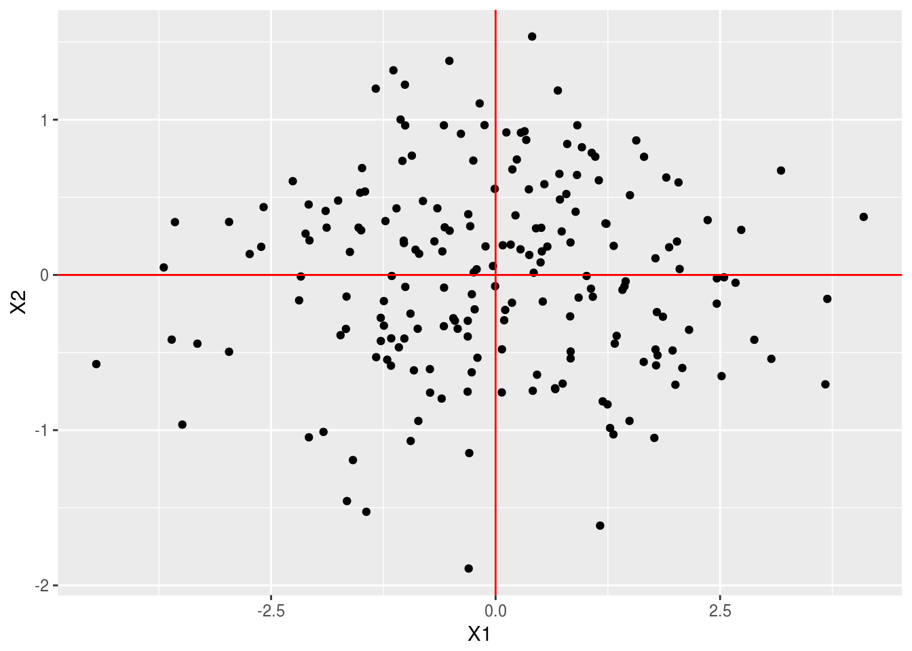

Las componentes de las proyecciones de los datos sobre las direcciones principales dan las
**componentes principales** (nótese que multiplicamos por los valores singulares):


```r
head(svd_x$u %*% diag(svd_x$d))
```

```
##            [,1]       [,2]
## [1,]  0.3230641  0.9257829
## [2,]  0.4070429  1.5360770
## [3,] -1.2788977 -0.2762829
## [4,]  0.8910247  0.4071926
## [5,] -4.4466993 -0.5743111
## [6,] -1.2267878  0.3470759
```

Que podemos graficar


```r
comps <- svd_x$u %*% diag(svd_x$d) %>% data.frame
ggplot(comps, aes(x=X1, y=X2)) + geom_point()+
  geom_vline(xintercept = 0, colour='red') +
  geom_hline(yintercept = 0, colour='red')
```

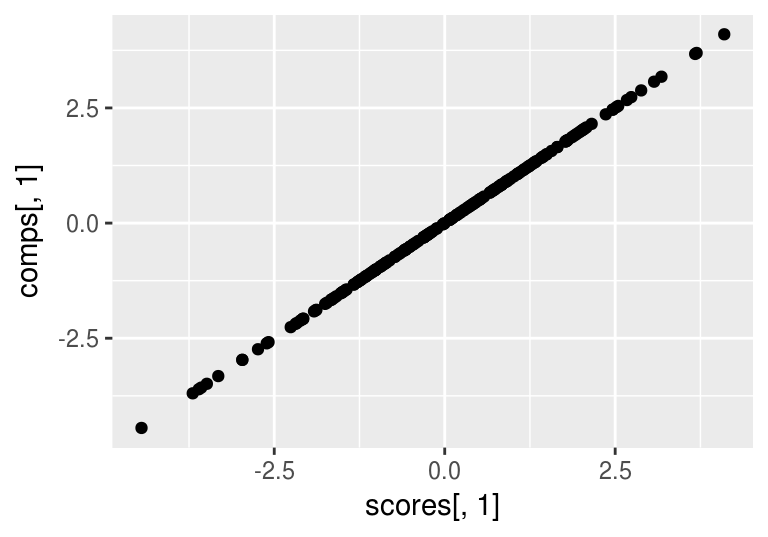

Este resultado lo podemos obtener directamente usando la función *princomp*


```r
comp_principales <- princomp(datos %>% select(-selec))
scores <- comp_principales$scores
head(scores)
```

```
##          Comp.1     Comp.2
## [1,]  0.3230641 -0.9257829
## [2,]  0.4070429 -1.5360770
## [3,] -1.2788977  0.2762829
## [4,]  0.8910247 -0.4071926
## [5,] -4.4466993  0.5743111
## [6,] -1.2267878 -0.3470759
```

Y verificamos que los resultados son los mismos:

```r
qplot(scores[,1], comps[,1])
```


```r
qplot(scores[,2], -comps[,2])
```

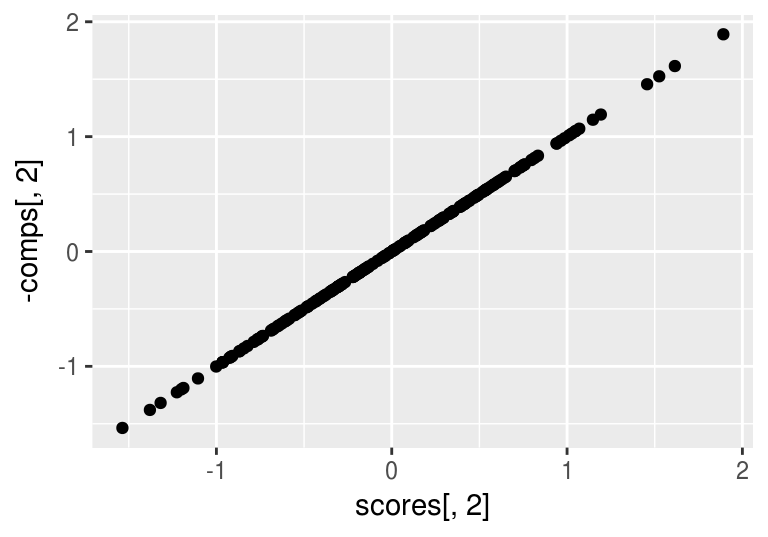

### Ejemplo: más apropiado hacer svd sin centrar {-}

### Ejemplo: más apropiado hacer svd centrando (componentes principales) {-}

### Interpretación de componentes principales


